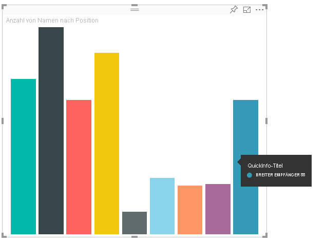
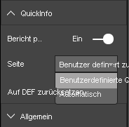

# <a name="tooltips-in-power-bi-visuals"></a><span data-ttu-id="94b48-103">QuickInfos in Power BI-Visuals</span><span class="sxs-lookup"><span data-stu-id="94b48-103">Tooltips in Power BI visuals</span></span>

<span data-ttu-id="94b48-104">In Visuals können jetzt auch Power BI-QuickInfos verwendet werden.</span><span class="sxs-lookup"><span data-stu-id="94b48-104">Visuals can now make use of Power BI tooltip support.</span></span> <span data-ttu-id="94b48-105">Interaktionen für QuickInfos in Power BI:</span><span class="sxs-lookup"><span data-stu-id="94b48-105">Power BI tooltips handle the following interactions:</span></span>

* <span data-ttu-id="94b48-106">Anzeigen einer QuickInfo</span><span class="sxs-lookup"><span data-stu-id="94b48-106">Show a tooltip.</span></span>
* <span data-ttu-id="94b48-107">Ausblenden einer QuickInfo</span><span class="sxs-lookup"><span data-stu-id="94b48-107">Hide a tooltip.</span></span>
* <span data-ttu-id="94b48-108">Verschieben einer QuickInfo</span><span class="sxs-lookup"><span data-stu-id="94b48-108">Move a tooltip.</span></span>

<span data-ttu-id="94b48-109">Eine QuickInfo kann als Textelement mit einem Titel, einem Wert in einer bestimmten Farbe und Deckkraft und einer Gruppe von Koordinaten angezeigt werden.</span><span class="sxs-lookup"><span data-stu-id="94b48-109">Tooltips can display a textual element with a title, a value in a given color, and opacity at a specified set of coordinates.</span></span> <span data-ttu-id="94b48-110">Diese Daten werden anschließend der API zur Verfügung gestellt und vom Power BI-Host auf dieselbe Weise gerendert wie QuickInfos für native Visuals.</span><span class="sxs-lookup"><span data-stu-id="94b48-110">This data is provided to the API, and the Power BI host renders it the same way it renders tooltips for native visuals.</span></span>

<span data-ttu-id="94b48-111">Auf dem folgenden Screenshot ist eine QuickInfo in einem beispielhaften Balkendiagramm zu sehen:</span><span class="sxs-lookup"><span data-stu-id="94b48-111">A tooltip in a sample bar chart is shown in the following image:</span></span>



<span data-ttu-id="94b48-113">Auf dem obigen Screenshot mit der QuickInfo wird eine einzelne Kategorie und ein einzelner Wert für ein Balkendiagramm veranschaulicht.</span><span class="sxs-lookup"><span data-stu-id="94b48-113">The preceding tooltip image illustrates a single bar category and value.</span></span> <span data-ttu-id="94b48-114">Sie können eine einzelne QuickInfo so erweitern, dass mehrere Werte angezeigt werden.</span><span class="sxs-lookup"><span data-stu-id="94b48-114">You can extend a single tooltip to display multiple values.</span></span>

## <a name="manage-tooltips"></a><span data-ttu-id="94b48-115">Verwalten von QuickInfos</span><span class="sxs-lookup"><span data-stu-id="94b48-115">Manage tooltips</span></span>

<span data-ttu-id="94b48-116">Die Schnittstelle für die Verwaltung von QuickInfos heißt ITooltipService.</span><span class="sxs-lookup"><span data-stu-id="94b48-116">The interface through which you manage tooltips is the "ITooltipService."</span></span> <span data-ttu-id="94b48-117">Über diese wird der Host darüber benachrichtigt, dass eine QuickInfo angezeigt, entfernt oder verschoben werden muss.</span><span class="sxs-lookup"><span data-stu-id="94b48-117">It's used to notify the host that a tooltip needs to be displayed, removed, or moved.</span></span>

```typescript
    interface ITooltipService {
        enabled(): boolean;
        show(options: TooltipShowOptions): void;
        move(options: TooltipMoveOptions): void;
        hide(options: TooltipHideOptions): void;
    }
```

<span data-ttu-id="94b48-118">Das Visual muss die eigenen Mausereignisse überwachen und bei Bedarf den Delegaten `show()`, `move()` oder `hide()` mit dem Inhalt aufrufen, der in den `Tooltip****Options`-Objekten enthalten ist.</span><span class="sxs-lookup"><span data-stu-id="94b48-118">Your visual needs to listen to the mouse events within your visual and call the `show()`, `move()`, and `hide()` delegates, as needed, with the appropriate content populated in the `Tooltip****Options` objects.</span></span>
<span data-ttu-id="94b48-119">Durch `TooltipShowOptions` und `TooltipHideOptions` wird wiederum definiert, was bei Auftreten dieser Ereignisse angezeigt wird und wie sich die QuickInfo verhält.</span><span class="sxs-lookup"><span data-stu-id="94b48-119">`TooltipShowOptions` and `TooltipHideOptions` would in turn define what to display and how to behave in these events.</span></span>

<span data-ttu-id="94b48-120">Da beim Aufrufen dieser Methoden auch Benutzerereignisse wie Mausbewegungen und Touchereignisse eine Rolle spielen, empfiehlt es sich, Listener für diese Ereignisse zu erstellen. Dadurch werden dann die `TooltipService`-Member aufgerufen.</span><span class="sxs-lookup"><span data-stu-id="94b48-120">Because calling these methods involves user events such as mouse moves and touch events, it's a good idea to create listeners for these events, which would in turn invoke the `TooltipService` members.</span></span>
<span data-ttu-id="94b48-121">In unserem Beispiel werden Daten in der `TooltipServiceWrapper`-Klasse aggregiert.</span><span class="sxs-lookup"><span data-stu-id="94b48-121">Our sample aggregates in a class called `TooltipServiceWrapper`.</span></span>

### <a name="the-tooltipservicewrapper-class"></a><span data-ttu-id="94b48-122">Die TooltipServiceWrapper-Klasse</span><span class="sxs-lookup"><span data-stu-id="94b48-122">The TooltipServiceWrapper class</span></span>

<span data-ttu-id="94b48-123">Diese Klasse ist dafür verantwortlich, die Instanz von `TooltipService` aufzunehmen, D3-Mausereignisse oder relevante Elemente zu überwachen und dann bei Bedarf `show()` oder `hide()` für die Elemente aufzurufen.</span><span class="sxs-lookup"><span data-stu-id="94b48-123">The basic idea behind this class is to hold the instance of the `TooltipService`, listen to D3 mouse events over relevant elements, and then make the calls to `show()` and `hide()` the elements when needed.</span></span>

<span data-ttu-id="94b48-124">Die Klasse enthält und verwaltet relevante Zustands- und Logikinformationen für diese Ereignisse, die hauptsächlich auf die Verknüpfung mit dem zugrunde liegenden D3-Code ausgerichtet sind.</span><span class="sxs-lookup"><span data-stu-id="94b48-124">The class holds and manages any relevant state and logic for these events, which are mostly geared at interfacing with the underlying D3 code.</span></span> <span data-ttu-id="94b48-125">Die Verknüpfung und Konvertierung von D3-Code wird in diesem Artikel nicht behandelt.</span><span class="sxs-lookup"><span data-stu-id="94b48-125">The D3 interfacing and conversion is out of scope for this article.</span></span>

<span data-ttu-id="94b48-126">Den vollständigen Beispielcode finden Sie im [SampleBarChart-Visualrepository](https://github.com/Microsoft/PowerBI-visuals-sampleBarChart/commit/981b021612d7b333adffe9f723ab27783c76fb14).</span><span class="sxs-lookup"><span data-stu-id="94b48-126">You can find the full sample code in [SampleBarChart visual repository](https://github.com/Microsoft/PowerBI-visuals-sampleBarChart/commit/981b021612d7b333adffe9f723ab27783c76fb14).</span></span>

### <a name="create-tooltipservicewrapper"></a><span data-ttu-id="94b48-127">Erstellen einer TooltipServiceWrapper-Instanz</span><span class="sxs-lookup"><span data-stu-id="94b48-127">Create TooltipServiceWrapper</span></span>

<span data-ttu-id="94b48-128">Der Konstruktor des Balkendiagramms verfügt jetzt über einen `TooltipServiceWrapper`-Member, der im Konstruktor mit der `tooltipService`-Hostinstanz instanziiert wird.</span><span class="sxs-lookup"><span data-stu-id="94b48-128">The bar chart constructor now has a `TooltipServiceWrapper` member, which is instantiated in the constructor with the host `tooltipService` instance.</span></span>

```typescript
        private tooltipServiceWrapper: ITooltipServiceWrapper;

        this.tooltipServiceWrapper = createTooltipServiceWrapper(this.host.tooltipService, options.element);
```

<span data-ttu-id="94b48-129">Die `TooltipServiceWrapper`-Klasse enthält die `tooltipService`-Instanz zusätzlich zum D3-Stammelement der Visual- und Touchparameter.</span><span class="sxs-lookup"><span data-stu-id="94b48-129">The `TooltipServiceWrapper` class holds the `tooltipService` instance, also as the root D3 element of the visual and touch parameters.</span></span>

```typescript
    class TooltipServiceWrapper implements ITooltipServiceWrapper {
        private handleTouchTimeoutId: number;
        private visualHostTooltipService: ITooltipService;
        private rootElement: Element;
        private handleTouchDelay: number;

        constructor(tooltipService: ITooltipService, rootElement: Element, handleTouchDelay: number) {
            this.visualHostTooltipService = tooltipService;
            this.handleTouchDelay = handleTouchDelay;
            this.rootElement = rootElement;
        }
        .
        .
        .
    }
```

<span data-ttu-id="94b48-130">Der einzige Einstiegspunkt, über den diese Klasse Ereignislistener registrieren kann, ist die `addTooltip`-Methode.</span><span class="sxs-lookup"><span data-stu-id="94b48-130">The single entry point for this class to register event listeners is the `addTooltip` method.</span></span>

### <a name="the-addtooltip-method"></a><span data-ttu-id="94b48-131">Die addTooltip-Methode</span><span class="sxs-lookup"><span data-stu-id="94b48-131">The addTooltip method</span></span>

```typescript
        public addTooltip<T>(
            selection: d3.Selection<Element>,
            getTooltipInfoDelegate: (args: TooltipEventArgs<T>) => VisualTooltipDataItem[],
            getDataPointIdentity: (args: TooltipEventArgs<T>) => ISelectionId,
            reloadTooltipDataOnMouseMove?: boolean): void {

            if (!selection || !this.visualHostTooltipService.enabled()) {
                return;
            }
        ...
        ...
        }
```

* <span data-ttu-id="94b48-132">**selection: d3.Selection:<Element>** die D3-Elemente, über die QuickInfos verarbeitet werden.</span><span class="sxs-lookup"><span data-stu-id="94b48-132">**selection: d3.Selection<Element>**: The d3 elements over which tooltips are handled.</span></span>

* <span data-ttu-id="94b48-133">**getTooltipInfoDelegate: (args: TooltipEventArgs<T>) => VisualTooltipDataItem[]:** der Delegat zum Auffüllen des anzuzeigenden QuickInfo-Inhalts für einen Kontext.</span><span class="sxs-lookup"><span data-stu-id="94b48-133">**getTooltipInfoDelegate: (args: TooltipEventArgs<T>) => VisualTooltipDataItem[]**: The delegate for populating the tooltip content (what to display) per context.</span></span>

* <span data-ttu-id="94b48-134">**getDataPointIdentity: (args: TooltipEventArgs<T>) => ISelectionId:** der Delegat zum Abrufen der Datenpunkt-ID (in diesem Beispiel nicht verwendet).</span><span class="sxs-lookup"><span data-stu-id="94b48-134">**getDataPointIdentity: (args: TooltipEventArgs<T>) => ISelectionId**: The delegate for retrieving the data point ID (unused in this sample).</span></span> 

* <span data-ttu-id="94b48-135">**reloadTooltipDataOnMouseMove? boolean:** ein boolescher Wert, der angibt, ob die QuickInfo-Daten während eines MouseMove-Ereignisses aktualisiert werden (in diesem Beispiel nicht verwendet).</span><span class="sxs-lookup"><span data-stu-id="94b48-135">**reloadTooltipDataOnMouseMove? boolean**: A Boolean that indicates whether to refresh the tooltip data during a MouseMove event (unused in this sample).</span></span>

<span data-ttu-id="94b48-136">Wie Sie sehen, wird `addTooltip` ohne Aktion beendet, wenn `tooltipService` deaktiviert ist oder keine Auswahl vorliegt.</span><span class="sxs-lookup"><span data-stu-id="94b48-136">As you can see, `addTooltip` exits with no action if the `tooltipService` is disabled or there's no real selection.</span></span>

### <a name="call-the-show-method-to-display-a-tooltip"></a><span data-ttu-id="94b48-137">Aufrufen der show-Methode zum Anzeigen einer QuickInfo</span><span class="sxs-lookup"><span data-stu-id="94b48-137">Call the show method to display a tooltip</span></span>

<span data-ttu-id="94b48-138">Die `addTooltip`-Methode überwacht, ob ein D3-`mouseover`-Ereignis auftritt. Dies wird im folgenden Code gezeigt:</span><span class="sxs-lookup"><span data-stu-id="94b48-138">The `addTooltip` method next listens to the D3 `mouseover` event, as shown in the following code:</span></span>

```typescript
        ...
        ...
        selection.on("mouseover.tooltip", () => {
            // Ignore mouseover while handling touch events
            if (!this.canDisplayTooltip(d3.event))
                return;

            let tooltipEventArgs = this.makeTooltipEventArgs<T>(rootNode, true, false);
            if (!tooltipEventArgs)
                return;

            let tooltipInfo = getTooltipInfoDelegate(tooltipEventArgs);
            if (tooltipInfo == null)
                return;

            let selectionId = getDataPointIdentity(tooltipEventArgs);

            this.visualHostTooltipService.show({
                coordinates: tooltipEventArgs.coordinates,
                isTouchEvent: false,
                dataItems: tooltipInfo,
                identities: selectionId ? [selectionId] : [],
            });
        });
```

* <span data-ttu-id="94b48-139">**makeTooltipEventArgs:** Extrahiert den Kontext aus den ausgewählten D3-Elementen in tooltipEventArg.</span><span class="sxs-lookup"><span data-stu-id="94b48-139">**makeTooltipEventArgs**: Extracts the context from the D3 selected elements into a tooltipEventArgs.</span></span> <span data-ttu-id="94b48-140">Die Koordinaten werden ebenfalls berechnet.</span><span class="sxs-lookup"><span data-stu-id="94b48-140">It calculates the coordinates as well.</span></span>

* <span data-ttu-id="94b48-141">**getTooltipInfoDelegate:** Anschließend wird der QuickInfo-Inhalt auf der Basis von tooltipEventArgs erstellt.</span><span class="sxs-lookup"><span data-stu-id="94b48-141">**getTooltipInfoDelegate**: It then builds the tooltip content from the tooltipEventArgs.</span></span> <span data-ttu-id="94b48-142">Dies ist ein Rückruf an die BarChart-Klasse, da es sich hier um die Logikinformationen des Visuals handelt.</span><span class="sxs-lookup"><span data-stu-id="94b48-142">It's a callback to the BarChart class, because it is the visual's logic.</span></span> <span data-ttu-id="94b48-143">Dies ist der tatsächliche Textinhalt, der in der QuickInfo angezeigt wird.</span><span class="sxs-lookup"><span data-stu-id="94b48-143">It's the actual text content to display in the tooltip.</span></span>

* <span data-ttu-id="94b48-144">**getDataPointIdentity:** in diesem Beispiel nicht verwendet.</span><span class="sxs-lookup"><span data-stu-id="94b48-144">**getDataPointIdentity**: Unused in this sample.</span></span>

* <span data-ttu-id="94b48-145">**this.visualHostTooltipService.show:** der Aufruf zur Anzeige der QuickInfo.</span><span class="sxs-lookup"><span data-stu-id="94b48-145">**this.visualHostTooltipService.show**: The call to display the tooltip.</span></span>  

<span data-ttu-id="94b48-146">Weitere praktische Informationen finden Sie in den Beispielen für das `mouseout`-Ereignis und das `mousemove`-Ereignis.</span><span class="sxs-lookup"><span data-stu-id="94b48-146">Additional handling can be found in the sample for `mouseout` and `mousemove` events.</span></span>

<span data-ttu-id="94b48-147">Weitere Informationen finden Sie im [SampleBarChart-Visualrepository](https://github.com/Microsoft/PowerBI-visuals-sampleBarChart/commit/981b021612d7b333adffe9f723ab27783c76fb14).</span><span class="sxs-lookup"><span data-stu-id="94b48-147">For more information, see the [SampleBarChart visual repository](https://github.com/Microsoft/PowerBI-visuals-sampleBarChart/commit/981b021612d7b333adffe9f723ab27783c76fb14).</span></span>

### <a name="populate-the-tooltip-content-by-the-gettooltipdata-method"></a><span data-ttu-id="94b48-148">Auffüllen des QuickInfo-Inhalts durch die getTooltipData-Methode</span><span class="sxs-lookup"><span data-stu-id="94b48-148">Populate the tooltip content by the getTooltipData method</span></span>

<span data-ttu-id="94b48-149">Die BarChart-Klasse wurde mit einem `getTooltipData`-Member hinzugefügt, durch den `category`, `value` und `color` des Datenpunkts einfach in ein VisualTooltipDataItem[]-Element extrahiert wird.</span><span class="sxs-lookup"><span data-stu-id="94b48-149">The BarChart class was added with a `getTooltipData` member, which simply extracts the `category`, `value`, and `color` of the data point into a VisualTooltipDataItem[] element.</span></span>

```typescript
        private static getTooltipData(value: any): VisualTooltipDataItem[] {
            return [{
                displayName: value.category,
                value: value.value.toString(),
                color: value.color,
                header: 'ToolTip Title'
            }];
        }
```

<span data-ttu-id="94b48-150">In der vorangehenden Implementierung ist der `header`-Member eine Konstante. Er kann jedoch auch für komplexere Implementierungen verwendet werden, die dynamische Werte erfordern.</span><span class="sxs-lookup"><span data-stu-id="94b48-150">In the preceding implementation, the `header` member is constant, but you can use it for more complex implementations, which require dynamic values.</span></span> <span data-ttu-id="94b48-151">Sie können `VisualTooltipDataItem[]` mit mehreren Elementen auffüllen, um der QuickInfo mehrere Zeilen hinzuzufügen.</span><span class="sxs-lookup"><span data-stu-id="94b48-151">You can populate the `VisualTooltipDataItem[]` with more than one element, which adds multiple lines to the tooltip.</span></span> <span data-ttu-id="94b48-152">Dies kann in Visuals wie gestapelten Balkendiagrammen nützlich sein, in denen QuickInfos Daten aus mehreren Datenpunkten enthalten können.</span><span class="sxs-lookup"><span data-stu-id="94b48-152">It can be useful in visuals such as stacked bar charts where the tooltip may display data from more than a single data point.</span></span>

### <a name="call-the-addtooltip-method"></a><span data-ttu-id="94b48-153">Aufrufen der addTooltip-Methode</span><span class="sxs-lookup"><span data-stu-id="94b48-153">Call the addTooltip method</span></span>

<span data-ttu-id="94b48-154">Der letzte Schritt besteht darin, die `addTooltip`-Methode aufzurufen, wenn sich die Daten ändern.</span><span class="sxs-lookup"><span data-stu-id="94b48-154">The final step is to call the `addTooltip` method when the actual data might change.</span></span> <span data-ttu-id="94b48-155">Dieser Aufruf findet in der `BarChart.update()`-Methode statt.</span><span class="sxs-lookup"><span data-stu-id="94b48-155">This call takes place in the `BarChart.update()` method.</span></span> <span data-ttu-id="94b48-156">Durch den Aufruf wird die Auswahl aller bar-Elemente überwacht und wie oben erwähnt nur `BarChart.getTooltipData()` übergeben.</span><span class="sxs-lookup"><span data-stu-id="94b48-156">A call is made to monitor the selection of all the 'bar' elements, passing only the `BarChart.getTooltipData()`, as mentioned previously.</span></span>

```typescript
        this.tooltipServiceWrapper.addTooltip(this.barContainer.selectAll('.bar'),
            (tooltipEvent: TooltipEventArgs<number>) => BarChart.getTooltipData(tooltipEvent.data),
            (tooltipEvent: TooltipEventArgs<number>) => null);
```

## <a name="add-report-page-tooltips"></a><span data-ttu-id="94b48-157">Hinzufügen von QuickInfos für Berichtsseiten</span><span class="sxs-lookup"><span data-stu-id="94b48-157">Add report page tooltips</span></span>

<span data-ttu-id="94b48-158">Wenn Sie QuickInfos für Berichtsseiten hinzufügen möchten, finden Sie die meisten erforderlichen Änderungen in der Datei *capabilities.json*.</span><span class="sxs-lookup"><span data-stu-id="94b48-158">To add report page tooltips support, you'll find most changes in the *capabilities.json* file.</span></span>

<span data-ttu-id="94b48-159">Ein Beispielschema:</span><span class="sxs-lookup"><span data-stu-id="94b48-159">A sample schema is</span></span>

```json
{
    "tooltips": {
        "supportedTypes": {
            "default": true,
            "canvas": true
        },
        "roles": [
            "tooltips"
        ]
    }
}
```

<span data-ttu-id="94b48-160">QuickInfos für Berichtseiten können Sie im Bereich **Format** definieren.</span><span class="sxs-lookup"><span data-stu-id="94b48-160">You can define report page tooltips in the **Format** pane.</span></span>



* <span data-ttu-id="94b48-162">`supportedTypes`: die QuickInfo-Konfiguration, die vom Visual unterstützt wird und im Bereich „Felder“ angezeigt wird.</span><span class="sxs-lookup"><span data-stu-id="94b48-162">`supportedTypes`: The tooltip configuration that's supported by the visual and reflected in the fields well.</span></span> 
   * <span data-ttu-id="94b48-163">`default`: gibt an, ob die „automatische“ Bindung von QuickInfos über das Datenfeld unterstützt wird.</span><span class="sxs-lookup"><span data-stu-id="94b48-163">`default`: Specifies whether the "automatic" tooltips binding via the data field is supported.</span></span> 
   * <span data-ttu-id="94b48-164">`canvas`: gibt an, ob QuickInfos für Berichtsseiten unterstützt werden.</span><span class="sxs-lookup"><span data-stu-id="94b48-164">`canvas`: Specifies whether the report page tooltips are supported.</span></span>

* <span data-ttu-id="94b48-165">`roles`: optionale Einstellung, mit der festgelegt wird, welche Datenrollen an die ausgewählte QuickInfo-Option im Bereich „Felder“ gebunden werden sollen.</span><span class="sxs-lookup"><span data-stu-id="94b48-165">`roles`: (Optional) After it's defined, it instructs what data roles are bound to the selected tooltip option in the fields well.</span></span>

<span data-ttu-id="94b48-166">Weitere Informationen finden Sie unter [Richtlinien zur Nutzung von QuickInfos für Berichtsseiten](https://powerbi.microsoft.com/blog/power-bi-desktop-march-2018-feature-summary/#tooltips).</span><span class="sxs-lookup"><span data-stu-id="94b48-166">For more information, see [Report page tooltips usage guidelines](https://powerbi.microsoft.com/blog/power-bi-desktop-march-2018-feature-summary/#tooltips).</span></span>

<span data-ttu-id="94b48-167">Der Power BI-Host ruft zuerst `ITooltipService.Show(options: TooltipShowOptions)` oder `ITooltipService.Move(options: TooltipMoveOptions)` auf, um das QuickInfo für die Berichtsseite anzuzeigen. Anschließend wird die selectionId genutzt (`identities`-Eigenschaft des vorangehenden `options`-Arguments).</span><span class="sxs-lookup"><span data-stu-id="94b48-167">To display the report page tooltip, after the Power BI host calls `ITooltipService.Show(options: TooltipShowOptions)` or `ITooltipService.Move(options: TooltipMoveOptions)`, it consumes the selectionId (`identities` property of the preceding `options` argument).</span></span> <span data-ttu-id="94b48-168">Die selectionId sollte die ausgewählten Daten (Kategorie, Reihe usw.) des Elements darstellen, auf das Sie gezeigt haben, damit die selectionId vom QuickInfo abgerufen werden kann.</span><span class="sxs-lookup"><span data-stu-id="94b48-168">To be retrieved by the tooltip, SelectionId should represent the selected data (category, series, and so on) of the item you hovered over.</span></span>

<span data-ttu-id="94b48-169">Wie die selectionId an die QuickInfo-Anzeigeaufrufe gesendet werden kann, sehen Sie im folgenden Codebeispiel:</span><span class="sxs-lookup"><span data-stu-id="94b48-169">An example of sending the selectionId to tooltip display calls is shown in the following code:</span></span>

```typescript
    this.tooltipServiceWrapper.addTooltip(this.barContainer.selectAll('.bar'),
        (tooltipEvent: TooltipEventArgs<number>) => BarChart.getTooltipData(tooltipEvent.data),
        (tooltipEvent: TooltipEventArgs<number>) => tooltipEvent.data.selectionID);
```
