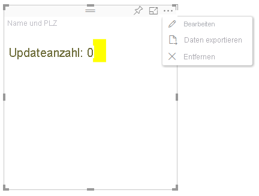

# Erweiterter Bearbeitungsmodus in Power BI-VisualsAdvanced edit mode in Power BI visuals

Wenn Sie in Ihrem Power BI-Visual erweiterte UI-Steuerelemente benötigen, können Sie den Modus „Erweiterte Bearbeitung“ nutzen.If you require advanced UI controls in your Power BI visual, you can take advantage of advanced edit mode. Wenn Sie sich im Bearbeitungsmodus des Berichts befinden, können Sie auf die Schaltfläche **Bearbeiten** klicken, um den Bearbeitungsmodus auf **Erweitert** festzulegen.When you're in report editing mode, you select an **Edit** button to set the edit mode to **Advanced**. Das Visual kann anhand des `EditMode`-Flags bestimmen, ob diese UI-Steuerelemente anzeigt werden sollen.The visual can use the `EditMode` flag to determine whether it should display this UI control.

Der Modus „Erweiterte Bearbeitung“ wird vom Visual standardmäßig nicht unterstützt.By default, the visual doesn't support advanced edit mode. Falls ein anderes Verhalten gewünscht ist, können Sie dies explizit in der *capabilities.json*-Datei des Visuals angeben, indem Sie die `advancedEditModeSupport`-Eigenschaft festlegen.If a different behavior is required, you can explicitly state this in the visual's *capabilities.json* file by setting the `advancedEditModeSupport` property.

Mögliche Werte:The possible values are:

- `0`: NotSupported`0` - NotSupported

- `1`: SupportedNoAction`1` - SupportedNoAction

- `2`: SupportedInFocus`2` - SupportedInFocus

## Wechseln zum Modus „Erweiterte Bearbeitung“Enter advanced edit mode

In den folgenden Fällen wird die Schaltfläche **Bearbeiten** angezeigt:An **Edit** button is displayed if:

* Die Eigenschaft `advancedEditModeSupport` ist in der *capabilities.json*-Datei entweder auf `SupportedNoAction` oder auf `SupportedInFocus` festgelegt.The `advancedEditModeSupport` property is set in the *capabilities.json* file to either `SupportedNoAction` or `SupportedInFocus`.

* Das Visual wird im Berichtsbearbeitungsmodus angezeigt.The visual is viewed in report editing mode.

Wenn die Eigenschaft `advancedEditModeSupport` in der *capabilities.json*-Datei fehlt oder auf `NotSupported` festgelegt ist, wird die Schaltfläche **Bearbeiten** nicht angezeigt.If `advancedEditModeSupport` property is missing from the *capabilities.json* file or set to `NotSupported`, the **Edit** button is not displayed.

Wenn Sie auf **Bearbeiten** klicken, empfängt das Visual einen update()-Aufruf, bei dem EditMode auf `Advanced` festgelegt ist.When you select **Edit**, the visual gets an update() call with EditMode set to `Advanced`. Abhängig von dem Wert, der in der *capabilities.json*-Datei festgelegt wird, treten die folgenden Aktionen auf:Depending on the value that's set in the *capabilities.json* file, the following actions occur:

* `SupportedNoAction`: Es ist keine weitere Aktion durch den Host erforderlich.`SupportedNoAction`: No further action is required by the host.
* `SupportedInFocus`: Der Host öffnet das Visual im Fokusmodus.`SupportedInFocus`: The host pops out the visual into in focus mode.

## Beenden des Modus „Erweiterte Bearbeitung“Exit advanced edit mode

Die Schaltfläche **Zurück zum Bericht** wird im folgenden Fall angezeigt:The **Back to report** button is displayed if:

* Die `advancedEditModeSupport`-Eigenschaft in der *capabilities.json*-Datei ist auf `SupportedInFocus` festgelegt.The `advancedEditModeSupport` property is set in the *capabilities.json* file to `SupportedInFocus`.
