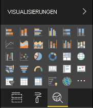

# <a name="the-analytics-pane-in-power-bi-visuals"></a>Der Bereich „Analyse“ in Power BI-Visuals

Der Bereich **Analyse** wurde im November 2018 für [native Visuals](https://docs.microsoft.com/power-bi/desktop-analytics-pane) eingeführt.
In diesem Artikel wird erläutert, wie Power BI-Visuals mithilfe von Version 2.5.0 der API ihre Eigenschaften im Bereich **Analyse** präsentieren und verwalten können.



## <a name="manage-the-analytics-pane"></a>Verwalten des Bereichs „Analyse“

Genauso wie Sie Eigenschaften im [Bereich **Format**](https://docs.microsoft.com/power-bi/developer/visuals/custom-visual-develop-tutorial-format-options) verwalten können, können Sie auch den Bereich **Analyse** verwalten, indem Sie ein Objekt in der Datei *capabilities.json* des Visuals definieren.

Es gelten die folgenden Unterschiede für den Bereich **Analyse**:

* Fügen Sie unter der Objektdefinition ein **objectCategory**-Feld mit dem Wert 2 hinzu.

    > [!NOTE]
    > Das optionale Feld `objectCategory` wurde im Rahmen der Version 2.5.0 der API eingeführt. Damit wird der Aspekt des Visuals definiert, der durch das Objekt gesteuert wird (1 = Formatierung, 2 = Analytics). `Formatting` wird für Elemente wie das Erscheinungsbild, Farben, Achsen und Bezeichnungen verwendet. `Analytics` wird für Elemente wie Vorhersagen, Trendlinien, Bezugslinien und Formen verwendet.
    >
    > Wenn der Wert nicht angegeben wird, hat `objectCategory` standardmäßig den Wert „Formatierung“.

* Das Objekt muss die beiden folgenden Eigenschaften aufweisen:
    * `show` vom Typ `bool` mit dem Standardwert `false`.
    * `displayName` vom Typ `text`. Der von Ihnen ausgewählte Standardwert wird zum ursprünglichen Anzeigenamen der Instanz.

```json
{
  "objects": {
    "YourAnalyticsPropertiesCard": {
      "displayName": "Your analytics properties card's name",
      "objectCategory": 2,
      "properties": {
        "show": {
          "type": {
            "bool": true
          }
        },
        "displayName": {
          "type": {
            "text": true
          }
        },
      ... //any other properties for your Analytics card
      }
    }
  ...
  }
}
```

Sie können andere Eigenschaften auf die gleiche Weise wie bei **Formatobjekten** definieren. Außerdem können Sie Objekte genauso wie im Bereich **Format** auflisten.

## <a name="known-limitations-and-issues-of-the-analytics-pane"></a>Bekannte Einschränkungen und Probleme des Bereichs „Analyse“

* Die Verwendung von mehreren Instanzen werden im Bereich **Analyse** noch nicht unterstützt. Objekte können nur den [Selektor](https://microsoft.github.io/PowerBI-visuals/docs/concepts/objects-and-properties/#selector) „static“ (d. h. Selektor: NULL) haben, und Power BI-Visuals können nicht mehrere benutzerdefinierte Instanzen einer Karte aufweisen.
* Eigenschaften des Typs `integer` werden nicht korrekt angezeigt. Verwenden Sie als Problemumgehung den Typ `numeric`.

> [!NOTE]
> * Verwenden Sie den Bereich **Analyse** nur für Objekte, durch die neue Informationen hinzugefügt bzw. die dargestellten Informationen in einem neuen Blickwickel betrachtet werden (z. B. dynamische Bezugslinien, die wichtige Trends darstellen).
> * Alle Optionen, die das Erscheinungsbild des Visuals bestimmen (d. h. Formatierungen), sollten auf den Bereich **Formatierung** beschränkt werden.
