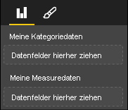

# <a name="capabilities-and-properties-of-power-bi-visuals"></a><span data-ttu-id="185b4-103">Funktionen und Eigenschaften von Power BI-Visuals</span><span class="sxs-lookup"><span data-stu-id="185b4-103">Capabilities and properties of Power BI visuals</span></span> 

<span data-ttu-id="185b4-104">Sie verwenden Funktionen, um dem Host Informationen zum Visual zur Verfügung zu stellen.</span><span class="sxs-lookup"><span data-stu-id="185b4-104">You use capabilities to provide information to the host about your visual.</span></span> <span data-ttu-id="185b4-105">Alle Eigenschaften im Funktionsmodell sind `optional`.</span><span class="sxs-lookup"><span data-stu-id="185b4-105">All properties on the capabilities model are `optional`.</span></span>

<span data-ttu-id="185b4-106">Die Stammobjekte einer Visualfunktion sind `dataRoles`, `dataViewMappings` usw.</span><span class="sxs-lookup"><span data-stu-id="185b4-106">The root objects of a visual's capabilities are `dataRoles`, `dataViewMappings`, and so on.</span></span>

```json
{
    "dataRoles": [ ... ],
    "dataViewMappings": [ ... ],
    "objects":  { ... },
    "supportsHighlight": true|false,
    "advancedEditModeSupport": 0|1|2,
    "sorting": { ... }
}

```

## <a name="define-the-data-fields-that-your-visual-expects-dataroles"></a><span data-ttu-id="185b4-107">Definieren der vom Visual erwarteten Datenfelder: dataRoles</span><span class="sxs-lookup"><span data-stu-id="185b4-107">Define the data fields that your visual expects: dataRoles</span></span>

<span data-ttu-id="185b4-108">Verwenden Sie `dataRoles` zum Definieren von Feldern, die an Daten gebunden werden können.</span><span class="sxs-lookup"><span data-stu-id="185b4-108">To define fields that can be bound to data, you use `dataRoles`.</span></span> <span data-ttu-id="185b4-109">`dataRoles` nimmt ein Array von `DataViewRole`-Objekten an, das alle erforderlichen Eigenschaften definiert.</span><span class="sxs-lookup"><span data-stu-id="185b4-109">`dataRoles` takes an array of `DataViewRole` objects, which defines all the required properties.</span></span>

### <a name="properties"></a><span data-ttu-id="185b4-110">Eigenschaften</span><span class="sxs-lookup"><span data-stu-id="185b4-110">Properties</span></span>

* <span data-ttu-id="185b4-111">**name**: Der interne Name dieses Datenfelds (muss eindeutig sein)</span><span class="sxs-lookup"><span data-stu-id="185b4-111">**name**: The internal name of this data field (must be unique).</span></span>
* <span data-ttu-id="185b4-112">**kind**: Die Art des Felds:</span><span class="sxs-lookup"><span data-stu-id="185b4-112">**kind**: The kind of field:</span></span>
    * <span data-ttu-id="185b4-113">`Grouping`: Diskrete Werte, die zum Gruppieren von Measurefeldern verwendet werden</span><span class="sxs-lookup"><span data-stu-id="185b4-113">`Grouping`: Discrete values that are used to group measure fields.</span></span>
    * <span data-ttu-id="185b4-114">`Measure`: Numerische Datenwerte</span><span class="sxs-lookup"><span data-stu-id="185b4-114">`Measure`: Numeric data values.</span></span>
    * <span data-ttu-id="185b4-115">`GroupingOrMeasure`: Werte, die als Gruppierung oder Measure verwendet werden können</span><span class="sxs-lookup"><span data-stu-id="185b4-115">`GroupingOrMeasure`: Values that can be used as either a grouping or a measure.</span></span>
* <span data-ttu-id="185b4-116">**displayName**: Der Name, den der Benutzer im Bereich **Eigenschaften** sieht.</span><span class="sxs-lookup"><span data-stu-id="185b4-116">**displayName**: The name displayed to the user in the **Properties** pane.</span></span>
* <span data-ttu-id="185b4-117">**description**: Eine kurze Beschreibung des Felds (optional)</span><span class="sxs-lookup"><span data-stu-id="185b4-117">**description**: A short description of the field (optional).</span></span>
* <span data-ttu-id="185b4-118">**requiredTypes**: Der für diese Datenrolle erforderliche Datentyp.</span><span class="sxs-lookup"><span data-stu-id="185b4-118">**requiredTypes**: The required type of data for this data role.</span></span> <span data-ttu-id="185b4-119">Werte, die nicht übereinstimmen, werden auf NULL festgelegt (optional)</span><span class="sxs-lookup"><span data-stu-id="185b4-119">Values that don't match are set to null (optional).</span></span>
* <span data-ttu-id="185b4-120">**preferredTypes**: Der bevorzugte Datentyp für diese Datenrolle (optional)</span><span class="sxs-lookup"><span data-stu-id="185b4-120">**preferredTypes**: The preferred type of data for this data role (optional).</span></span>

### <a name="valid-data-types-in-requiredtypes-and-preferredtypes"></a><span data-ttu-id="185b4-121">Gültige Datentypen in requiredTypes und preferredTypes</span><span class="sxs-lookup"><span data-stu-id="185b4-121">Valid data types in requiredTypes and preferredTypes</span></span>

* <span data-ttu-id="185b4-122">**bool**: Boolescher Wert</span><span class="sxs-lookup"><span data-stu-id="185b4-122">**bool**: A boolean value</span></span>
* <span data-ttu-id="185b4-123">**integer**: Ein Wert in Form einer ganzen Zahl</span><span class="sxs-lookup"><span data-stu-id="185b4-123">**integer**: An integer (whole number) value</span></span>
* <span data-ttu-id="185b4-124">**numeric**: Ein numerischer Wert</span><span class="sxs-lookup"><span data-stu-id="185b4-124">**numeric**: A numeric value</span></span>
* <span data-ttu-id="185b4-125">**text**: Ein Textwert</span><span class="sxs-lookup"><span data-stu-id="185b4-125">**text**: A text value</span></span>
* <span data-ttu-id="185b4-126">**geography**: Geografische Daten</span><span class="sxs-lookup"><span data-stu-id="185b4-126">**geography**: A geographic data</span></span>

### <a name="example"></a><span data-ttu-id="185b4-127">Beispiel</span><span class="sxs-lookup"><span data-stu-id="185b4-127">Example</span></span>

```json
"dataRoles": [
    {
        "displayName": "My Category Data",
        "name": "myCategory",
        "kind": "Grouping",
        "requiredTypes": [
            {
                "text": true
            },
            {
                "numeric": true
            },
            {
                "integer": true
            }
        ],
        "preferredTypes": [
            {
                "text": true
            }
        ]
    },
    {
        "displayName": "My Measure Data",
        "name": "myMeasure",
        "kind": "Measure",
        "requiredTypes": [
            {
                "integer": true
            },
            {
                "numeric": true
            }
        ],
        "preferredTypes": [
            {
                "integer": true
            }
        ]
    },
    {
        "displayNameKey": "Visual_Location",
        "name": "Locations",
        "kind": "Measure",
        "displayName": "Locations",
        "requiredTypes": [
            {
                "geography": {
                    "address": true
                }
            },
            {
                "geography": {
                    "city": true
                }
            },
            {
                "geography": {
                    "continent": true
                }
            },
            {
                "geography": {
                    "country": true
                }
            },
            {
                "geography": {
                    "county": true
                }
            },
            {
                "geography": {
                    "place": true
                }
            },
            {
                "geography": {
                    "postalCode": true
                }
            },
            {
                "geography": {
                    "region": true
                }
            },
            {
                "geography": {
                    "stateOrProvince": true
                }
            }
        ]
    }
]
```

<span data-ttu-id="185b4-128">Die vorangehenden Datenrollen erstellen die Felder, die in der folgenden Abbildung angezeigt werden:</span><span class="sxs-lookup"><span data-stu-id="185b4-128">The preceding data roles would create the fields that are displayed in the following image:</span></span>



## <a name="define-how-you-want-the-data-mapped-dataviewmappings"></a><span data-ttu-id="185b4-130">Definieren, wie die Daten zugeordnet werden sollen: dataViewMappings</span><span class="sxs-lookup"><span data-stu-id="185b4-130">Define how you want the data mapped: dataViewMappings</span></span>

<span data-ttu-id="185b4-131">Die Eigenschaft „DataViewMapping“ beschreibt die Beziehung zwischen den Datenrollen und ermöglicht es Ihnen, bedingte Anforderungen dafür festzulegen.</span><span class="sxs-lookup"><span data-stu-id="185b4-131">A DataViewMappings property describes how the data roles relate to each other and allows you to specify conditional requirements for the them.</span></span>

<span data-ttu-id="185b4-132">Die meisten Visuals verfügen über eine einzelne Zuordnung. Sie können aber auch mehrere dataViewMappings angeben.</span><span class="sxs-lookup"><span data-stu-id="185b4-132">Most visuals provide a single mapping, but you can provide multiple dataViewMappings.</span></span> <span data-ttu-id="185b4-133">Jede gültige Zuordnung erzeugt eine Datenansicht.</span><span class="sxs-lookup"><span data-stu-id="185b4-133">Each valid mapping produces a data view.</span></span> 

```json
"dataViewMappings": [
    {
        "conditions": [ ... ],
        "categorical": { ... },
        "table": { ... },
        "single": { ... },
        "matrix": { ... }
    }
]
```

<span data-ttu-id="185b4-134">Weitere Informationen finden Sie unter [Grundlegendes zur Zuordnung von Datenansichten in Power BI-Visuals](dataview-mappings.md).</span><span class="sxs-lookup"><span data-stu-id="185b4-134">For more information, see [Understand data view mapping in Power BI visuals](dataview-mappings.md).</span></span>

## <a name="define-property-pane-options-objects"></a><span data-ttu-id="185b4-135">Definieren von Optionen für den Eigenschaftenbereich: Objekte</span><span class="sxs-lookup"><span data-stu-id="185b4-135">Define property pane options: objects</span></span>

<span data-ttu-id="185b4-136">Objekte beschreiben anpassbare Eigenschaften, die dem Visual zugeordnet sind.</span><span class="sxs-lookup"><span data-stu-id="185b4-136">Objects describe customizable properties that are associated with the visual.</span></span> <span data-ttu-id="185b4-137">Jedes Objekt kann über mehrere Eigenschaften verfügen, und jeder Eigenschaft ist ein Typ zugeordnet.</span><span class="sxs-lookup"><span data-stu-id="185b4-137">Each object can have multiple properties, and each property has a type that's associated with it.</span></span> <span data-ttu-id="185b4-138">Mit Typen wird die Eigenschaft näher bestimmt.</span><span class="sxs-lookup"><span data-stu-id="185b4-138">Types refer to what the property will be.</span></span> 

```json
"objects": {
    "myCustomObject": {
        "displayName": "My Object Name",
        "properties": { ... }
    }
}
```

<span data-ttu-id="185b4-139">Weitere Informationen finden Sie unter [Objekte und Eigenschaften von Power BI-Visuals](objects-properties.md).</span><span class="sxs-lookup"><span data-stu-id="185b4-139">For more information, see [Objects and properties of Power BI visuals](objects-properties.md).</span></span>

## <a name="handle-partial-highlighting-supportshighlight"></a><span data-ttu-id="185b4-140">Behandeln teilweiser Hervorhebungen: supportsHighlight</span><span class="sxs-lookup"><span data-stu-id="185b4-140">Handle partial highlighting: supportsHighlight</span></span>

<span data-ttu-id="185b4-141">Standardmäßig ist dieser Wert auf `false` festgelegt. Dies bedeutet, dass Ihre Werte automatisch gefiltert werden, wenn etwas auf der Seite ausgewählt ist.</span><span class="sxs-lookup"><span data-stu-id="185b4-141">By default, this value is set to `false`, which means that your values are automatically filtered when something on the page is selected.</span></span> <span data-ttu-id="185b4-142">Diese automatische Filterung aktualisiert wiederum Ihr Visual, sodass nur der ausgewählte Wert angezeigt wird.</span><span class="sxs-lookup"><span data-stu-id="185b4-142">This automatic filtering in turn updates your visual to display only the selected value.</span></span> <span data-ttu-id="185b4-143">Wenn Sie die vollständigen Daten anzeigen möchten, aber nur die ausgewählten Elemente hervorheben, müssen Sie `supportsHighlight` in der *capabilities.json*-Datei auf `true` festlegen.</span><span class="sxs-lookup"><span data-stu-id="185b4-143">If you want to display the full data but highlight only the selected items, you need to set `supportsHighlight` to `true` in your *capabilities.json* file.</span></span>

<span data-ttu-id="185b4-144">Weitere Informationen finden Sie unter [Hervorheben von Datenpunkten in Power BI-Visuals](highlight.md).</span><span class="sxs-lookup"><span data-stu-id="185b4-144">For more information, see [Highlight data points in Power BI visuals](highlight.md).</span></span>

## <a name="handle-advanced-edit-mode-advancededitmodesupport"></a><span data-ttu-id="185b4-145">Behandeln des erweiterten Bearbeitungsmodus: advancedEditModeSupport</span><span class="sxs-lookup"><span data-stu-id="185b4-145">Handle advanced edit mode: advancedEditModeSupport</span></span>

<span data-ttu-id="185b4-146">Für ein Visual kann deklariert werden, dass es den Modus „Erweiterte Bearbeitung“ unterstützt.</span><span class="sxs-lookup"><span data-stu-id="185b4-146">A visual can declare its support of advanced edit mode.</span></span> <span data-ttu-id="185b4-147">Ein Visual bietet standardmäßig keine Unterstützung für den Modus „Erweiterte Bearbeitung“, es sei denn, dies wurde explizit in der *capabilities.json*-Datei angegeben.</span><span class="sxs-lookup"><span data-stu-id="185b4-147">By default, a visual doesn't support advanced edit mode, unless stated otherwise in the *capabilities.json* file.</span></span>

<span data-ttu-id="185b4-148">Weitere Informationen erhalten Sie unter [Modus „Erweiterte Bearbeitung“ in Power BI-Visuals](advanced-edit-mode.md).</span><span class="sxs-lookup"><span data-stu-id="185b4-148">For more information, see [Advanced edit mode in Power BI visuals](advanced-edit-mode.md).</span></span>

## <a name="data-sorting-options-for-visual-sorting"></a><span data-ttu-id="185b4-149">Datensortieroptionen für Visuals: Sortierung</span><span class="sxs-lookup"><span data-stu-id="185b4-149">Data sorting options for visual: sorting</span></span>

<span data-ttu-id="185b4-150">Das Sortierverhalten eines Visuals kann in dessen Funktionen definiert werden.</span><span class="sxs-lookup"><span data-stu-id="185b4-150">A visual can define its sorting behavior via its capabilities.</span></span> <span data-ttu-id="185b4-151">Die Änderung der Sortierreihenfolge wird von einem Visual standardmäßig nicht unterstützt, es sei denn, dies wurde explizit in der *capabilities.json*-Datei angegeben.</span><span class="sxs-lookup"><span data-stu-id="185b4-151">By default, a visual doesn't support modifying its sorting order, unless stated otherwise in the *capabilities.json* file.</span></span>

<span data-ttu-id="185b4-152">Weitere Informationen finden Sie unter [Sortieroptionen für Power BI-Visuals](sort-options.md).</span><span class="sxs-lookup"><span data-stu-id="185b4-152">For more information, see [Sorting options for Power BI visuals](sort-options.md).</span></span>
