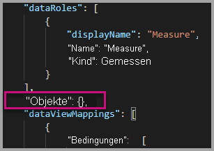
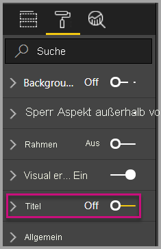
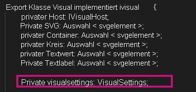
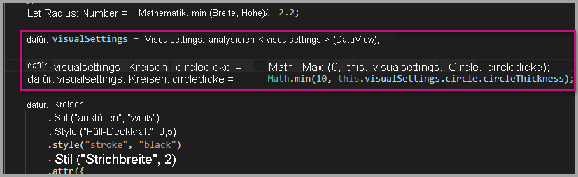
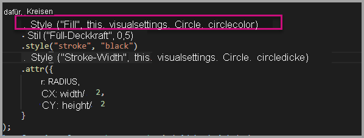
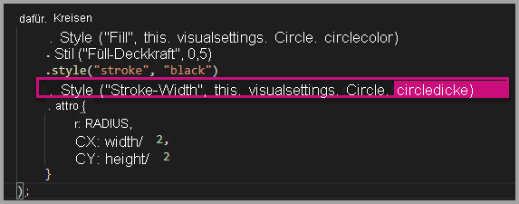
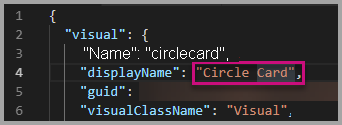
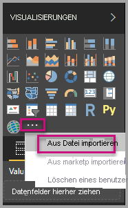

# <a name="tutorial-adding-formatting-options-to-a-power-bi-visual"></a><span data-ttu-id="8b126-103">Tutorial: Hinzufügen von Formatierungsoptionen zu einem Power BI visuellen Element</span><span class="sxs-lookup"><span data-stu-id="8b126-103">Tutorial: Adding formatting options to a Power BI visual</span></span>

<span data-ttu-id="8b126-104">Dieses Tutorial erläutert die genaue Vorgehensweise beim Hinzufügen allgemeiner Eigenschaften zu einem Visual.</span><span class="sxs-lookup"><span data-stu-id="8b126-104">In this tutorial, we go through how to add common properties to the visual.</span></span>

<span data-ttu-id="8b126-105">In diesem Tutorial erhalten Sie Informationen zu den folgenden Vorgängen:</span><span class="sxs-lookup"><span data-stu-id="8b126-105">In this tutorial, you learn how to:</span></span>
> [!div class="checklist"]
> * <span data-ttu-id="8b126-106">Hinzufügen von Visualeigenschaften</span><span class="sxs-lookup"><span data-stu-id="8b126-106">Add visual properties.</span></span>
> * <span data-ttu-id="8b126-107">Verpacken von Visuals</span><span class="sxs-lookup"><span data-stu-id="8b126-107">Package the visual.</span></span>
> * <span data-ttu-id="8b126-108">Importieren des benutzerdefinierten Visuals in einen Power BI Desktop-Bericht</span><span class="sxs-lookup"><span data-stu-id="8b126-108">Import the custom visual to a Power BI Desktop report.</span></span>

## <a name="adding-formatting-options"></a><span data-ttu-id="8b126-109">Hinzufügen von Formatierungsoptionen</span><span class="sxs-lookup"><span data-stu-id="8b126-109">Adding formatting options</span></span>

1. <span data-ttu-id="8b126-110">Wählen Sie in **Power BI** die **Seite zum Formatieren** aus.</span><span class="sxs-lookup"><span data-stu-id="8b126-110">In **Power BI**, select the **Format page**.</span></span>

    <span data-ttu-id="8b126-111">Daraufhin wird diese Meldung angezeigt: *Für diese Darstellung stehen keine Formatierungsoptionen zur Verfügung.*</span><span class="sxs-lookup"><span data-stu-id="8b126-111">You should see a message that reads - *Formatting options are unavailable for this visual.*</span></span>

    

2. <span data-ttu-id="8b126-113">Öffnen Sie in **Visual Studio Code** die Datei *capabilities.json*.</span><span class="sxs-lookup"><span data-stu-id="8b126-113">In **Visual Studio Code**, open the *capabilities.json* file.</span></span>

3. <span data-ttu-id="8b126-114">Fügen Sie vor dem Array **dataViewMappings** **objects** hinzu (nach Zeile 8).</span><span class="sxs-lookup"><span data-stu-id="8b126-114">Before the **dataViewMappings** array, add **objects** (after line 8).</span></span>

    ```json
    "objects": {},
    ```

    

4. <span data-ttu-id="8b126-116">Speichern Sie die Datei **capabilities.json**.</span><span class="sxs-lookup"><span data-stu-id="8b126-116">Save the **capabilities.json** file.</span></span>

5. <span data-ttu-id="8b126-117">Überprüfen Sie in **Power BI** die Formatierungsoptionen noch einmal.</span><span class="sxs-lookup"><span data-stu-id="8b126-117">In **Power BI**, review the formatting options again.</span></span>

    > [!Note]
    > <span data-ttu-id="8b126-118">Wenn die Formatierungsoptionen nicht geändert werden, wählen Sie **Benutzerdefiniertes Visual erneut laden** aus.</span><span class="sxs-lookup"><span data-stu-id="8b126-118">If you do not see the formatting options change then select **Reload Custom Visual**.</span></span>

    

6. <span data-ttu-id="8b126-120">Legen Sie die Option **Titel** auf *Aus* fest.</span><span class="sxs-lookup"><span data-stu-id="8b126-120">Set the **Title** option to *Off*.</span></span> <span data-ttu-id="8b126-121">Das Visual zeigt den Measurenamen nicht mehr links oben an.</span><span class="sxs-lookup"><span data-stu-id="8b126-121">Notice that the visual no longer displays the measure name at the top-left corner.</span></span>

    

    

### <a name="adding-custom-formatting-options"></a><span data-ttu-id="8b126-124">Hinzufügen von benutzerdefinierten Formatierungsoptionen</span><span class="sxs-lookup"><span data-stu-id="8b126-124">Adding custom formatting options</span></span>

<span data-ttu-id="8b126-125">Sie können benutzerdefinierte Eigenschaften hinzufügen, um die Farbe des Kreises und auch die Rahmenbreite zu konfigurieren.</span><span class="sxs-lookup"><span data-stu-id="8b126-125">You can add custom properties to enable configuring the color of the circle, and also the border width.</span></span>

1. <span data-ttu-id="8b126-126">Beenden Sie das benutzerdefinierte Visual in PowerShell.</span><span class="sxs-lookup"><span data-stu-id="8b126-126">In PowerShell, stop the custom visual.</span></span>

2. <span data-ttu-id="8b126-127">Fügen Sie in Visual Studio Code in der Datei **capabilities.json** das folgende JSON-Fragment in das Objekt mit der Bezeichnung **objects** ein.</span><span class="sxs-lookup"><span data-stu-id="8b126-127">In Visual Studio Code, in the **capabilities.json** file, insert the following JSON fragment into the object labeled **objects**.</span></span>

    ```json
    "circle": {
     "displayName": "Circle",
     "properties": {
         "circleColor": {
             "displayName": "Color",
             "description": "The fill color of the circle.",
             "type": {
                 "fill": {
                     "solid": {
                         "color": true
                     }
                 }
             }
         },
         "circleThickness": {
             "displayName": "Thickness",
             "description": "The circle thickness.",
             "type": {
                 "numeric": true
                 }
             }
         }
     },
    ```

    <span data-ttu-id="8b126-128">Das JSON-Fragment beschreibt eine Gruppe namens „circle“ (Kreis), die aus zwei Optionen besteht: „circleColor“ und „circleThickness“.</span><span class="sxs-lookup"><span data-stu-id="8b126-128">The JSON fragment describes a group named circle, which consists of two options named circleColor and circleThickness.</span></span>

   

3. <span data-ttu-id="8b126-130">Speichern Sie die Datei **capabilities.json**.</span><span class="sxs-lookup"><span data-stu-id="8b126-130">Save the **capabilities.json** file.</span></span>

4. <span data-ttu-id="8b126-131">Wählen Sie im Bereich **Explorer** im Ordner **src** **settings.ts** aus.</span><span class="sxs-lookup"><span data-stu-id="8b126-131">In the **Explorer pane**, from inside the **src** folder, and then select **settings.ts**.</span></span> <span data-ttu-id="8b126-132">*Diese Datei enthält die Einstellungen für das erste Visual.*</span><span class="sxs-lookup"><span data-stu-id="8b126-132">*This file represents the settings for the starter visual*.</span></span>

5. <span data-ttu-id="8b126-133">Ersetzen Sie in der Datei **settings.ts** die beiden Klassen durch den folgenden Code.</span><span class="sxs-lookup"><span data-stu-id="8b126-133">In the **settings.ts** file, replace the two classes with the following code.</span></span>

    ```typescript
    export class CircleSettings {
        public circleColor: string = "white";
        public circleThickness: number = 2;
    }
    export class VisualSettings extends DataViewObjectsParser {
        public circle: CircleSettings = new CircleSettings();
    }
    ```

    

    <span data-ttu-id="8b126-135">Dieses Modul definiert die beiden Klassen.</span><span class="sxs-lookup"><span data-stu-id="8b126-135">This module defines the two classes.</span></span> <span data-ttu-id="8b126-136">Die Klasse **CircleSettings** definiert zwei Eigenschaften mit Namen, die mit den in der Datei **capabilities.json** (**circleColor** und **circleThickness**) definierten Objekten übereinstimmen, und legt außerdem die Standardwerte fest.</span><span class="sxs-lookup"><span data-stu-id="8b126-136">The **CircleSettings** class defines two properties with names that match the objects defined in the **capabilities.json** file (**circleColor** and **circleThickness**) and also sets default values.</span></span> <span data-ttu-id="8b126-137">Die Klasse **VisualSettings** erbt die Klasse **DataViewObjectParser** und fügt eine Eigenschaft namens **circle** hinzu, die dem in der Datei *capabilities.json* definierten Objekt entspricht, und gibt eine Instanz von **CircleSettings** zurück.</span><span class="sxs-lookup"><span data-stu-id="8b126-137">The **VisualSettings** class inherits the **DataViewObjectParser** class and adds a property named **circle**, which matches the object defined in the *capabilities.json* file, and returns an instance of **CircleSettings**.</span></span>

6. <span data-ttu-id="8b126-138">Speichern Sie die Datei **settings.ts**.</span><span class="sxs-lookup"><span data-stu-id="8b126-138">Save the **settings.ts** file.</span></span>

7. <span data-ttu-id="8b126-139">Öffnen Sie die Datei **visual.ts**.</span><span class="sxs-lookup"><span data-stu-id="8b126-139">Open the **visual.ts** file.</span></span>

8. <span data-ttu-id="8b126-140">Importieren Sie in der Datei **visual.ts**</span><span class="sxs-lookup"><span data-stu-id="8b126-140">In the **visual.ts** file,</span></span>

    <span data-ttu-id="8b126-141">die `VisualSettings`-Klasse,</span><span class="sxs-lookup"><span data-stu-id="8b126-141">import `VisualSettings` class</span></span>

    ```typescript
    import { VisualSettings } from "./settings";
    ```

    <span data-ttu-id="8b126-142">und fügen Sie in der Klasse **Visual** die folgende Eigenschaft hinzu:</span><span class="sxs-lookup"><span data-stu-id="8b126-142">and in the **Visual** class add the following property:</span></span>

    ```typescript
    private visualSettings: VisualSettings;
    ```

    <span data-ttu-id="8b126-143">Diese Eigenschaft speichert einen Verweis auf das Objekt **VisualSettings**, das die Einstellungen des Visuals beschreibt.</span><span class="sxs-lookup"><span data-stu-id="8b126-143">This property stores a reference to the **VisualSettings** object, describing the visual settings.</span></span>

    

9. <span data-ttu-id="8b126-145">Fügen Sie in der Klasse **Visual** die folgende Methode vor der Methode **update** hinzu.</span><span class="sxs-lookup"><span data-stu-id="8b126-145">In the **Visual** class, add the following method before the **update** method.</span></span> <span data-ttu-id="8b126-146">Mit dieser Methode werden die Formatierungsoptionen aufgefüllt.</span><span class="sxs-lookup"><span data-stu-id="8b126-146">This method is used to populate the formatting options.</span></span>

    ```typescript
    public enumerateObjectInstances(options: EnumerateVisualObjectInstancesOptions): VisualObjectInstanceEnumeration {
        const settings: VisualSettings = this.visualSettings || <VisualSettings>VisualSettings.getDefault();
        return VisualSettings.enumerateObjectInstances(settings, options);
    }
    ```

    <span data-ttu-id="8b126-147">Mit dieser Methode werden die Formatierungsoptionen aufgefüllt.</span><span class="sxs-lookup"><span data-stu-id="8b126-147">This method is used to populate the formatting options.</span></span>

    

10. <span data-ttu-id="8b126-149">Fügen Sie in der Methode **update** nach der Deklaration der Variablen **radius** den folgenden Code hinzu.</span><span class="sxs-lookup"><span data-stu-id="8b126-149">In the **update** method, after the declaration of the **radius** variable, add the following code.</span></span>

    ```typescript
    this.visualSettings = VisualSettings.parse<VisualSettings>(dataView);

    this.visualSettings.circle.circleThickness = Math.max(0, this.visualSettings.circle.circleThickness);
    this.visualSettings.circle.circleThickness = Math.min(10, this.visualSettings.circle.circleThickness);
    ```

    <span data-ttu-id="8b126-150">Dieser Code ruft die Formatierungsoptionen ab.</span><span class="sxs-lookup"><span data-stu-id="8b126-150">This code retrieves the format options.</span></span> <span data-ttu-id="8b126-151">Er passt jeden Wert an, der an die **circleThickness**-Eigenschaft übergeben wird, und wandelt ihn in „0“ um, wenn er negativ ist, bzw. in „10“, wenn er größer als 10 ist.</span><span class="sxs-lookup"><span data-stu-id="8b126-151">It adjusts any value passed into the **circleThickness** property, converting it to 0 if negative, or 10 if it's a value greater than 10.</span></span>

    

11. <span data-ttu-id="8b126-153">Ändern Sie für das **Kreiselement** den an das **Füllformat** übergebenen Wert in den folgenden Ausdruck.</span><span class="sxs-lookup"><span data-stu-id="8b126-153">For the **circle element**, modify the value passed to the **fill style** to the following expression.</span></span>

    ```typescript
    this.visualSettings.circle.circleColor
    ```

    

12. <span data-ttu-id="8b126-155">Ändern Sie für das **Kreiselement** den an die **Strichstärke** übergebenen Wert in den folgenden Ausdruck.</span><span class="sxs-lookup"><span data-stu-id="8b126-155">For the **circle element**, modify the value passed to the **stroke-width style** to the following expression.</span></span>

    ```typescript
    this.visualSettings.circle.circleThickness
    ```

    

13. <span data-ttu-id="8b126-157">Speichern Sie die „visual.ts“-Datei.</span><span class="sxs-lookup"><span data-stu-id="8b126-157">Save the visual.ts file.</span></span>

14. <span data-ttu-id="8b126-158">Starten Sie das Visual in PowerShell.</span><span class="sxs-lookup"><span data-stu-id="8b126-158">In PowerShell, start the visual.</span></span>

    ```powershell
    pbiviz start
    ```

15. <span data-ttu-id="8b126-159">Wählen Sie in **Power BI** in der Symbolleiste über dem Visual **Automatisches erneutes Laden aktivieren/deaktivieren** aus.</span><span class="sxs-lookup"><span data-stu-id="8b126-159">In **Power BI**, in the toolbar floating above the visual, select **Toggle Auto Reload**.</span></span>

16. <span data-ttu-id="8b126-160">Erweitern Sie in den Optionen für die **Visualformatierung** die Option **Kreis**.</span><span class="sxs-lookup"><span data-stu-id="8b126-160">In the **visual format** options, expand **Circle**.</span></span>

    

    <span data-ttu-id="8b126-162">Ändern Sie die Optionen **Farbe** und **Stärke**.</span><span class="sxs-lookup"><span data-stu-id="8b126-162">Modify the **color** and **thickness** option.</span></span>

    <span data-ttu-id="8b126-163">Ändern Sie die Option **Stärke** in einen Wert kleiner als 0 und einen Wert größer als 10.</span><span class="sxs-lookup"><span data-stu-id="8b126-163">Modify the **thickness** option to a value less than zero, and a value higher than 10.</span></span> <span data-ttu-id="8b126-164">Daraufhin können Sie sehen, dass das Visual den Wert auf ein tolerierbares Minimum oder Maximum aktualisiert.</span><span class="sxs-lookup"><span data-stu-id="8b126-164">Then notice the visual updates the value to a tolerable minimum or maximum.</span></span>

## <a name="packaging-the-custom-visual"></a><span data-ttu-id="8b126-165">Verpacken des benutzerdefinierten Visuals</span><span class="sxs-lookup"><span data-stu-id="8b126-165">Packaging the custom visual</span></span>

<span data-ttu-id="8b126-166">Geben Sie Eigenschaftswerte für das benutzerdefinierte Visual ein, aktualisieren Sie die Symboldatei, und verpacken Sie das benutzerdefinierte Visual.</span><span class="sxs-lookup"><span data-stu-id="8b126-166">Enter property values for the custom visual project, update the icon file, and then package the custom visual.</span></span>

1. <span data-ttu-id="8b126-167">Beenden Sie das benutzerdefinierte Visual in **PowerShell**.</span><span class="sxs-lookup"><span data-stu-id="8b126-167">In **PowerShell**, stop the custom visual.</span></span>

2. <span data-ttu-id="8b126-168">Öffnen Sie die Datei **pbiviz.json** in **Visual Studio Code**.</span><span class="sxs-lookup"><span data-stu-id="8b126-168">Open the **pbiviz.json** file in **Visual Studio Code**.</span></span>

3. <span data-ttu-id="8b126-169">Ändern Sie im Objekt **visual** die Eigenschaft **displayName** in *Circle Card*.</span><span class="sxs-lookup"><span data-stu-id="8b126-169">In the **visual** object, modify the **displayName** property to *Circle Card*.</span></span>

    <span data-ttu-id="8b126-170">Wenn Sie im Bereich **Visualisierungen** mit der Maus auf das Symbol zeigen, erscheint der Anzeigename.</span><span class="sxs-lookup"><span data-stu-id="8b126-170">In the **Visualizations** pane, hovering over the icon reveals the display name.</span></span>

    

4. <span data-ttu-id="8b126-172">Geben Sie für die Eigenschaft **description** den folgenden Text ein.</span><span class="sxs-lookup"><span data-stu-id="8b126-172">For the **description** property, enter the following text.</span></span>

    <span data-ttu-id="8b126-173">*Zeigt einen formatierten Measurewert in einem Kreis an.*</span><span class="sxs-lookup"><span data-stu-id="8b126-173">*Displays a formatted measure value inside a circle*</span></span>

5. <span data-ttu-id="8b126-174">Optional können Sie im Objekt **author** Ihre Angaben eingeben.</span><span class="sxs-lookup"><span data-stu-id="8b126-174">Optionally, in the **author** object, enter your details.</span></span>

6. <span data-ttu-id="8b126-175">Speichern Sie die Datei **pbiviz.json**.</span><span class="sxs-lookup"><span data-stu-id="8b126-175">Save the **pbiviz.json** file.</span></span>

7. <span data-ttu-id="8b126-176">Achten Sie im Objekt **assets** darauf, dass das Dokument einen Pfad zu einem Symbol definiert.</span><span class="sxs-lookup"><span data-stu-id="8b126-176">In the **assets** object, notice that the document defines a path to an icon.</span></span> <span data-ttu-id="8b126-177">Das Symbol ist das Bild, das im Bereich **_Visualisierungen_** angezeigt wird.</span><span class="sxs-lookup"><span data-stu-id="8b126-177">The icon is the image that appears in the **_Visualizations_** pane.</span></span> <span data-ttu-id="8b126-178">Es muss eine **PNG**-Datei mit den Maßen *20 Pixel x 20 Pixel* sein.</span><span class="sxs-lookup"><span data-stu-id="8b126-178">It must be a **PNG** file, *20 pixels by 20 pixels*.</span></span>

8. <span data-ttu-id="8b126-179">Kopieren Sie im Windows-Explorer die Datei „icon.png“, und fügen Sie sie ein, um die Standarddatei im Ordner „assets“ zu ersetzen.</span><span class="sxs-lookup"><span data-stu-id="8b126-179">In Windows Explorer, copy the icon.png file, and then paste it to replace the default file located at assets folder.</span></span>

9. <span data-ttu-id="8b126-180">Erweitern Sie in Visual Studio Code im Bereich „Explorer“ den Ordner „assets“, und wählen Sie dann die Datei „icon.png“ aus.</span><span class="sxs-lookup"><span data-stu-id="8b126-180">In Visual Studio Code, in the Explorer pane, expand the assets folder, and then select the icon.png file.</span></span>

10. <span data-ttu-id="8b126-181">Überprüfen Sie das Symbol.</span><span class="sxs-lookup"><span data-stu-id="8b126-181">Review the icon.</span></span>

    

11. <span data-ttu-id="8b126-183">Überprüfen Sie in Visual Studio Code, ob alle Dateien gespeichert sind.</span><span class="sxs-lookup"><span data-stu-id="8b126-183">In Visual Studio Code, ensure that all files are saved.</span></span>

12. <span data-ttu-id="8b126-184">Geben Sie in PowerShell den folgenden Befehl ein, um das benutzerdefinierte Visual zu verpacken.</span><span class="sxs-lookup"><span data-stu-id="8b126-184">To package the custom visual, in PowerShell, enter the following command.</span></span>

    ```powershell
    pbiviz package
    ```

    

<span data-ttu-id="8b126-186">Nun wird das Paket in den Projektordner **dist** ausgegeben.</span><span class="sxs-lookup"><span data-stu-id="8b126-186">Now the package is output to the **dist** folder of the project.</span></span> <span data-ttu-id="8b126-187">Das Paket erfüllt alle Voraussetzungen, damit das benutzerdefinierte Visual in den Power BI-Dienst oder in einen Power BI Desktop-Bericht importiert werden kann.</span><span class="sxs-lookup"><span data-stu-id="8b126-187">The package contains everything required to import the custom visual into either the Power BI service or a Power BI Desktop report.</span></span> <span data-ttu-id="8b126-188">Sie haben das benutzerdefinierte Visual verpackt, und nun kann es verwendet werden.</span><span class="sxs-lookup"><span data-stu-id="8b126-188">You have now packaged the custom visual, and it is now ready for use.</span></span>

## <a name="importing-the-custom-visual"></a><span data-ttu-id="8b126-189">Importieren des benutzerdefinierten Visuals</span><span class="sxs-lookup"><span data-stu-id="8b126-189">Importing the custom visual</span></span>

<span data-ttu-id="8b126-190">Jetzt können Sie den Power BI Desktop-Bericht öffnen und das benutzerdefinierte Visual „Circle Card“ importieren.</span><span class="sxs-lookup"><span data-stu-id="8b126-190">Now you can open the Power BI Desktop report, and import the Circle Card custom visual.</span></span>

1. <span data-ttu-id="8b126-191">Öffnen Sie **Power BI Desktop**, und erstellen Sie einen neuen Bericht mit einem beliebigen *Beispieldataset*.</span><span class="sxs-lookup"><span data-stu-id="8b126-191">Open **Power BI Desktop**, create a new report with any *sample dataset*</span></span>

2. <span data-ttu-id="8b126-192">Wählen Sie im Bereich **_Visualisierungen_** die **Auslassungspunkte** und dann **Aus Datei importieren** aus.</span><span class="sxs-lookup"><span data-stu-id="8b126-192">In the **_Visualizations_** pane, select the **ellipsis**, and then select **Import** from File.</span></span>

    

3. <span data-ttu-id="8b126-194">Wählen Sie im **Importfenster** **Importieren** aus.</span><span class="sxs-lookup"><span data-stu-id="8b126-194">In the **import window**, select **Import**.</span></span>

4. <span data-ttu-id="8b126-195">Navigieren Sie im Fenster „Öffnen“ zum Ordner **dist** in Ihrem Projektverzeichnis.</span><span class="sxs-lookup"><span data-stu-id="8b126-195">In the Open window, navigate to the **dist** folder in your project directory.</span></span>

5. <span data-ttu-id="8b126-196">Wählen Sie die Datei **circleCard.pbiviz** und dann **Öffnen** aus.</span><span class="sxs-lookup"><span data-stu-id="8b126-196">Select the **circleCard.pbiviz** file, and then select **Open**.</span></span>

6. <span data-ttu-id="8b126-197">Wenn das Visual erfolgreich importiert wurde, wählen Sie **OK** aus.</span><span class="sxs-lookup"><span data-stu-id="8b126-197">When the visual has successfully imported, select **OK**.</span></span>

7. <span data-ttu-id="8b126-198">Überprüfen Sie, ob das Visual dem Bereich **_Visualisierungen_** hinzugefügt wurde.</span><span class="sxs-lookup"><span data-stu-id="8b126-198">Verify that the visual has been added to the **_Visualizations_** pane.</span></span>

    

8. <span data-ttu-id="8b126-200">Zeigen Sie mit der Maus auf das Symbol **Circle Card**. Dabei wir eine QuickInfo angezeigt.</span><span class="sxs-lookup"><span data-stu-id="8b126-200">Hover over the **Circle Card** icon, and notice the tooltip that appears.</span></span>

## <a name="debugging"></a><span data-ttu-id="8b126-201">Debuggen</span><span class="sxs-lookup"><span data-stu-id="8b126-201">Debugging</span></span>

<span data-ttu-id="8b126-202">Tipps zum Debuggen von benutzerdefinierten Visualisierungen finden Sie im [Debug-Handbuch](https://microsoft.github.io/PowerBI-visuals/docs/how-to-guide/how-to-debug/).</span><span class="sxs-lookup"><span data-stu-id="8b126-202">For tips about debugging your custom visual, see the [debugging guide](https://microsoft.github.io/PowerBI-visuals/docs/how-to-guide/how-to-debug/).</span></span>

## <a name="next-steps"></a><span data-ttu-id="8b126-203">Nächste Schritte</span><span class="sxs-lookup"><span data-stu-id="8b126-203">Next steps</span></span>

<span data-ttu-id="8b126-204">Sie können Ihr neu entwickeltes Visual auflisten, sodass andere Personen dieses verwenden können, indem Sie es zu **AppSource** übermitteln.</span><span class="sxs-lookup"><span data-stu-id="8b126-204">You can list your newly developed visual for others to use by submitting it to the **AppSource**.</span></span> <span data-ttu-id="8b126-205">Weitere Informationen zu diesem Vorgang finden Sie im Artikel zum [Veröffentlichen benutzerdefinierter Visuals in AppSource](../office-store.md).</span><span class="sxs-lookup"><span data-stu-id="8b126-205">For more information on this process reference [Publish custom visuals to AppSource](../office-store.md).</span></span>
