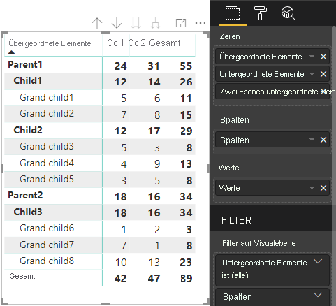

# <a name="understand-data-view-mapping-in-power-bi-visuals"></a><span data-ttu-id="814e4-103">Grundlegendes zur Zuordnung von Datenansichten in Power BI-Visuals</span><span class="sxs-lookup"><span data-stu-id="814e4-103">Understand data view mapping in Power BI visuals</span></span>

<span data-ttu-id="814e4-104">In diesem Artikel wird erläutert, wie Datenansichten zugeordnet werden. Außerdem wird beschrieben, wie Datenrollen zusammenhängen und wie Sie für sie Bedingungen festlegen.</span><span class="sxs-lookup"><span data-stu-id="814e4-104">This article discusses data view mapping and describes how data roles relate to each other and allow you to specify conditional requirements for them.</span></span> <span data-ttu-id="814e4-105">Darüber hinaus werden die einzelnen `dataMappings`-Typen behandelt.</span><span class="sxs-lookup"><span data-stu-id="814e4-105">The article also describes each `dataMappings` type.</span></span>

<span data-ttu-id="814e4-106">Jede gültige Zuordnung erzeugt eine Datenansicht. Aktuell wird jedoch nur eine Abfrage pro Visual unterstützt.</span><span class="sxs-lookup"><span data-stu-id="814e4-106">Each valid mapping produces a data view, but we currently support performing only one query per visual.</span></span> <span data-ttu-id="814e4-107">Üblicherweise ist daher nur eine Datensicht verfügbar.</span><span class="sxs-lookup"><span data-stu-id="814e4-107">You ordinarily get only one data view.</span></span> <span data-ttu-id="814e4-108">Sie können allerdings mehrere Datenzuordnungen mit unterschiedlichen Bedingungen bereitstellen, die folgende Möglichkeiten bieten:</span><span class="sxs-lookup"><span data-stu-id="814e4-108">However, you can provide multiple data mappings in certain conditions, which allow:</span></span>

```json
"dataViewMappings": [
    {
        "conditions": [ ... ],
        "categorical": { ... },
        "single": { ... },
        "table": { ... },
        "matrix": { ... }
    }
]
```

<span data-ttu-id="814e4-109">Power BI erstellt nur dann eine Zuordnung zu einer Datenansicht, wenn die gültige Zuordnung in `dataViewMappings` angegeben ist.</span><span class="sxs-lookup"><span data-stu-id="814e4-109">Power BI creates a mapping to a data view if and only if the valid mapping is filled in `dataViewMappings`.</span></span>

<span data-ttu-id="814e4-110">Anders ausgedrückt: `categorical` kann in `dataViewMappings` definiert werden, andere Zuordnungen wie `table` oder `single` jedoch möglicherweise nicht.</span><span class="sxs-lookup"><span data-stu-id="814e4-110">In other words, `categorical` might be defined in `dataViewMappings` but other mappings, such as `table` or `single`, might not be.</span></span> <span data-ttu-id="814e4-111">Beispiel:</span><span class="sxs-lookup"><span data-stu-id="814e4-111">For example:</span></span>

```json
"dataViewMappings": [
    {
        "categorical": { ... }
    }
]
```

<span data-ttu-id="814e4-112">Power BI erzeugt eine Datenansicht mit einer einzelnen `categorical`-Zuordnung. `table` und andere Zuordnungen sind nicht definiert:</span><span class="sxs-lookup"><span data-stu-id="814e4-112">Power BI produces a data view with a single `categorical` mapping, and `table` and other mappings are undefined:</span></span>

```javascript
{
    "categorical": {
        "categories": [ ... ],
        "values": [ ... ]
    },
    "metadata": { ... }
}
```

## <a name="conditions"></a><span data-ttu-id="814e4-113">„conditions“</span><span class="sxs-lookup"><span data-stu-id="814e4-113">Conditions</span></span>

<span data-ttu-id="814e4-114">In diesem Abschnitt werden Bedingungen für eine bestimmte Datenzuordnung beschrieben.</span><span class="sxs-lookup"><span data-stu-id="814e4-114">This section describes conditions for a particular data mapping.</span></span> <span data-ttu-id="814e4-115">Sie können mehrere Gruppen von Bedingungen bereitstellen. Wenn die Daten mit einer der beschriebenen Bedingungsgruppen übereinstimmen, werden die Daten vom Visual als gültig betrachtet.</span><span class="sxs-lookup"><span data-stu-id="814e4-115">You can provide multiple sets of conditions and, if the data matches one of the described sets of conditions, the visual accepts the data as valid.</span></span>

<span data-ttu-id="814e4-116">Derzeit können Sie für jedes Feld einen minimalen und einen maximalen Wert angeben.</span><span class="sxs-lookup"><span data-stu-id="814e4-116">Currently, for each field, you can specify a minimum and maximum value.</span></span> <span data-ttu-id="814e4-117">Diese Werte stellen die Anzahl von Feldern dar, die an die Datenrolle gebunden werden können.</span><span class="sxs-lookup"><span data-stu-id="814e4-117">The value represents the number of fields that can be bound to that data role.</span></span> 

> [!NOTE]
> <span data-ttu-id="814e4-118">Wenn eine Datenrolle in der Bedingung ausgelassen wird, kann sie über eine beliebige Anzahl von Feldern verfügen.</span><span class="sxs-lookup"><span data-stu-id="814e4-118">If a data role is omitted in the condition, it can have any number of fields.</span></span>

### <a name="example-1"></a><span data-ttu-id="814e4-119">Beispiel 1</span><span class="sxs-lookup"><span data-stu-id="814e4-119">Example 1</span></span>

<span data-ttu-id="814e4-120">Sie können mehrere Felder in jede Datenrolle ziehen.</span><span class="sxs-lookup"><span data-stu-id="814e4-120">You can drag multiple fields into each data role.</span></span> <span data-ttu-id="814e4-121">In diesem Beispiel beschränken Sie die Kategorie auf ein Datenfeld und das Measure auf zwei Datenfelder.</span><span class="sxs-lookup"><span data-stu-id="814e4-121">In this example, you limit the category to one data field and the measure to two data fields.</span></span>

```json
"conditions": [
    { "category": { "max": 1 }, "y": { "max": 2 } },
]
```

### <a name="example-2"></a><span data-ttu-id="814e4-122">Beispiel 2</span><span class="sxs-lookup"><span data-stu-id="814e4-122">Example 2</span></span>

<span data-ttu-id="814e4-123">In diesem Beispiel ist eine von zwei Bedingungen erforderlich:</span><span class="sxs-lookup"><span data-stu-id="814e4-123">In this example, either of two conditions is required:</span></span>
* <span data-ttu-id="814e4-124">Genau ein category-Datenfeld und genau zwei Measures</span><span class="sxs-lookup"><span data-stu-id="814e4-124">Exactly one category data field and exactly two measures</span></span>
* <span data-ttu-id="814e4-125">Genau zwei Kategorien und genau ein Measure</span><span class="sxs-lookup"><span data-stu-id="814e4-125">Exactly two categories and exactly one measure.</span></span>

```json
"conditions": [
    { "category": { "min": 1, "max": 1 }, "measure": { "min": 2, "max": 2 } },
    { "category": { "min": 2, "max": 2 }, "measure": { "min": 1, "max": 1 } }
]
```

## <a name="single-data-mapping"></a><span data-ttu-id="814e4-126">Einzelne Datenzuordnung</span><span class="sxs-lookup"><span data-stu-id="814e4-126">Single data mapping</span></span>

<span data-ttu-id="814e4-127">Die einzelne Datenzuordnung ist die einfachste Form der Datenzuordnung.</span><span class="sxs-lookup"><span data-stu-id="814e4-127">Single data mapping is the simplest form of data mapping.</span></span> <span data-ttu-id="814e4-128">Sie akzeptiert ein einzelnes Measurefeld und gibt die Summe zurück.</span><span class="sxs-lookup"><span data-stu-id="814e4-128">It accepts a single measure field and gives you the total.</span></span> <span data-ttu-id="814e4-129">Bei einem numerischen Feld wird die Summe zurückgegeben.</span><span class="sxs-lookup"><span data-stu-id="814e4-129">If the field is numeric, it gives you the sum.</span></span> <span data-ttu-id="814e4-130">Andernfalls wird die Anzahl der eindeutigen Werte ermittelt.</span><span class="sxs-lookup"><span data-stu-id="814e4-130">Otherwise, it gives you a count of unique values.</span></span>

<span data-ttu-id="814e4-131">Wenn Sie eine einzelne Datenzuordnung verwenden möchten, müssen Sie den Namen der Datenrolle festlegen, die Sie zuordnen möchten.</span><span class="sxs-lookup"><span data-stu-id="814e4-131">To use single data mapping, you need to define the name of the data role that you want to map.</span></span> <span data-ttu-id="814e4-132">Diese Zuordnung funktioniert nur mit einem einzelnen Measurefeld.</span><span class="sxs-lookup"><span data-stu-id="814e4-132">This mapping works only with a single measure field.</span></span> <span data-ttu-id="814e4-133">Wenn ein zweites Feld zugewiesen ist, wird keine Datenansicht generiert. Es wird daher zusätzlich empfohlen, eine Bedingung bereitzustellen, die die Daten auf ein einzelnes Feld beschränkt.</span><span class="sxs-lookup"><span data-stu-id="814e4-133">If a second field is assigned, no data view is generated, so it's also a good practice to include a condition that limits the data to a single field.</span></span>

> [!NOTE]
> <span data-ttu-id="814e4-134">Diese Datenzuordnung kann nicht in Verbindung mit einer anderen Datenzuordnung verwendet werden.</span><span class="sxs-lookup"><span data-stu-id="814e4-134">This data mapping can't be used in conjunction with any other data mapping.</span></span> <span data-ttu-id="814e4-135">Sie soll Daten auf einen einzelnen numerischen Wert reduzieren.</span><span class="sxs-lookup"><span data-stu-id="814e4-135">It's meant to reduce data into a single numeric value.</span></span>

### <a name="example-3"></a><span data-ttu-id="814e4-136">Beispiel 3</span><span class="sxs-lookup"><span data-stu-id="814e4-136">Example 3</span></span>

```json
"dataViewMappings": {
    "conditions": [
        { "Y": { "max": 1 } }
    ],
    "single": {
        "role": "Y"
    }
}  
```

<span data-ttu-id="814e4-137">Die resultierende Datenansicht enthält immer noch die anderen Typen („table“, „categorical“ usw.). Jede Zuordnung enthält jedoch nur den einzelnen Wert.</span><span class="sxs-lookup"><span data-stu-id="814e4-137">The resulting data view still contains the other types (table, categorical, and so on), but each mapping contains only the single value.</span></span> <span data-ttu-id="814e4-138">Es empfiehlt sich, nur auf den Wert in „single“ zuzugreifen.</span><span class="sxs-lookup"><span data-stu-id="814e4-138">The best practice is to access the value only in single.</span></span>

```JSON
{
    "dataView": [
        {
            "metadata": null,
            "categorical": null,
            "matrix": null,
            "table": null,
            "tree": null,
            "single": {
                "value": 94163140.3560001
            }
        }
    ]
}
```

## <a name="categorical-data-mapping"></a><span data-ttu-id="814e4-139">Kategorische Datenzuordnung</span><span class="sxs-lookup"><span data-stu-id="814e4-139">Categorical data mapping</span></span>

<span data-ttu-id="814e4-140">Die kategorische Datenzuordnung wird verwendet, um eine oder zwei unabhängige Datengruppierungen zu erhalten.</span><span class="sxs-lookup"><span data-stu-id="814e4-140">Categorical data mapping is used to get one or two independent groupings of data.</span></span>

### <a name="example-4"></a><span data-ttu-id="814e4-141">Beispiel 4</span><span class="sxs-lookup"><span data-stu-id="814e4-141">Example 4</span></span>

<span data-ttu-id="814e4-142">Die Datenrollen aus dem vorherigen Beispiel sind wie folgt definiert:</span><span class="sxs-lookup"><span data-stu-id="814e4-142">Here is the definition from the previous example for data roles:</span></span>

```json
"dataRole":[
    {
        "displayName": "Category",
        "name": "category",
        "kind": "Grouping"
    },
    {
        "displayName": "Y Axis",
        "name": "measure",
        "kind": "Measure"
    }
]
```

<span data-ttu-id="814e4-143">Die Zuordnung sieht so aus:</span><span class="sxs-lookup"><span data-stu-id="814e4-143">Here is the mapping:</span></span>

```json
"dataViewMappings": {
    "categorical": {
        "categories": {
            "for": { "in": "category" }
        },
        "values": {
            "select": [
                { "bind": { "to": "measure" } }
            ]
        }
    }
}
```

<span data-ttu-id="814e4-144">Dies ist ein einfaches Beispiel.</span><span class="sxs-lookup"><span data-stu-id="814e4-144">It's a simple example.</span></span> <span data-ttu-id="814e4-145">Es kann wie folgt interpretiert werden: Die `category`-Datenrolle wird so zugeordnet, dass für jedes Feld, das in `category` gezogen wird, die Daten `categorical.categories` zugeordnet werden.</span><span class="sxs-lookup"><span data-stu-id="814e4-145">It reads "Map my `category` data role so that for every field I drag into `category`, its data is mapped to `categorical.categories`.</span></span> <span data-ttu-id="814e4-146">Außerdem wird die `measure`-Datenrolle `categorical.values` zugeordnet.</span><span class="sxs-lookup"><span data-stu-id="814e4-146">Also map my `measure` data role to `categorical.values`."</span></span>

* <span data-ttu-id="814e4-147">**for...in:** fügt alle Elemente dieser Datenrolle in die Datenabfrage ein.</span><span class="sxs-lookup"><span data-stu-id="814e4-147">**for...in**: For all the items in this data role, include them in the data query.</span></span>
* <span data-ttu-id="814e4-148">**bind...to:** erzeugt dasselbe Ergebnis wie *for...in*, erwartet jedoch, dass die Datenrolle über eine Bedingung verfügt, die sie auf ein einzelnes Feld beschränkt.</span><span class="sxs-lookup"><span data-stu-id="814e4-148">**bind...to**: Produces the same result as in *for...in*, but expects that the data role will have a condition restricting it to a single field.</span></span>

### <a name="example-5"></a><span data-ttu-id="814e4-149">Beispiel 5</span><span class="sxs-lookup"><span data-stu-id="814e4-149">Example 5</span></span>

<span data-ttu-id="814e4-150">Im folgenden Beispiel werden die ersten beiden Datenrollen aus dem vorherigen Beispiel verwendet. Zusätzlich werden `grouping` und `measure2` definiert.</span><span class="sxs-lookup"><span data-stu-id="814e4-150">This example uses the first two data roles from the previous example and additionally defines `grouping` and `measure2`.</span></span>

```json
"dataRole":[
    {
        "displayName": "Category",
        "name": "category",
        "kind": "Grouping"
    },
    {
        "displayName": "Y Axis",
        "name": "measure",
        "kind": "Measure"
    },
    {
        "displayName": "Grouping with",
        "name": "grouping",
        "kind": "Grouping"
    },
    {
        "displayName": "X Axis",
        "name": "measure2",
        "kind": "Grouping"
    }
]
```

<span data-ttu-id="814e4-151">Die Zuordnung sieht so aus:</span><span class="sxs-lookup"><span data-stu-id="814e4-151">Here is the mapping:</span></span>

```json
"dataViewMappings":{
    "categorical": {
        "categories": {
            "for": { "in": "category" }
        },
        "values": {
            "group": {
                "by": "grouping",
                "select":[
                    { "bind": { "to": "measure" } },
                    { "bind": { "to": "measure2" } }
                ]
            }
        }
    }
}
```

<span data-ttu-id="814e4-152">Hier liegt der Unterschied in der Zuordnung von „categorical.values“.</span><span class="sxs-lookup"><span data-stu-id="814e4-152">Here the difference is in how we are mapping categorical.values.</span></span> <span data-ttu-id="814e4-153">Das Beispiel kann wie folgt interpretiert werden: Die Datenrollen `measure` und `measure2` werden so zugeordnet, dass diese von der Datenrolle `grouping` gruppiert werden.</span><span class="sxs-lookup"><span data-stu-id="814e4-153">We are saying that "Map my `measure` and `measure2` data roles to be grouped by the data role `grouping`."</span></span>

### <a name="example-6"></a><span data-ttu-id="814e4-154">Beispiel 6</span><span class="sxs-lookup"><span data-stu-id="814e4-154">Example 6</span></span>

<span data-ttu-id="814e4-155">Die Datenrollen sehen wie folgt aus:</span><span class="sxs-lookup"><span data-stu-id="814e4-155">Here are the data roles:</span></span>

```json
"dataRoles": [
    {
        "displayName": "Categories",
        "name": "category",
        "kind": "Grouping"
    },
    {
        "displayName": "Measures",
        "name": "measure",
        "kind": "Measure"
    },
    {
        "displayName": "Series",
        "name": "series",
        "kind": "Measure"
    }
]
```

<span data-ttu-id="814e4-156">Die Zuordnung der Datensicht sieht wie folgt aus:</span><span class="sxs-lookup"><span data-stu-id="814e4-156">Here is the data view mapping:</span></span>

```json
"dataViewMappings": [
    {
        "categorical": {
            "categories": {
                "for": {
                    "in": "category"
                }
            },
            "values": {
                "group": {
                    "by": "series",
                    "select": [{
                            "for": {
                                "in": "measure"
                            }
                        }
                    ]
                }
            }
        }
    }
]
```

<span data-ttu-id="814e4-157">Die kategorische Datensicht kann beispielsweise wie folgt visualisiert werden:</span><span class="sxs-lookup"><span data-stu-id="814e4-157">The categorical data view could be visualized like this:</span></span>

| <span data-ttu-id="814e4-158">Kategorisch</span><span class="sxs-lookup"><span data-stu-id="814e4-158">Categorical</span></span> |  |  | | | |
|-----|-----|------|------|------|------|
| | <span data-ttu-id="814e4-159">Jahr</span><span class="sxs-lookup"><span data-stu-id="814e4-159">Year</span></span> | <span data-ttu-id="814e4-160">2013</span><span class="sxs-lookup"><span data-stu-id="814e4-160">2013</span></span> | <span data-ttu-id="814e4-161">2014</span><span class="sxs-lookup"><span data-stu-id="814e4-161">2014</span></span> | <span data-ttu-id="814e4-162">2015</span><span class="sxs-lookup"><span data-stu-id="814e4-162">2015</span></span> | <span data-ttu-id="814e4-163">2016</span><span class="sxs-lookup"><span data-stu-id="814e4-163">2016</span></span> |
| <span data-ttu-id="814e4-164">Land</span><span class="sxs-lookup"><span data-stu-id="814e4-164">Country</span></span> | | |
| <span data-ttu-id="814e4-165">USA</span><span class="sxs-lookup"><span data-stu-id="814e4-165">USA</span></span> | | <span data-ttu-id="814e4-166">x</span><span class="sxs-lookup"><span data-stu-id="814e4-166">x</span></span> | <span data-ttu-id="814e4-167">x</span><span class="sxs-lookup"><span data-stu-id="814e4-167">x</span></span> | <span data-ttu-id="814e4-168">125</span><span class="sxs-lookup"><span data-stu-id="814e4-168">125</span></span> | <span data-ttu-id="814e4-169">100</span><span class="sxs-lookup"><span data-stu-id="814e4-169">100</span></span> |
| <span data-ttu-id="814e4-170">Kanada</span><span class="sxs-lookup"><span data-stu-id="814e4-170">Canada</span></span> | | <span data-ttu-id="814e4-171">x</span><span class="sxs-lookup"><span data-stu-id="814e4-171">x</span></span> | <span data-ttu-id="814e4-172">50</span><span class="sxs-lookup"><span data-stu-id="814e4-172">50</span></span> | <span data-ttu-id="814e4-173">200</span><span class="sxs-lookup"><span data-stu-id="814e4-173">200</span></span> | <span data-ttu-id="814e4-174">x</span><span class="sxs-lookup"><span data-stu-id="814e4-174">x</span></span> |
| <span data-ttu-id="814e4-175">Mexiko</span><span class="sxs-lookup"><span data-stu-id="814e4-175">Mexico</span></span> | | <span data-ttu-id="814e4-176">300</span><span class="sxs-lookup"><span data-stu-id="814e4-176">300</span></span> | <span data-ttu-id="814e4-177">x</span><span class="sxs-lookup"><span data-stu-id="814e4-177">x</span></span> | <span data-ttu-id="814e4-178">x</span><span class="sxs-lookup"><span data-stu-id="814e4-178">x</span></span> | <span data-ttu-id="814e4-179">x</span><span class="sxs-lookup"><span data-stu-id="814e4-179">x</span></span> |
| <span data-ttu-id="814e4-180">VEREINIGTES KÖNIGREICH</span><span class="sxs-lookup"><span data-stu-id="814e4-180">UK</span></span> | | <span data-ttu-id="814e4-181">x</span><span class="sxs-lookup"><span data-stu-id="814e4-181">x</span></span> | <span data-ttu-id="814e4-182">x</span><span class="sxs-lookup"><span data-stu-id="814e4-182">x</span></span> | <span data-ttu-id="814e4-183">75</span><span class="sxs-lookup"><span data-stu-id="814e4-183">75</span></span> | <span data-ttu-id="814e4-184">x</span><span class="sxs-lookup"><span data-stu-id="814e4-184">x</span></span> |

<span data-ttu-id="814e4-185">Power BI erstellt sie als kategorische Datenansicht.</span><span class="sxs-lookup"><span data-stu-id="814e4-185">Power BI produces it as the categorical data view.</span></span> <span data-ttu-id="814e4-186">Dabei handelt es sich um die Gruppe von Kategorien.</span><span class="sxs-lookup"><span data-stu-id="814e4-186">It's the set of categories.</span></span>

```JSON
{
    "categorical": {
        "categories": [
            {
                "source": {...},
                "values": [
                    "Canada",
                    "Mexico",
                    "UK",
                    "USA"
                ],
                "identity": [...],
                "identityFields": [...],
            }
        ]
    }
}
```

<span data-ttu-id="814e4-187">Jede Kategorie wird auch einer Gruppe von Werten zugeordnet.</span><span class="sxs-lookup"><span data-stu-id="814e4-187">Each category maps to a set of values as well.</span></span> <span data-ttu-id="814e4-188">Zur Gruppierung der einzelnen Werte wird eine Reihe verwendet, die auf Jahren basiert.</span><span class="sxs-lookup"><span data-stu-id="814e4-188">Each of these values is grouped by series, which is expressed as years.</span></span>

<span data-ttu-id="814e4-189">Beispielsweise belaufen sich die Verkaufszahlen in Kanada im Jahr 2013 auf 0 und im Jahr 2014 auf 50.</span><span class="sxs-lookup"><span data-stu-id="814e4-189">For example, Canada sales in 2013 is null, Canada sales in 2014 is 50.</span></span>

```JSON
{
    "values": [
        {
            "source": {...},
            "values": [
                null,
                300,
                null,
                null
            ],
            "identity": [...],
        },
        {
            "source": {...},
            "values": [
                50,
                null,
                150,
                null
            ],
            "identity": [...],
        },
        {
            "source": {...},
            "values": [
                200,
                null,
                null,
                125
            ],
            "identity": [...],
        },
        {
            "source": {...},
            "values": [
                null,
                null,
                null,
                100
            ],
            "identity": [...],
        }
    ]
}
```

## <a name="table-data-mapping"></a><span data-ttu-id="814e4-190">Tabellendatenzuordnung</span><span class="sxs-lookup"><span data-stu-id="814e4-190">Table data mapping</span></span>

<span data-ttu-id="814e4-191">Die Tabellendatenansicht ist eine einfache Datenzuordnung.</span><span class="sxs-lookup"><span data-stu-id="814e4-191">The table data view is a simple data mapping.</span></span> <span data-ttu-id="814e4-192">Im Wesentlichen handelt es sich um eine Liste von Datenpunkten, in der numerische Datenpunkte aggregiert werden können.</span><span class="sxs-lookup"><span data-stu-id="814e4-192">Essentially, it's a list of data points, where numeric data points could be aggregated.</span></span>

### <a name="example-7"></a><span data-ttu-id="814e4-193">Beispiel 7</span><span class="sxs-lookup"><span data-stu-id="814e4-193">Example 7</span></span>

<span data-ttu-id="814e4-194">Mit den angegebenen Funktionen</span><span class="sxs-lookup"><span data-stu-id="814e4-194">With the given capabilities:</span></span>

```json
"dataRoles": [
    {
        "displayName": "Values",
        "name": "values",
        "kind": "Measure"
    }
]
```

```json
"dataViewMappings": [
    {
        "table": {
            "rows": {
                "for": {
                    "in": "values"
                }
            }
        }
    }
]
```

<span data-ttu-id="814e4-195">Mit diesen können Sie die Tabellendatenansicht wie folgt visualisieren:</span><span class="sxs-lookup"><span data-stu-id="814e4-195">You can visualize the table data view as the following:</span></span>  

| <span data-ttu-id="814e4-196">Land</span><span class="sxs-lookup"><span data-stu-id="814e4-196">Country</span></span>| <span data-ttu-id="814e4-197">Jahr</span><span class="sxs-lookup"><span data-stu-id="814e4-197">Year</span></span> | <span data-ttu-id="814e4-198">Vertrieb</span><span class="sxs-lookup"><span data-stu-id="814e4-198">Sales</span></span> |
|-----|-----|------|
| <span data-ttu-id="814e4-199">USA</span><span class="sxs-lookup"><span data-stu-id="814e4-199">USA</span></span> | <span data-ttu-id="814e4-200">2016</span><span class="sxs-lookup"><span data-stu-id="814e4-200">2016</span></span> | <span data-ttu-id="814e4-201">100</span><span class="sxs-lookup"><span data-stu-id="814e4-201">100</span></span> |
| <span data-ttu-id="814e4-202">USA</span><span class="sxs-lookup"><span data-stu-id="814e4-202">USA</span></span> | <span data-ttu-id="814e4-203">2015</span><span class="sxs-lookup"><span data-stu-id="814e4-203">2015</span></span> | <span data-ttu-id="814e4-204">50</span><span class="sxs-lookup"><span data-stu-id="814e4-204">50</span></span> |
| <span data-ttu-id="814e4-205">Kanada</span><span class="sxs-lookup"><span data-stu-id="814e4-205">Canada</span></span> | <span data-ttu-id="814e4-206">2015</span><span class="sxs-lookup"><span data-stu-id="814e4-206">2015</span></span> | <span data-ttu-id="814e4-207">200</span><span class="sxs-lookup"><span data-stu-id="814e4-207">200</span></span> |
| <span data-ttu-id="814e4-208">Kanada</span><span class="sxs-lookup"><span data-stu-id="814e4-208">Canada</span></span> | <span data-ttu-id="814e4-209">2015</span><span class="sxs-lookup"><span data-stu-id="814e4-209">2015</span></span> | <span data-ttu-id="814e4-210">50</span><span class="sxs-lookup"><span data-stu-id="814e4-210">50</span></span> |
| <span data-ttu-id="814e4-211">Mexiko</span><span class="sxs-lookup"><span data-stu-id="814e4-211">Mexico</span></span> | <span data-ttu-id="814e4-212">2013</span><span class="sxs-lookup"><span data-stu-id="814e4-212">2013</span></span> | <span data-ttu-id="814e4-213">300</span><span class="sxs-lookup"><span data-stu-id="814e4-213">300</span></span> |
| <span data-ttu-id="814e4-214">VEREINIGTES KÖNIGREICH</span><span class="sxs-lookup"><span data-stu-id="814e4-214">UK</span></span> | <span data-ttu-id="814e4-215">2014</span><span class="sxs-lookup"><span data-stu-id="814e4-215">2014</span></span> | <span data-ttu-id="814e4-216">150</span><span class="sxs-lookup"><span data-stu-id="814e4-216">150</span></span> |
| <span data-ttu-id="814e4-217">USA</span><span class="sxs-lookup"><span data-stu-id="814e4-217">USA</span></span> | <span data-ttu-id="814e4-218">2015</span><span class="sxs-lookup"><span data-stu-id="814e4-218">2015</span></span> | <span data-ttu-id="814e4-219">75</span><span class="sxs-lookup"><span data-stu-id="814e4-219">75</span></span> |

<span data-ttu-id="814e4-220">In Power BI werden die Daten als Tabellendatenansicht angezeigt.</span><span class="sxs-lookup"><span data-stu-id="814e4-220">Power BI displays your data as the table data view.</span></span> <span data-ttu-id="814e4-221">Sie sollten nicht davon ausgehen, dass die Daten sortiert wurden.</span><span class="sxs-lookup"><span data-stu-id="814e4-221">You shouldn't assume that the data is ordered.</span></span>

```JSON
{
    "table" : {
        "columns": [...],
        "rows": [
            [
                "Canada",
                2014,
                50
            ],
            [
                "Canada",
                2015,
                200
            ],
            [
                "Mexico",
                2013,
                300
            ],
            [
                "UK",
                2014,
                150
            ],
            [
                "USA",
                2015,
                100
            ],
            [
                "USA",
                2015,
                75
            ],
            [
                "USA",
                2016,
                100
            ]
        ]
    }
}
```

<span data-ttu-id="814e4-222">Sie können die Daten aggregieren, indem Sie das gewünschte Feld auswählen und dann „Summe“ auswählen.</span><span class="sxs-lookup"><span data-stu-id="814e4-222">You can aggregate the data by selecting the desired field and then selecting sum.</span></span>  


## <a name="matrix-data-mapping"></a><span data-ttu-id="814e4-224">Matrixdatenzuordnung</span><span class="sxs-lookup"><span data-stu-id="814e4-224">Matrix data mapping</span></span>

<span data-ttu-id="814e4-225">Die Matrixdatenzuordnung ist mit der Tabellendatenzuordnung vergleichbar, allerdings werden Zeilen hierarchisch dargestellt.</span><span class="sxs-lookup"><span data-stu-id="814e4-225">Matrix data mapping is similar to table data mapping, but the rows are presented hierarchically.</span></span> <span data-ttu-id="814e4-226">Alle Datenrollenwerte können als Werte für die Spaltenkopfzeile verwendet werden.</span><span class="sxs-lookup"><span data-stu-id="814e4-226">Any of the data role values can be used as a column header value.</span></span>

```json
{
    "dataRoles": [
        {
            "name": "Category",
            "displayName": "Category",
            "displayNameKey": "Visual_Category",
            "kind": "Grouping"
        },
        {
            "name": "Column",
            "displayName": "Column",
            "displayNameKey": "Visual_Column",
            "kind": "Grouping"
        },
        {
            "name": "Measure",
            "displayName": "Measure",
            "displayNameKey": "Visual_Values",
            "kind": "Measure"
        }
    ],
    "dataViewMappings": [
        {
            "matrix": {
                "rows": {
                    "for": {
                        "in": "Category"
                    }
                },
                "columns": {
                    "for": {
                        "in": "Column"
                    }
                },
                "values": {
                    "select": [
                        {
                            "for": {
                                "in": "Measure"
                            }
                        }
                    ]
                }
            }
        }
    ]
}
```

<span data-ttu-id="814e4-227">Power BI erzeugt eine hierarchische Datenstruktur.</span><span class="sxs-lookup"><span data-stu-id="814e4-227">Power BI creates a hierarchical data structure.</span></span> <span data-ttu-id="814e4-228">Das Stammelement dieser Struktur enthält die Daten aus der Spalte **Parents** (Eltern) der `Category`-Datenrolle und die Daten aus der Spalte **Children** (Kinder) aus der Datenrollentabelle.</span><span class="sxs-lookup"><span data-stu-id="814e4-228">The root of the tree hierarchy includes the data from the **Parents** column of the `Category` data role, with children from the **Children** column of the data role table.</span></span>

<span data-ttu-id="814e4-229">Dataset:</span><span class="sxs-lookup"><span data-stu-id="814e4-229">Dataset:</span></span>

| <span data-ttu-id="814e4-230">Übergeordnete Elemente</span><span class="sxs-lookup"><span data-stu-id="814e4-230">Parents</span></span> | <span data-ttu-id="814e4-231">Untergeordnete Elemente</span><span class="sxs-lookup"><span data-stu-id="814e4-231">Children</span></span> | <span data-ttu-id="814e4-232">Grandchildren (Enkelkinder)</span><span class="sxs-lookup"><span data-stu-id="814e4-232">Grandchildren</span></span> | <span data-ttu-id="814e4-233">Spalten</span><span class="sxs-lookup"><span data-stu-id="814e4-233">Columns</span></span> | <span data-ttu-id="814e4-234">Werte</span><span class="sxs-lookup"><span data-stu-id="814e4-234">Values</span></span> |
|-----|-----|------|-------|-------|
| <span data-ttu-id="814e4-235">Parent1</span><span class="sxs-lookup"><span data-stu-id="814e4-235">Parent1</span></span> | <span data-ttu-id="814e4-236">Child1</span><span class="sxs-lookup"><span data-stu-id="814e4-236">Child1</span></span> | <span data-ttu-id="814e4-237">Grand child1</span><span class="sxs-lookup"><span data-stu-id="814e4-237">Grand child1</span></span> | <span data-ttu-id="814e4-238">Col1</span><span class="sxs-lookup"><span data-stu-id="814e4-238">Col1</span></span> | <span data-ttu-id="814e4-239">5</span><span class="sxs-lookup"><span data-stu-id="814e4-239">5</span></span> |
| <span data-ttu-id="814e4-240">Parent1</span><span class="sxs-lookup"><span data-stu-id="814e4-240">Parent1</span></span> | <span data-ttu-id="814e4-241">Child1</span><span class="sxs-lookup"><span data-stu-id="814e4-241">Child1</span></span> | <span data-ttu-id="814e4-242">Grand child1</span><span class="sxs-lookup"><span data-stu-id="814e4-242">Grand child1</span></span> | <span data-ttu-id="814e4-243">Col2</span><span class="sxs-lookup"><span data-stu-id="814e4-243">Col2</span></span> | <span data-ttu-id="814e4-244">6</span><span class="sxs-lookup"><span data-stu-id="814e4-244">6</span></span> |
| <span data-ttu-id="814e4-245">Parent1</span><span class="sxs-lookup"><span data-stu-id="814e4-245">Parent1</span></span> | <span data-ttu-id="814e4-246">Child1</span><span class="sxs-lookup"><span data-stu-id="814e4-246">Child1</span></span> | <span data-ttu-id="814e4-247">Grand child2</span><span class="sxs-lookup"><span data-stu-id="814e4-247">Grand child2</span></span> | <span data-ttu-id="814e4-248">Col1</span><span class="sxs-lookup"><span data-stu-id="814e4-248">Col1</span></span> | <span data-ttu-id="814e4-249">7</span><span class="sxs-lookup"><span data-stu-id="814e4-249">7</span></span> |
| <span data-ttu-id="814e4-250">Parent1</span><span class="sxs-lookup"><span data-stu-id="814e4-250">Parent1</span></span> | <span data-ttu-id="814e4-251">Child1</span><span class="sxs-lookup"><span data-stu-id="814e4-251">Child1</span></span> | <span data-ttu-id="814e4-252">Grand child2</span><span class="sxs-lookup"><span data-stu-id="814e4-252">Grand child2</span></span> | <span data-ttu-id="814e4-253">Col2</span><span class="sxs-lookup"><span data-stu-id="814e4-253">Col2</span></span> | <span data-ttu-id="814e4-254">8</span><span class="sxs-lookup"><span data-stu-id="814e4-254">8</span></span> |
| <span data-ttu-id="814e4-255">Parent1</span><span class="sxs-lookup"><span data-stu-id="814e4-255">Parent1</span></span> | <span data-ttu-id="814e4-256">Child2</span><span class="sxs-lookup"><span data-stu-id="814e4-256">Child2</span></span> | <span data-ttu-id="814e4-257">Grand child3</span><span class="sxs-lookup"><span data-stu-id="814e4-257">Grand child3</span></span> | <span data-ttu-id="814e4-258">Col1</span><span class="sxs-lookup"><span data-stu-id="814e4-258">Col1</span></span> | <span data-ttu-id="814e4-259">5</span><span class="sxs-lookup"><span data-stu-id="814e4-259">5</span></span> |
| <span data-ttu-id="814e4-260">Parent1</span><span class="sxs-lookup"><span data-stu-id="814e4-260">Parent1</span></span> | <span data-ttu-id="814e4-261">Child2</span><span class="sxs-lookup"><span data-stu-id="814e4-261">Child2</span></span> | <span data-ttu-id="814e4-262">Grand child3</span><span class="sxs-lookup"><span data-stu-id="814e4-262">Grand child3</span></span> | <span data-ttu-id="814e4-263">Col2</span><span class="sxs-lookup"><span data-stu-id="814e4-263">Col2</span></span> | <span data-ttu-id="814e4-264">3</span><span class="sxs-lookup"><span data-stu-id="814e4-264">3</span></span> |
| <span data-ttu-id="814e4-265">Parent1</span><span class="sxs-lookup"><span data-stu-id="814e4-265">Parent1</span></span> | <span data-ttu-id="814e4-266">Child2</span><span class="sxs-lookup"><span data-stu-id="814e4-266">Child2</span></span> | <span data-ttu-id="814e4-267">Grand child4</span><span class="sxs-lookup"><span data-stu-id="814e4-267">Grand child4</span></span> | <span data-ttu-id="814e4-268">Col1</span><span class="sxs-lookup"><span data-stu-id="814e4-268">Col1</span></span> | <span data-ttu-id="814e4-269">4</span><span class="sxs-lookup"><span data-stu-id="814e4-269">4</span></span> |
| <span data-ttu-id="814e4-270">Parent1</span><span class="sxs-lookup"><span data-stu-id="814e4-270">Parent1</span></span> | <span data-ttu-id="814e4-271">Child2</span><span class="sxs-lookup"><span data-stu-id="814e4-271">Child2</span></span> | <span data-ttu-id="814e4-272">Grand child4</span><span class="sxs-lookup"><span data-stu-id="814e4-272">Grand child4</span></span> | <span data-ttu-id="814e4-273">Col2</span><span class="sxs-lookup"><span data-stu-id="814e4-273">Col2</span></span> | <span data-ttu-id="814e4-274">9</span><span class="sxs-lookup"><span data-stu-id="814e4-274">9</span></span> |
| <span data-ttu-id="814e4-275">Parent1</span><span class="sxs-lookup"><span data-stu-id="814e4-275">Parent1</span></span> | <span data-ttu-id="814e4-276">Child2</span><span class="sxs-lookup"><span data-stu-id="814e4-276">Child2</span></span> | <span data-ttu-id="814e4-277">Grand child5</span><span class="sxs-lookup"><span data-stu-id="814e4-277">Grand child5</span></span> | <span data-ttu-id="814e4-278">Col1</span><span class="sxs-lookup"><span data-stu-id="814e4-278">Col1</span></span> | <span data-ttu-id="814e4-279">3</span><span class="sxs-lookup"><span data-stu-id="814e4-279">3</span></span> |
| <span data-ttu-id="814e4-280">Parent1</span><span class="sxs-lookup"><span data-stu-id="814e4-280">Parent1</span></span> | <span data-ttu-id="814e4-281">Child2</span><span class="sxs-lookup"><span data-stu-id="814e4-281">Child2</span></span> | <span data-ttu-id="814e4-282">Grand child5</span><span class="sxs-lookup"><span data-stu-id="814e4-282">Grand child5</span></span> | <span data-ttu-id="814e4-283">Col2</span><span class="sxs-lookup"><span data-stu-id="814e4-283">Col2</span></span> | <span data-ttu-id="814e4-284">5</span><span class="sxs-lookup"><span data-stu-id="814e4-284">5</span></span> |
| <span data-ttu-id="814e4-285">Parent2</span><span class="sxs-lookup"><span data-stu-id="814e4-285">Parent2</span></span> | <span data-ttu-id="814e4-286">Child3</span><span class="sxs-lookup"><span data-stu-id="814e4-286">Child3</span></span> | <span data-ttu-id="814e4-287">Grand child6</span><span class="sxs-lookup"><span data-stu-id="814e4-287">Grand child6</span></span> | <span data-ttu-id="814e4-288">Col1</span><span class="sxs-lookup"><span data-stu-id="814e4-288">Col1</span></span> | <span data-ttu-id="814e4-289">1</span><span class="sxs-lookup"><span data-stu-id="814e4-289">1</span></span> |
| <span data-ttu-id="814e4-290">Parent2</span><span class="sxs-lookup"><span data-stu-id="814e4-290">Parent2</span></span> | <span data-ttu-id="814e4-291">Child3</span><span class="sxs-lookup"><span data-stu-id="814e4-291">Child3</span></span> | <span data-ttu-id="814e4-292">Grand child6</span><span class="sxs-lookup"><span data-stu-id="814e4-292">Grand child6</span></span> | <span data-ttu-id="814e4-293">Col2</span><span class="sxs-lookup"><span data-stu-id="814e4-293">Col2</span></span> | <span data-ttu-id="814e4-294">2</span><span class="sxs-lookup"><span data-stu-id="814e4-294">2</span></span> |
| <span data-ttu-id="814e4-295">Parent2</span><span class="sxs-lookup"><span data-stu-id="814e4-295">Parent2</span></span> | <span data-ttu-id="814e4-296">Child3</span><span class="sxs-lookup"><span data-stu-id="814e4-296">Child3</span></span> | <span data-ttu-id="814e4-297">Grand child7</span><span class="sxs-lookup"><span data-stu-id="814e4-297">Grand child7</span></span> | <span data-ttu-id="814e4-298">Col1</span><span class="sxs-lookup"><span data-stu-id="814e4-298">Col1</span></span> | <span data-ttu-id="814e4-299">7</span><span class="sxs-lookup"><span data-stu-id="814e4-299">7</span></span> |
| <span data-ttu-id="814e4-300">Parent2</span><span class="sxs-lookup"><span data-stu-id="814e4-300">Parent2</span></span> | <span data-ttu-id="814e4-301">Child3</span><span class="sxs-lookup"><span data-stu-id="814e4-301">Child3</span></span> | <span data-ttu-id="814e4-302">Grand child7</span><span class="sxs-lookup"><span data-stu-id="814e4-302">Grand child7</span></span> | <span data-ttu-id="814e4-303">Col2</span><span class="sxs-lookup"><span data-stu-id="814e4-303">Col2</span></span> | <span data-ttu-id="814e4-304">1</span><span class="sxs-lookup"><span data-stu-id="814e4-304">1</span></span> |
| <span data-ttu-id="814e4-305">Parent2</span><span class="sxs-lookup"><span data-stu-id="814e4-305">Parent2</span></span> | <span data-ttu-id="814e4-306">Child3</span><span class="sxs-lookup"><span data-stu-id="814e4-306">Child3</span></span> | <span data-ttu-id="814e4-307">Grand child8</span><span class="sxs-lookup"><span data-stu-id="814e4-307">Grand child8</span></span> | <span data-ttu-id="814e4-308">Col1</span><span class="sxs-lookup"><span data-stu-id="814e4-308">Col1</span></span> | <span data-ttu-id="814e4-309">10</span><span class="sxs-lookup"><span data-stu-id="814e4-309">10</span></span> |
| <span data-ttu-id="814e4-310">Parent2</span><span class="sxs-lookup"><span data-stu-id="814e4-310">Parent2</span></span> | <span data-ttu-id="814e4-311">Child3</span><span class="sxs-lookup"><span data-stu-id="814e4-311">Child3</span></span> | <span data-ttu-id="814e4-312">Grand child8</span><span class="sxs-lookup"><span data-stu-id="814e4-312">Grand child8</span></span> | <span data-ttu-id="814e4-313">Col2</span><span class="sxs-lookup"><span data-stu-id="814e4-313">Col2</span></span> | <span data-ttu-id="814e4-314">13</span><span class="sxs-lookup"><span data-stu-id="814e4-314">13</span></span> |

<span data-ttu-id="814e4-315">Das Hauptmatrixvisual von Power BI rendert die Daten als Tabelle.</span><span class="sxs-lookup"><span data-stu-id="814e4-315">The core matrix visual of Power BI renders the data as a table.</span></span>



<span data-ttu-id="814e4-317">Die Datenstruktur für das Visual wird wie im folgenden Code definiert. Nur die ersten beiden Tabellenzeilen werden hier aufgeführt:</span><span class="sxs-lookup"><span data-stu-id="814e4-317">The visual gets its data structure as described in the following code (only the first two table rows are shown here):</span></span>

```json
{
    "metadata": {...},
    "matrix": {
        "rows": {
            "levels": [...],
            "root": {
                "childIdentityFields": [...],
                "children": [
                    {
                        "level": 0,
                        "levelValues": [...],
                        "value": "Parent1",
                        "identity": {...},
                        "childIdentityFields": [...],
                        "children": [
                            {
                                "level": 1,
                                "levelValues": [...],
                                "value": "Child1",
                                "identity": {...},
                                "childIdentityFields": [...],
                                "children": [
                                    {
                                        "level": 2,
                                        "levelValues": [...],
                                        "value": "Grand child1",
                                        "identity": {...},
                                        "values": {
                                            "0": {
                                                "value": 5 // value for Col1
                                            },
                                            "1": {
                                                "value": 6 // value for Col2
                                            }
                                        }
                                    },
                                    ...
                                ]
                            },
                            ...
                        ]
                    },
                    ...
                ]
            }
        },
        "columns": {
            "levels": [...],
            "root": {
                "childIdentityFields": [...],
                "children": [
                    {
                        "level": 0,
                        "levelValues": [...],
                        "value": "Col1",
                        "identity": {...}
                    },
                    {
                        "level": 0,
                        "levelValues": [...],
                        "value": "Col2",
                        "identity": {...}
                    },
                    ...
                ]
            }
        },
        "valueSources": [...]
    }
}
```

## <a name="data-reduction-algorithm"></a><span data-ttu-id="814e4-318">Datenverringerungsalgorithmus</span><span class="sxs-lookup"><span data-stu-id="814e4-318">Data reduction algorithm</span></span>

<span data-ttu-id="814e4-319">Sie können einen Datenverringerungsalgorithmus verwenden, um festzulegen, wie viele Daten für die Datenansicht verwendet werden.</span><span class="sxs-lookup"><span data-stu-id="814e4-319">To control the amount of data to receive in the data view, you can apply a data reduction algorithm.</span></span>

<span data-ttu-id="814e4-320">Auf alle Power BI-Visuals wird standardmäßig der Datenverringerungsalgorithmus „top“ angewendet, wobei *count* auf 1000 Datenpunkte festgelegt ist.</span><span class="sxs-lookup"><span data-stu-id="814e4-320">By default, all Power BI visuals have the top data reduction algorithm applied with the *count* set to 1000 data points.</span></span> <span data-ttu-id="814e4-321">Das Festlegen der folgenden Eigenschaften in *capabilities.json* hat dieselben Auswirkungen:</span><span class="sxs-lookup"><span data-stu-id="814e4-321">It's the same as setting the following properties in the *capabilities.json* file:</span></span>

```json
"dataReductionAlgorithm": {
    "top": {
        "count": 1000
    }
}
```

<span data-ttu-id="814e4-322">Sie können für *count* einen anderen Integerwert bis 30.000 festlegen.</span><span class="sxs-lookup"><span data-stu-id="814e4-322">You can modify the *count* value to any integer value up to 30000.</span></span> <span data-ttu-id="814e4-323">R-basierte Power BI-Visuals können bis zu 150000 Zeilen unterstützen.</span><span class="sxs-lookup"><span data-stu-id="814e4-323">R-based Power BI visuals can support up to 150000 rows.</span></span>

## <a name="data-reduction-algorithm-types"></a><span data-ttu-id="814e4-324">Typen von Datenverringerungsalgorithmen</span><span class="sxs-lookup"><span data-stu-id="814e4-324">Data reduction algorithm types</span></span>

<span data-ttu-id="814e4-325">Für den Datenverringerungsalgorithmus sind vier Einstellungstypen verfügbar:</span><span class="sxs-lookup"><span data-stu-id="814e4-325">There are four types of data reduction algorithm settings:</span></span>

* <span data-ttu-id="814e4-326">`top`: Hiermit beschränken Sie die Daten auf Werte, die vom Anfang des Datasets abgerufen wurden.</span><span class="sxs-lookup"><span data-stu-id="814e4-326">`top`: If you want to limit the data to values taken from the top of the dataset.</span></span> <span data-ttu-id="814e4-327">Die ersten Werte, deren Anzahl durch *count* vorgegeben wird, werden aus dem Dataset abgerufen.</span><span class="sxs-lookup"><span data-stu-id="814e4-327">The top first *count* values will be taken from the dataset.</span></span>
* <span data-ttu-id="814e4-328">`bottom`: Hiermit beschränken Sie die Daten auf Werte, die vom Ende des Datasets abgerufen werden.</span><span class="sxs-lookup"><span data-stu-id="814e4-328">`bottom`: If you want to limit the data to values taken from the bottom of the dataset.</span></span> <span data-ttu-id="814e4-329">Die letzten Werte, deren Anzahl durch „count“ vorgegeben wird, werden aus dem Dataset abgerufen.</span><span class="sxs-lookup"><span data-stu-id="814e4-329">The last "count" values will be taken from the dataset.</span></span>
* <span data-ttu-id="814e4-330">`sample`: Hiermit beschränken Sie das Dataset durch einen einfachen Algorithmus für die Stichprobenentnahme auf eine durch *count* vorgegebene Anzahl von Elementen.</span><span class="sxs-lookup"><span data-stu-id="814e4-330">`sample`: Reduce the dataset by a simple sampling algorithm, limited to a *count* number of items.</span></span> <span data-ttu-id="814e4-331">Dies bedeutet, dass das erste und das letzte Element einbezogen werden und dass zwischen einer durch *count* vorgegebenen Anzahl von Elementen dieselben Intervalle bestehen.</span><span class="sxs-lookup"><span data-stu-id="814e4-331">It means that the first and last items are included, and a *count* number of items have equal intervals between them.</span></span>
<span data-ttu-id="814e4-332">Wenn z. B. das Dataset [0, 1, 2, ... 100] vorliegt und *count* 9 beträgt, ergeben sich daraus die Werte [0, 10, 20 ... 100].</span><span class="sxs-lookup"><span data-stu-id="814e4-332">For example, if you have a dataset [0, 1, 2, ... 100] and a *count* of 9,  you'll receive the values [0, 10, 20 ... 100].</span></span>
* <span data-ttu-id="814e4-333">`window`: Hiermit wird jeweils ein Segment (*window*) mit Datenpunkten mit der durch *count* angegebenen Anzahl von Elementen geladen.</span><span class="sxs-lookup"><span data-stu-id="814e4-333">`window`: Loads one *window* of data points at a time containing *count* elements.</span></span> <span data-ttu-id="814e4-334">`top` und `window` sind derzeit gleichwertig.</span><span class="sxs-lookup"><span data-stu-id="814e4-334">Currently, `top` and `window` are equivalent.</span></span> <span data-ttu-id="814e4-335">An der vollständigen Unterstützung der Segmentierungseinstellung wird aktuell gearbeitet.</span><span class="sxs-lookup"><span data-stu-id="814e4-335">We are working toward fully supporting a windowing setting.</span></span>

## <a name="data-reduction-algorithm-usage"></a><span data-ttu-id="814e4-336">Verwenden des Datenverringerungsalgorithmus</span><span class="sxs-lookup"><span data-stu-id="814e4-336">Data reduction algorithm usage</span></span>

<span data-ttu-id="814e4-337">Der Datenverringerungsalgorithmus kann für Datenansichtszuordnungen der Typen „categorical“, „table“ oder „matrix“ genutzt werden.</span><span class="sxs-lookup"><span data-stu-id="814e4-337">The data reduction algorithm can be used in categorical, table, or matrix data view mapping.</span></span>

<span data-ttu-id="814e4-338">Sie können den Algorithmus in `categories` und/oder im Gruppenabschnitt von `values` für kategorische Datenzuordnungen verwenden.</span><span class="sxs-lookup"><span data-stu-id="814e4-338">You can set the algorithm into `categories` and/or group section of `values` for categorical data mapping.</span></span>

### <a name="example-8"></a><span data-ttu-id="814e4-339">Beispiel 8</span><span class="sxs-lookup"><span data-stu-id="814e4-339">Example 8</span></span>

```json
"dataViewMappings": {
    "categorical": {
        "categories": {
            "for": { "in": "category" },
            "dataReductionAlgorithm": {
                "window": {
                    "count": 300
                }
            }  
        },
        "values": {
            "group": {
                "by": "series",
                "select": [{
                        "for": {
                            "in": "measure"
                        }
                    }
                ],
                "dataReductionAlgorithm": {
                    "top": {
                        "count": 100
                    }
                }  
            }
        }
    }
}
```

<span data-ttu-id="814e4-340">Sie können den Datenverringerungsalgorithmus auf den `rows`-Abschnitt der Zuordnungstabelle für Datenansichten anwenden.</span><span class="sxs-lookup"><span data-stu-id="814e4-340">You can apply the data reduction algorithm to the `rows` section of the Data View mapping table.</span></span>

### <a name="example-9"></a><span data-ttu-id="814e4-341">Beispiel 9</span><span class="sxs-lookup"><span data-stu-id="814e4-341">Example 9</span></span>

```json
"dataViewMappings": [
    {
        "table": {
            "rows": {
                "for": {
                    "in": "values"
                },
                "dataReductionAlgorithm": {
                    "top": {
                        "count": 2000
                    }
                } 
            }
        }
    }
]
```

<span data-ttu-id="814e4-342">Sie können den Datenverringerungsalgorithmus auf die Abschnitte `rows` und `columns` der Zuordnungsmatrix für Datenansichten anwenden.</span><span class="sxs-lookup"><span data-stu-id="814e4-342">You can apply the data reduction algorithm to the `rows` and `columns` sections of the Data View mapping matrix.</span></span>
