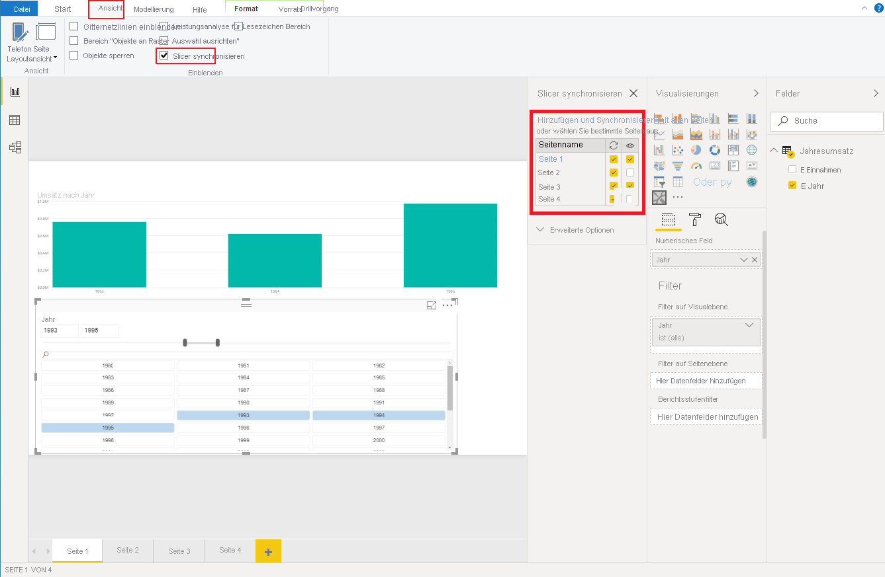

# <a name="sync-slicers-in-power-bi-visuals"></a><span data-ttu-id="12bbf-103">Synchronisieren von Slicern in Power BI-Visuals</span><span class="sxs-lookup"><span data-stu-id="12bbf-103">Sync slicers in Power BI visuals</span></span>

<span data-ttu-id="12bbf-104">Zur Unterstützung der Funktion [Slicer synchronisieren](https://docs.microsoft.com/power-bi/desktop-slicers) muss die benutzerdefinierte Slicer-Visual API-Version 1.13 oder höher verwenden werden.</span><span class="sxs-lookup"><span data-stu-id="12bbf-104">To support the [Sync Slicers](https://docs.microsoft.com/power-bi/desktop-slicers) feature, your custom slicer visual must use API version 1.13 or later.</span></span>

<span data-ttu-id="12bbf-105">Außerdem müssen Sie wie im folgenden Code veranschaulicht die Option in der Datei *capabilities.json* aktivieren:</span><span class="sxs-lookup"><span data-stu-id="12bbf-105">Additionally, you need to enable the option in the *capabilities.json* file, as shown in the following code:</span></span>

```json
{
    ...
    "supportsHighlight": true,
    "suppressDefaultTitle": true,
    "supportsSynchronizingFilterState": true,
    "sorting": {
        "default": {}
    }
}
```

<span data-ttu-id="12bbf-106">Nachdem Sie die Datei *capabilities.json* aktualisiert haben, können Sie den Optionsbereich **Slicers synchronisieren** anzeigen, wenn Sie Ihr benutzerdefiniertes Slicer-Visual auswählen.</span><span class="sxs-lookup"><span data-stu-id="12bbf-106">After you've updated the *capabilities.json* file, you can view the **Sync slicers** options pane when you select your custom slicer visual.</span></span>

> [!NOTE]
> <span data-ttu-id="12bbf-107">Die Funktion „Slicer synchronisieren“ unterstützt nicht mehr als ein Feld.</span><span class="sxs-lookup"><span data-stu-id="12bbf-107">The Sync Slicers feature doesn't support more than one field.</span></span> <span data-ttu-id="12bbf-108">Wenn Ihr Slicer mehr als ein Feld (**Kategorie** oder **Measure**) aufweist, ist die Funktion deaktiviert.</span><span class="sxs-lookup"><span data-stu-id="12bbf-108">If your slicer has more than one field (**Category** or **Measure**), the feature is disabled.</span></span>



<span data-ttu-id="12bbf-110">Im Bereich **Slicer synchronisieren** sehen Sie, dass die Sichtbarkeit und Filterung des Slicers auf mehrere Berichtsseiten angewendet werden können.</span><span class="sxs-lookup"><span data-stu-id="12bbf-110">In the **Sync slicers** pane, you can see that your slicer visibility and its filtration can be applied to several report pages.</span></span>
