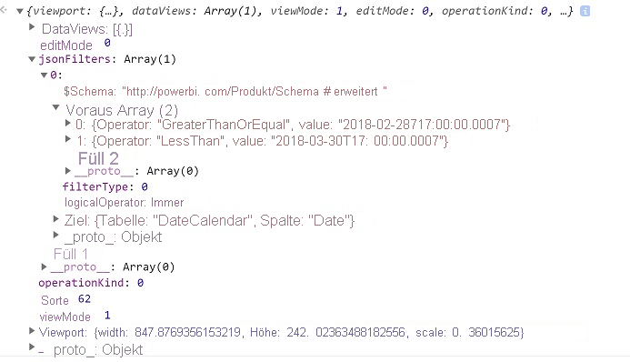

# <a name="the-visual-filters-api-in-power-bi-visuals"></a><span data-ttu-id="7adf2-103">Die API für visuelle Filter für Power BI-Visuals</span><span class="sxs-lookup"><span data-stu-id="7adf2-103">The Visual Filters API in Power BI visuals</span></span>

<span data-ttu-id="7adf2-104">Mit der API für visuelle Filter können Sie Daten in Power BI-Visuals filtern.</span><span class="sxs-lookup"><span data-stu-id="7adf2-104">The Visual Filters API allows you to filter data in Power BI visuals.</span></span> <span data-ttu-id="7adf2-105">Der Hauptunterschied zu anderen Auswahlen besteht darin, dass andere Visuals in beliebiger Weise gefiltert werden, obwohl die Hervorhebung von einem anderen Visual unterstützt wird.</span><span class="sxs-lookup"><span data-stu-id="7adf2-105">The main difference from other selections is that other visuals will be filtered in any way, despite highlight support by other visual.</span></span>

<span data-ttu-id="7adf2-106">Ein Visual sollte ein `filter`-Objekt im `general`-Abschnitt des Codes in *capabilities.json* enthalten, um die Filterung für das Visual zu ermöglichen.</span><span class="sxs-lookup"><span data-stu-id="7adf2-106">To enable filtering for the visual, it should contain a `filter` object in the `general` section of *capabilities.json* code.</span></span>

```json
"objects": {
        "general": {
            "displayName": "General",
            "displayNameKey": "formattingGeneral",
            "properties": {
                "filter": {
                    "type": {
                        "filter": true
                    }
                }
            }
        }
    }
```

<span data-ttu-id="7adf2-107">Die Schnittstellen der API für visuelle Filter stehen im Paket [powerbi-models](https://www.npmjs.com/package/powerbi-models) zur Verfügung.</span><span class="sxs-lookup"><span data-stu-id="7adf2-107">Visual Filters API interfaces are available in the [powerbi-models](https://www.npmjs.com/package/powerbi-models) package.</span></span> <span data-ttu-id="7adf2-108">Das Paket enthält auch Klassen zum Erstellen von Filterinstanzen.</span><span class="sxs-lookup"><span data-stu-id="7adf2-108">The package also contains classes to create filter instances.</span></span>

```cmd
npm install powerbi-models --save
```

<span data-ttu-id="7adf2-109">Wenn Sie eine ältere Version der Tools verwenden (früher als 3.x.x), sollten Sie `powerbi-models` in das Visualpaket einschließen.</span><span class="sxs-lookup"><span data-stu-id="7adf2-109">If you use an older (earlier than 3.x.x) version of the tools, you should include `powerbi-models` in the visuals package.</span></span> <span data-ttu-id="7adf2-110">Weitere Informationen finden Sie in der Kurzanleitung [Hinzufügen der API für erweiterte Filter zum benutzerdefinierten Visual](https://github.com/Microsoft/powerbi-visuals-sampleslicer/blob/master/doc/AddingAdvancedFilterAPI.md).</span><span class="sxs-lookup"><span data-stu-id="7adf2-110">For more information, see the short guide, [Add the Advanced Filter API to the custom visual](https://github.com/Microsoft/powerbi-visuals-sampleslicer/blob/master/doc/AddingAdvancedFilterAPI.md).</span></span>

<span data-ttu-id="7adf2-111">Alle Filter erweitern wie im folgenden Code gezeigt die `IFilter`-Schnittstelle:</span><span class="sxs-lookup"><span data-stu-id="7adf2-111">All filters extend the `IFilter` interface, as shown in the following code:</span></span>

```typescript
export interface IFilter {
    $schema: string;
    target: IFilterTarget;
}
```
<span data-ttu-id="7adf2-112">Hier gilt:</span><span class="sxs-lookup"><span data-stu-id="7adf2-112">Where:</span></span>
* <span data-ttu-id="7adf2-113">`target` ist die Tabellenspalte in der Datenquelle.</span><span class="sxs-lookup"><span data-stu-id="7adf2-113">`target` is the table column on the data source.</span></span>

## <a name="the-basic-filter-api"></a><span data-ttu-id="7adf2-114">API für einfache Filter</span><span class="sxs-lookup"><span data-stu-id="7adf2-114">The Basic Filter API</span></span>

<span data-ttu-id="7adf2-115">Die einfache Filterschnittstelle wird im folgenden Code gezeigt:</span><span class="sxs-lookup"><span data-stu-id="7adf2-115">Basic filter interface is shown in the following code:</span></span>

```typescript
export interface IBasicFilter extends IFilter {
    operator: BasicFilterOperators;
    values: (string | number | boolean)[];
}
```

<span data-ttu-id="7adf2-116">Hier gilt:</span><span class="sxs-lookup"><span data-stu-id="7adf2-116">Where:</span></span>
* <span data-ttu-id="7adf2-117">`operator` ist eine Enumeration mit den Werten *In*, *NotIn* und *All*.</span><span class="sxs-lookup"><span data-stu-id="7adf2-117">`operator` is an enumeration with the values *In*, *NotIn*, and *All*.</span></span>
* <span data-ttu-id="7adf2-118">`values` sind Werte für die Bedingung.</span><span class="sxs-lookup"><span data-stu-id="7adf2-118">`values` are values for the condition.</span></span>

<span data-ttu-id="7adf2-119">Beispiel für einen einfachen Filter:</span><span class="sxs-lookup"><span data-stu-id="7adf2-119">Example of a basic filter:</span></span>

```typescript
let basicFilter = {
    target: {
        column: "Col1"
    },
    operator: "In",
    values: [1,2,3]
}
```

<span data-ttu-id="7adf2-120">Dieser Filter bedeutet: „Gib alle Zeilen zurück, in denen `col1` den Werten „1“, „2“ oder „3“ entspricht“.</span><span class="sxs-lookup"><span data-stu-id="7adf2-120">The filter means, "Give me all rows where `col1` equals the value 1, 2, or 3."</span></span>

<span data-ttu-id="7adf2-121">Im Folgenden die Entsprechung in SQL:</span><span class="sxs-lookup"><span data-stu-id="7adf2-121">The SQL equivalent is:</span></span>

```sql
SELECT * FROM table WHERE col1 IN ( 1 , 2 , 3 )
```

<span data-ttu-id="7adf2-122">Sie können die BasicFilter-Klasse in `powerbi-models` verwenden, um einen Filter zu erstellen.</span><span class="sxs-lookup"><span data-stu-id="7adf2-122">To create a filter, you can use the BasicFilter class in `powerbi-models`.</span></span>

<span data-ttu-id="7adf2-123">Wenn Sie eine ältere Version des Tools verwenden, sollten Sie wie im folgenden Code gezeigt eine models-Instanz im window-Objekt mithilfe von `window['powerbi-models']` abrufen:</span><span class="sxs-lookup"><span data-stu-id="7adf2-123">If you use an older version of the tool, you should get an instance of models in the window object by using `window['powerbi-models']`, as shown in the following code:</span></span>

```javascript
let categories: DataViewCategoricalColumn = this.dataView.categorical.categories[0];

let target: IFilterColumnTarget = {
    table: categories.source.queryName.substr(0, categories.source.queryName.indexOf('.')),
    column: categories.source.displayName
};

let values = [ 1, 2, 3 ];

let filter: IBasicFilter = new window['powerbi-models'].BasicFilter(target, "In", values);
```

<span data-ttu-id="7adf2-124">Das Visual ruft den Filter mithilfe der applyJsonFilter()-Methode für die Hostschnittstelle „IVisualHost“ auf, die im Konstruktor für das Visual bereitgestellt wird.</span><span class="sxs-lookup"><span data-stu-id="7adf2-124">The visual invokes the filter by using the applyJsonFilter() method on the host interface, IVisualHost, which is provided to the visual in the constructor.</span></span>

```typescript
visualHost.applyJsonFilter(filter, "general", "filter", FilterAction.merge);
```

## <a name="the-advanced-filter-api"></a><span data-ttu-id="7adf2-125">API für erweiterte Filter</span><span class="sxs-lookup"><span data-stu-id="7adf2-125">The Advanced Filter API</span></span>

<span data-ttu-id="7adf2-126">Die [erweiterte Filter-API](https://github.com/Microsoft/powerbi-models) unterstützt die komplexe Datenpunktauswahl über mehrere Visuals hinweg und die Filterung von Abfragen, die auf mehreren Kriterien basieren (z. B. *LessThan*, *Contains*, *Is*, *IsBlank* usw.).</span><span class="sxs-lookup"><span data-stu-id="7adf2-126">The [Advanced Filter API](https://github.com/Microsoft/powerbi-models) enables complex cross-visual data-point selection and filtering queries that are based on multiple criteria, such as *LessThan*, *Contains*, *Is*, *IsBlank*, and so on).</span></span>

<span data-ttu-id="7adf2-127">Der Filter wurde in der Visuals-API 1.7.0 eingeführt.</span><span class="sxs-lookup"><span data-stu-id="7adf2-127">The filter was introduced in Visuals API 1.7.0.</span></span>

<span data-ttu-id="7adf2-128">Die erweiterte Filter-API erfordert ebenfalls `target` mit Namen für `table` und `column`.</span><span class="sxs-lookup"><span data-stu-id="7adf2-128">The Advanced Filter API also requires `target` with a `table` and `column` name.</span></span> <span data-ttu-id="7adf2-129">Jedoch lauten die Operatoren der erweiterten Filter-API *And* und *Or* („Und“ und „Oder“).</span><span class="sxs-lookup"><span data-stu-id="7adf2-129">But the Advanced Filter API operators are *And* and *Or*.</span></span> 

<span data-ttu-id="7adf2-130">Außerdem nutzt der Filter Bedingungen anstelle von Werten für die Schnittstelle:</span><span class="sxs-lookup"><span data-stu-id="7adf2-130">Additionally, the filter uses conditions instead of values with the interface:</span></span>

```typescript
interface IAdvancedFilterCondition {
    value: (string | number | boolean);
    operator: AdvancedFilterConditionOperators;
}
```

<span data-ttu-id="7adf2-131">Der `operator`-Parameter kann die folgenden Bedingungsoperatoren aufweisen: *None*, *LessThan*, *LessThanOrEqual*, *GreaterThan*, *GreaterThanOrEqual*, *Contains*, *DoesNotContain*, *StartsWith*, *DoesNotStartWith*, *Is*, *IsNot*, *IsBlank* und „IsNotBlank“.</span><span class="sxs-lookup"><span data-stu-id="7adf2-131">Condition operators for the `operator` parameter are *None*, *LessThan*, *LessThanOrEqual*, *GreaterThan*, *GreaterThanOrEqual*, *Contains*, *DoesNotContain*, *StartsWith*, *DoesNotStartWith*, *Is*, *IsNot*, *IsBlank*, and "IsNotBlank"\`</span></span>

```javascript
let categories: DataViewCategoricalColumn = this.dataView.categorical.categories[0];

let target: IFilterColumnTarget = {
    table: categories.source.queryName.substr(0, categories.source.queryName.indexOf('.')), // table
    column: categories.source.displayName // col1
};

let conditions: IAdvancedFilterCondition[] = [];

conditions.push({
    operator: "LessThan",
    value: 0
});

let filter: IAdvancedFilter = new window['powerbi-models'].AdvancedFilter(target, "And", conditions);

// invoke the filter
visualHost.applyJsonFilter(filter, "general", "filter", FilterAction.merge);
```

<span data-ttu-id="7adf2-132">Im Folgenden die Entsprechung in SQL:</span><span class="sxs-lookup"><span data-stu-id="7adf2-132">The SQL equivalent is:</span></span>

```sql
SELECT * FROM table WHERE col1 < 0;
```

<span data-ttu-id="7adf2-133">Den vollständigen Beispielcode für die Verwendung der erweiterten Filter-API finden Sie im [Repository des Beispieldatenschnittvisuals](https://github.com/Microsoft/powerbi-visuals-sampleslicer).</span><span class="sxs-lookup"><span data-stu-id="7adf2-133">For the complete sample code for using the Advanced Filter API, go to the [Sampleslicer visual repository](https://github.com/Microsoft/powerbi-visuals-sampleslicer).</span></span>

## <a name="the-tuple-filter-api-multi-column-filter"></a><span data-ttu-id="7adf2-134">Tupelfilter-API (Filter für mehrere Spalten)</span><span class="sxs-lookup"><span data-stu-id="7adf2-134">The Tuple Filter API (multi-column filter)</span></span>

<span data-ttu-id="7adf2-135">Die Tupelfilter-API wurde in der Visuals-API 2.3.0 eingeführt.</span><span class="sxs-lookup"><span data-stu-id="7adf2-135">The Tuple Filter API was introduced in Visuals API 2.3.0.</span></span> <span data-ttu-id="7adf2-136">Sie ähnelt der API für einfache Filter, ermöglicht Ihnen aber das Definieren von Bedingungen für mehrere Spalten und Tabellen.</span><span class="sxs-lookup"><span data-stu-id="7adf2-136">It is similar to the Basic Filter API, but it allows you to define conditions for several columns and tables.</span></span>

<span data-ttu-id="7adf2-137">Die Filterschnittstelle wird im folgenden Code gezeigt:</span><span class="sxs-lookup"><span data-stu-id="7adf2-137">The filter interface is shown in the following code:</span></span> 

```typescript
interface ITupleFilter extends IFilter {
    $schema: string;
    filterType: FilterType;
    operator: TupleFilterOperators;
    target: ITupleFilterTarget;
    values: TupleValueType[];
}
```

<span data-ttu-id="7adf2-138">Hier gilt:</span><span class="sxs-lookup"><span data-stu-id="7adf2-138">Where:</span></span>
* <span data-ttu-id="7adf2-139">`target` ist ein Array von Spalten mit Tabellennamen:</span><span class="sxs-lookup"><span data-stu-id="7adf2-139">`target` is an array of columns with table names:</span></span>

    ```typescript
    declare type ITupleFilterTarget = IFilterTarget[];
    ```

  <span data-ttu-id="7adf2-140">Der Filter kann auf Spalten aus verschiedenen Tabellen angewendet werden.</span><span class="sxs-lookup"><span data-stu-id="7adf2-140">The filter can address columns from various tables.</span></span>

* <span data-ttu-id="7adf2-141">`$schema` ist http://powerbi.com/product/schema#tuple.</span><span class="sxs-lookup"><span data-stu-id="7adf2-141">`$schema` is http://powerbi.com/product/schema#tuple.</span></span>

* <span data-ttu-id="7adf2-142">`filterType` ist *FilterType.Tuple*.</span><span class="sxs-lookup"><span data-stu-id="7adf2-142">`filterType` is *FilterType.Tuple*.</span></span>

* <span data-ttu-id="7adf2-143">`operator` erlaubt die Verwendung nur im Operator *In*.</span><span class="sxs-lookup"><span data-stu-id="7adf2-143">`operator` allows use only in the *In* operator.</span></span>

* <span data-ttu-id="7adf2-144">`values` ist ein Array von Werttupeln, und jedes Tupel stellt eine zulässige Kombination der Zielspaltenwerte dar.</span><span class="sxs-lookup"><span data-stu-id="7adf2-144">`values` is an array of value tuples, and each tuple represents one permitted combination of the target column values.</span></span> 

```typescript
declare type TupleValueType = ITupleElementValue[];

interface ITupleElementValue {
    value: PrimitiveValueType
}
```

<span data-ttu-id="7adf2-145">Vollständiges Beispiel:</span><span class="sxs-lookup"><span data-stu-id="7adf2-145">Complete example:</span></span>

```typescript
let target: ITupleFilterTarget = [
    {
        table: "DataTable",
        column: "Team"
    },
    {
        table: "DataTable",
        column: "Value"
    }
];

let values = [
    [
        // the first column combination value (or the column tuple/vector value) that the filter will pass through
        {
            value: "Team1" // the value for the `Team` column of the `DataTable` table
        },
        {
            value: 5 // the value for the `Value` column of the `DataTable` table
        }
    ],
    [
        // the second column combination value (or the column tuple/vector value) that the filter will pass through
        {
            value: "Team2" // the value for `Team` column of `DataTable` table
        },
        {
            value: 6 // the value for `Value` column of `DataTable` table
        }
    ]
];

let filter: ITupleFilter = {
    $schema: "http://powerbi.com/product/schema#tuple",
    filterType: FilterType.Tuple,
    operator: "In",
    target: target,
    values: values
}

// invoke the filter
visualHost.applyJsonFilter(filter, "general", "filter", FilterAction.merge);
```

> [!IMPORTANT]
> <span data-ttu-id="7adf2-146">Die Reihenfolge der Spaltennamen und Bedingungswerte ist sensibel.</span><span class="sxs-lookup"><span data-stu-id="7adf2-146">The order of the column names and condition values is sensitive.</span></span>

<span data-ttu-id="7adf2-147">Im Folgenden die Entsprechung in SQL:</span><span class="sxs-lookup"><span data-stu-id="7adf2-147">The SQL equivalent is:</span></span>

```sql
SELECT * FROM DataTable WHERE ( Team = "Team1" AND Value = 5 ) OR ( Team = "Team2" AND Value = 6 );
```  

## <a name="restore-the-json-filter-from-the-data-view"></a><span data-ttu-id="7adf2-148">Wiederherstellen der JSON-Filter aus der Datenansicht</span><span class="sxs-lookup"><span data-stu-id="7adf2-148">Restore the JSON filter from the data view</span></span>

<span data-ttu-id="7adf2-149">Ab API-Version 2.2 können Sie die JSON-Filter von *VisualUpdateOptions* wie im folgenden Code gezeigt wiederherstellen:</span><span class="sxs-lookup"><span data-stu-id="7adf2-149">Starting with API version 2.2, you can restore the JSON filter from *VisualUpdateOptions*, as shown in the following code:</span></span>

```typescript
export interface VisualUpdateOptions extends extensibility.VisualUpdateOptions {
    viewport: IViewport;
    dataViews: DataView[];
    type: VisualUpdateType;
    viewMode?: ViewMode;
    editMode?: EditMode;
    operationKind?: VisualDataChangeOperationKind;
    jsonFilters?: IFilter[];
}
```

<span data-ttu-id="7adf2-150">Wenn Sie zwischen Lesezeichen wechseln, ruft Power BI die `update`-Methode des Visuals auf, und das Visual ruft ein entsprechendes `filter`-Objekt ab.</span><span class="sxs-lookup"><span data-stu-id="7adf2-150">When you switch, bookmarks, Power BI calls the `update` method of the visual, and the visual gets a corresponding `filter` object.</span></span> <span data-ttu-id="7adf2-151">Weitere Informationen finden Sie unter [Hinzufügen von Lesezeichenunterstützung für Power BI-Visuals](bookmarks-support.md).</span><span class="sxs-lookup"><span data-stu-id="7adf2-151">For more information, see [Add bookmark support for Power BI visuals](bookmarks-support.md).</span></span>

### <a name="sample-json-filter"></a><span data-ttu-id="7adf2-152">Beispiel für JSON-Filter</span><span class="sxs-lookup"><span data-stu-id="7adf2-152">Sample JSON filter</span></span>

<span data-ttu-id="7adf2-153">In der folgenden Abbildung wird ein Beispiel für JSON-Filtercode veranschaulicht:</span><span class="sxs-lookup"><span data-stu-id="7adf2-153">Some sample JSON filter code is shown in the following image:</span></span>



### <a name="clear-the-json-filter"></a><span data-ttu-id="7adf2-155">Bereinigen des JSON-Filters</span><span class="sxs-lookup"><span data-stu-id="7adf2-155">Clear the JSON filter</span></span>

<span data-ttu-id="7adf2-156">Die Filter-API interpretiert den Filterwert `null` als Befehl zum *Zurücksetzen* oder *Löschen*.</span><span class="sxs-lookup"><span data-stu-id="7adf2-156">The Filter API accepts the `null` value of the filter as *reset* or *clear*.</span></span>

```typescript
// invoke the filter
visualHost.applyJsonFilter(null, "general", "filter", FilterAction.merge);
```
