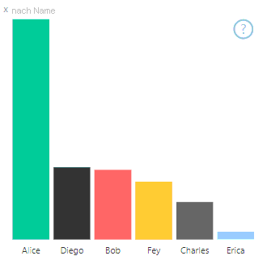
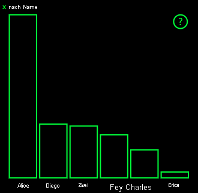
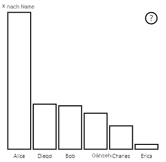

# <a name="high-contrast-mode-support-in-power-bi-visuals"></a>Unterstützung des Modus für hohen Kontrast in Power BI-Visuals

Durch die Windows-Einstellung *Hoher Kontrast* sind Text und Anwendungen besser zu sehen, da kontrastreichere Farben verwendet werden. In diesem Artikel wird beschrieben, wie Sie die Unterstützung des Modus „Hoher Kontrast“ zu Power BI-Visuals hinzufügen. Weitere Informationen finden Sie unter [Unterstützung für hohen Kontrast in Power BI](https://powerbi.microsoft.com/blog/power-bi-desktop-june-2018-feature-summary/#highContrast).

Im [PowerBI-visuals-sampleBarChart-Visual-Repository](https://github.com/Microsoft/PowerBI-visuals-sampleBarChart/commit/61011c82b66ca0d3321868f1d089c65101ca42e6) wird eine Implementierung der Unterstützung für hohen Kontrast veranschaulicht.

## <a name="on-initialization"></a>Bei der Initialisierung

Das colorPalette-Element von `options.host` verfügt über mehrere Eigenschaften für den Modus „Hoher Kontrast“. Ermitteln Sie anhand dieser Eigenschaften, ob der Modus „Hoher Kontrast“ aktiv ist und welche Farben in diesem Fall verwendet werden sollen.

### <a name="detect-that-power-bi-is-in-high-contrast-mode"></a>Erkennen, ob sich Power BI im Modus „Hoher Kontrast“ befindet

Wenn `host.colorPalette.isHighContrast` den Wert `true` zurückgibt, ist der Modus „Hoher Kontrast“ aktiv und das Visual muss entsprechend gerendert werden.

### <a name="get-high-contrast-colors"></a>Abrufen von Farben mit hohem Kontrast

Im Modus „Hoher Kontrast“ sollte das Visual auf die folgenden Einstellungen beschränkt sein:

* **Vordergrund**: Die Farbe wird zum Zeichnen beliebiger Linien, Symbole, Textelemente, Konturen oder Formfüllungen verwendet.
* **Hintergrund**: Die Farbe wird für den Hintergrund und als Füllfarbe konturierter Formen verwendet.
* **Vordergrund – ausgewählt**: Durch die Farbe werden ausgewählte oder aktive Elemente hervorgehoben.
* **Hyperlink**: Die Farbe wird nur für Hyperlinktext verwendet.

> [!NOTE]
> Wenn eine sekundäre Farbe erforderlich ist, kann die Vordergrundfarbe mit einem Deckkraftwert kombiniert werden (native Visuals in Power BI haben eine Deckkraft von 40 %). Damit visuelle Details leicht erkennbar bleiben, sollten Sie von dieser Möglichkeit nur sparsam Gebrauch machen.

Die folgenden Werte können während der Initialisierung gespeichert werden:

```typescript
private isHighContrast: boolean;

private foregroundColor: string;
private backgroundColor: string;
private foregroundSelectedColor: string;
private hyperlinkColor: string;
//...

constructor(options: VisualConstructorOptions) {
    this.host = options.host;
    let colorPalette: ISandboxExtendedColorPalette = host.colorPalette;
    //...
    this.isHighContrast = colorPalette.isHighContrast;
    if (this.isHighContrast) {
        this.foregroundColor = colorPalette.foreground.value;
        this.backgroundColor = colorPalette.background.value;
        this.foregroundSelectedColor = colorPalette.foregroundSelected.value;
        this.hyperlinkColor = colorPalette.hyperlink.value;
    }
```

Alternativ können Sie das `host`-Objekt während der Initialisierung speichern und während der Aktualisierung auf die relevanten `colorPalette`-Eigenschaften zugreifen.

## <a name="on-update"></a>Bei der Aktualisierung

Wie Unterstützung für hohen Kontrast implementiert wird, hängt vom Visual und den Details des grafischen Designs ab. Damit wichtige Details trotz eingeschränkter Farben leicht zu erkennen sind, wird beim Modus „Hoher Kontrast“ normalerweise vorausgesetzt, dass sich das Design etwas von der Standardeinstellung unterscheidet.

Native Power BI-Visuals folgen diesen Richtlinien:

* Für alle Datenpunkte wird dieselbe Farbe (Vordergrund) verwendet.
* Für sämtlichen Text, Achsen, Pfeile, Linien usw. wird die Vordergrundfarbe verwendet.
* Dicke Formen werden als Konturen gezeichnet, mit dicken Strichen (mindestens zwei Pixel) und Hintergrundfüllfarbe.
* Bei Bedarf werden unterschiedliche Markierungsformen zur Unterscheidung von Datenpunkten und unterschiedliche Striche zur Unterscheidung von Datenlinien verwendet.
* Wenn ein Datenelement hervorgehoben ist, wird die Deckkraft aller anderen Elemente in 40 % geändert.
* Bei Slicern wird für aktive Filterelemente die für den Vordergrund ausgewählte Farbe verwendet.

Im folgenden Balkendiagrammbeispiel werden beispielsweise alle Balken mit einer Vordergrundkonturlinie von zwei Pixeln und Hintergrundfüllung gezeichnet. Vergleichen Sie, wie sich die Darstellungsweise ändert, wenn Sie Standardfarben bzw. verschiedene kontrastreiche Designs verwenden:





Der nächste Abschnitt zeigt eine Stelle in der `visualTransform`-Funktion an, die geändert wurde, um einen hohen Kontrast zu unterstützen. Sie wird während des Updates als Teil des Renderings aufgerufen.

### <a name="before"></a>Vorher

```typescript
for (let i = 0, len = Math.max(category.values.length, dataValue.values.length); i < len; i++) {
    let defaultColor: Fill = {
        solid: {
            color: colorPalette.getColor(category.values[i] + '').value
        }
    };

    barChartDataPoints.push({
        category: category.values[i] + '',
        value: dataValue.values[i],
        color: getCategoricalObjectValue<Fill>(category, i, 'colorSelector', 'fill', defaultColor).solid.color,
        selectionId: host.createSelectionIdBuilder()
            .withCategory(category, i)
            .createSelectionId()
    });
}
```

### <a name="after"></a>Nachher

```typescript
for (let i = 0, len = Math.max(category.values.length, dataValue.values.length); i < len; i++) {
    const color: string = getColumnColorByIndex(category, i, colorPalette);

    const selectionId: ISelectionId = host.createSelectionIdBuilder()
        .withCategory(category, i)
        .createSelectionId();

    barChartDataPoints.push({
        color,
        strokeColor,
        strokeWidth,
        selectionId,
        value: dataValue.values[i],
        category: `${category.values[i]}`,
    });
}

//...

function getColumnColorByIndex(
    category: DataViewCategoryColumn,
    index: number,
    colorPalette: ISandboxExtendedColorPalette,
): string {
    if (colorPalette.isHighContrast) {
        return colorPalette.background.value;
    }

    const defaultColor: Fill = {
        solid: {
            color: colorPalette.getColor(`${category.values[index]}`).value,
        }
    };

    return getCategoricalObjectValue<Fill>(category, index, 'colorSelector', 'fill', defaultColor).solid.color;
}
```
