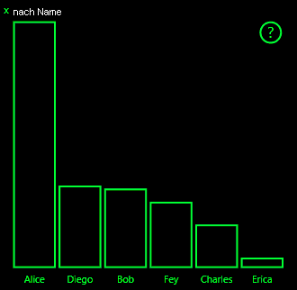

# <a name="high-contrast-mode-support-in-power-bi-visuals"></a><span data-ttu-id="b58b5-103">Unterstützung des Modus für hohen Kontrast in Power BI-Visuals</span><span class="sxs-lookup"><span data-stu-id="b58b5-103">High-contrast mode support in Power BI visuals</span></span>

<span data-ttu-id="b58b5-104">Durch die Windows-Einstellung *Hoher Kontrast* sind Text und Anwendungen besser zu sehen, da kontrastreichere Farben verwendet werden.</span><span class="sxs-lookup"><span data-stu-id="b58b5-104">The Windows *high contrast* setting makes text and apps easier to see by displaying more distinct colors.</span></span> <span data-ttu-id="b58b5-105">In diesem Artikel wird beschrieben, wie Sie die Unterstützung des Modus „Hoher Kontrast“ zu Power BI-Visuals hinzufügen.</span><span class="sxs-lookup"><span data-stu-id="b58b5-105">This article discusses how to add high-contrast mode support to Power BI visuals.</span></span> <span data-ttu-id="b58b5-106">Weitere Informationen finden Sie unter [Unterstützung für hohen Kontrast in Power BI](https://powerbi.microsoft.com/blog/power-bi-desktop-june-2018-feature-summary/#highContrast).</span><span class="sxs-lookup"><span data-stu-id="b58b5-106">For more information, see [high-contrast support in Power BI](https://powerbi.microsoft.com/blog/power-bi-desktop-june-2018-feature-summary/#highContrast).</span></span>

<span data-ttu-id="b58b5-107">Im [PowerBI-visuals-sampleBarChart-Visual-Repository](https://github.com/Microsoft/PowerBI-visuals-sampleBarChart/commit/61011c82b66ca0d3321868f1d089c65101ca42e6) wird eine Implementierung der Unterstützung für hohen Kontrast veranschaulicht.</span><span class="sxs-lookup"><span data-stu-id="b58b5-107">To view an implementation of high-contrast support, go to the [PowerBI-visuals-sampleBarChart visual repository](https://github.com/Microsoft/PowerBI-visuals-sampleBarChart/commit/61011c82b66ca0d3321868f1d089c65101ca42e6).</span></span>

## <a name="on-initialization"></a><span data-ttu-id="b58b5-108">Bei der Initialisierung</span><span class="sxs-lookup"><span data-stu-id="b58b5-108">On initialization</span></span>

<span data-ttu-id="b58b5-109">Das colorPalette-Element von `options.host` verfügt über mehrere Eigenschaften für den Modus „Hoher Kontrast“.</span><span class="sxs-lookup"><span data-stu-id="b58b5-109">The colorPalette member of `options.host` has several properties for high-contrast mode.</span></span> <span data-ttu-id="b58b5-110">Ermitteln Sie anhand dieser Eigenschaften, ob der Modus „Hoher Kontrast“ aktiv ist und welche Farben in diesem Fall verwendet werden sollen.</span><span class="sxs-lookup"><span data-stu-id="b58b5-110">Use these properties to determine whether high-contrast mode is active and, if it is, what colors to use.</span></span>

### <a name="detect-that-power-bi-is-in-high-contrast-mode"></a><span data-ttu-id="b58b5-111">Erkennen, ob sich Power BI im Modus „Hoher Kontrast“ befindet</span><span class="sxs-lookup"><span data-stu-id="b58b5-111">Detect that Power BI is in high-contrast mode</span></span>

<span data-ttu-id="b58b5-112">Wenn `host.colorPalette.isHighContrast` den Wert `true` zurückgibt, ist der Modus „Hoher Kontrast“ aktiv und das Visual muss entsprechend gerendert werden.</span><span class="sxs-lookup"><span data-stu-id="b58b5-112">If `host.colorPalette.isHighContrast` is `true`, high-contrast mode is active and the visual should draw itself accordingly.</span></span>

### <a name="get-high-contrast-colors"></a><span data-ttu-id="b58b5-113">Abrufen von Farben mit hohem Kontrast</span><span class="sxs-lookup"><span data-stu-id="b58b5-113">Get high-contrast colors</span></span>

<span data-ttu-id="b58b5-114">Im Modus „Hoher Kontrast“ sollte das Visual auf die folgenden Einstellungen beschränkt sein:</span><span class="sxs-lookup"><span data-stu-id="b58b5-114">In high-contrast mode, your visual should limit itself to the following settings:</span></span>

* <span data-ttu-id="b58b5-115">**Vordergrund**: Die Farbe wird zum Zeichnen beliebiger Linien, Symbole, Textelemente, Konturen oder Formfüllungen verwendet.</span><span class="sxs-lookup"><span data-stu-id="b58b5-115">**Foreground** color is used to draw any lines, icons, text, and outline or fill of shapes.</span></span>
* <span data-ttu-id="b58b5-116">**Hintergrund**: Die Farbe wird für den Hintergrund und als Füllfarbe konturierter Formen verwendet.</span><span class="sxs-lookup"><span data-stu-id="b58b5-116">**Background** color is used for background, and as the fill color of outlined shapes.</span></span>
* <span data-ttu-id="b58b5-117">**Vordergrund – ausgewählt**: Durch die Farbe werden ausgewählte oder aktive Elemente hervorgehoben.</span><span class="sxs-lookup"><span data-stu-id="b58b5-117">**Foreground - selected** color is used to indicate a selected or active element.</span></span>
* <span data-ttu-id="b58b5-118">**Hyperlink**: Die Farbe wird nur für Hyperlinktext verwendet.</span><span class="sxs-lookup"><span data-stu-id="b58b5-118">**Hyperlink** color is used only for hyperlink text.</span></span>

> [!NOTE]
> <span data-ttu-id="b58b5-119">Wenn eine sekundäre Farbe erforderlich ist, kann die Vordergrundfarbe mit einem Deckkraftwert kombiniert werden (native Visuals in Power BI haben eine Deckkraft von 40 %).</span><span class="sxs-lookup"><span data-stu-id="b58b5-119">If a secondary color is needed, foreground color may be used with some opacity (Power BI native visuals use 40% opacity).</span></span> <span data-ttu-id="b58b5-120">Damit visuelle Details leicht erkennbar bleiben, sollten Sie von dieser Möglichkeit nur sparsam Gebrauch machen.</span><span class="sxs-lookup"><span data-stu-id="b58b5-120">Use this sparingly to keep the visual details easy to see.</span></span>

<span data-ttu-id="b58b5-121">Die folgenden Werte können während der Initialisierung gespeichert werden:</span><span class="sxs-lookup"><span data-stu-id="b58b5-121">During initialization, you can store the following values:</span></span>

```typescript
private isHighContrast: boolean;

private foregroundColor: string;
private backgroundColor: string;
private foregroundSelectedColor: string;
private hyperlinkColor: string;
//...

constructor(options: VisualConstructorOptions) {
    this.host = options.host;
    let colorPalette: ISandboxExtendedColorPalette = host.colorPalette;
    //...
    this.isHighContrast = colorPalette.isHighContrast;
    if (this.isHighContrast) {
        this.foregroundColor = colorPalette.foreground.value;
        this.backgroundColor = colorPalette.background.value;
        this.foregroundSelectedColor = colorPalette.foregroundSelected.value;
        this.hyperlinkColor = colorPalette.hyperlink.value;
    }
```

<span data-ttu-id="b58b5-122">Alternativ können Sie das `host`-Objekt während der Initialisierung speichern und während der Aktualisierung auf die relevanten `colorPalette`-Eigenschaften zugreifen.</span><span class="sxs-lookup"><span data-stu-id="b58b5-122">Or you can store the `host` object during initialization and access the relevant `colorPalette` properties during update.</span></span>

## <a name="on-update"></a><span data-ttu-id="b58b5-123">Bei der Aktualisierung</span><span class="sxs-lookup"><span data-stu-id="b58b5-123">On update</span></span>

<span data-ttu-id="b58b5-124">Wie Unterstützung für hohen Kontrast implementiert wird, hängt vom Visual und den Details des grafischen Designs ab.</span><span class="sxs-lookup"><span data-stu-id="b58b5-124">The specific implementations of high-contrast support vary from visual to visual and depend on the details of the graphic design.</span></span> <span data-ttu-id="b58b5-125">Damit wichtige Details trotz eingeschränkter Farben leicht zu erkennen sind, wird beim Modus „Hoher Kontrast“ normalerweise vorausgesetzt, dass sich das Design etwas von der Standardeinstellung unterscheidet.</span><span class="sxs-lookup"><span data-stu-id="b58b5-125">To keep important details easy to distinguish with the limited colors, high-contrast mode ordinarily requires a design that's slightly different from the default mode.</span></span>

<span data-ttu-id="b58b5-126">Native Power BI-Visuals folgen diesen Richtlinien:</span><span class="sxs-lookup"><span data-stu-id="b58b5-126">Power BI native visuals follow these guidelines:</span></span>

* <span data-ttu-id="b58b5-127">Für alle Datenpunkte wird dieselbe Farbe (Vordergrund) verwendet.</span><span class="sxs-lookup"><span data-stu-id="b58b5-127">All data points use the same color (foreground).</span></span>
* <span data-ttu-id="b58b5-128">Für sämtlichen Text, Achsen, Pfeile, Linien usw. wird die Vordergrundfarbe verwendet.</span><span class="sxs-lookup"><span data-stu-id="b58b5-128">All text, axes, arrows, lines, and so on use the foreground color.</span></span>
* <span data-ttu-id="b58b5-129">Dicke Formen werden als Konturen gezeichnet, mit dicken Strichen (mindestens zwei Pixel) und Hintergrundfüllfarbe.</span><span class="sxs-lookup"><span data-stu-id="b58b5-129">Thick shapes are drawn as outlines, with thick strokes (at least two pixels) and background color fill.</span></span>
* <span data-ttu-id="b58b5-130">Bei Bedarf werden unterschiedliche Markierungsformen zur Unterscheidung von Datenpunkten und unterschiedliche Striche zur Unterscheidung von Datenlinien verwendet.</span><span class="sxs-lookup"><span data-stu-id="b58b5-130">When data points are relevant, they're distinguished by different marker shapes, and data lines are distinguished by different dashing.</span></span>
* <span data-ttu-id="b58b5-131">Wenn ein Datenelement hervorgehoben ist, wird die Deckkraft aller anderen Elemente in 40 % geändert.</span><span class="sxs-lookup"><span data-stu-id="b58b5-131">When a data element is highlighted, all other elements change their opacity to 40%.</span></span>
* <span data-ttu-id="b58b5-132">Bei Slicern wird für aktive Filterelemente die für den Vordergrund ausgewählte Farbe verwendet.</span><span class="sxs-lookup"><span data-stu-id="b58b5-132">For slicers, active filter elements use foreground-selected color.</span></span>

<span data-ttu-id="b58b5-133">Im folgenden Balkendiagrammbeispiel werden beispielsweise alle Balken mit einer Vordergrundkonturlinie von zwei Pixeln und Hintergrundfüllung gezeichnet.</span><span class="sxs-lookup"><span data-stu-id="b58b5-133">In the following sample bar chart, for example, all bars are drawn with two pixels of thick foreground outline and background fill.</span></span> <span data-ttu-id="b58b5-134">Vergleichen Sie, wie sich die Darstellungsweise ändert, wenn Sie Standardfarben bzw. verschiedene kontrastreiche Designs verwenden:</span><span class="sxs-lookup"><span data-stu-id="b58b5-134">Compare the way it looks with default colors and with a couple of high-contrast themes:</span></span>

<span data-ttu-id="b58b5-135">

</span><span class="sxs-lookup"><span data-stu-id="b58b5-135">

</span></span>

<span data-ttu-id="b58b5-136">Der nächste Abschnitt zeigt eine Stelle in der `visualTransform`-Funktion an, die geändert wurde, um einen hohen Kontrast zu unterstützen.</span><span class="sxs-lookup"><span data-stu-id="b58b5-136">The next section shows one place in the `visualTransform` function that was changed to support high contrast.</span></span> <span data-ttu-id="b58b5-137">Sie wird während des Updates als Teil des Renderings aufgerufen.</span><span class="sxs-lookup"><span data-stu-id="b58b5-137">It's called as part of rendering during the update.</span></span>

### <a name="before"></a><span data-ttu-id="b58b5-138">Vorher</span><span class="sxs-lookup"><span data-stu-id="b58b5-138">Before</span></span>

```typescript
for (let i = 0, len = Math.max(category.values.length, dataValue.values.length); i < len; i++) {
    let defaultColor: Fill = {
        solid: {
            color: colorPalette.getColor(category.values[i] + '').value
        }
    };

    barChartDataPoints.push({
        category: category.values[i] + '',
        value: dataValue.values[i],
        color: getCategoricalObjectValue<Fill>(category, i, 'colorSelector', 'fill', defaultColor).solid.color,
        selectionId: host.createSelectionIdBuilder()
            .withCategory(category, i)
            .createSelectionId()
    });
}
```

### <a name="after"></a><span data-ttu-id="b58b5-139">Nachher</span><span class="sxs-lookup"><span data-stu-id="b58b5-139">After</span></span>

```typescript
for (let i = 0, len = Math.max(category.values.length, dataValue.values.length); i < len; i++) {
    const color: string = getColumnColorByIndex(category, i, colorPalette);

    const selectionId: ISelectionId = host.createSelectionIdBuilder()
        .withCategory(category, i)
        .createSelectionId();

    barChartDataPoints.push({
        color,
        strokeColor,
        strokeWidth,
        selectionId,
        value: dataValue.values[i],
        category: `${category.values[i]}`,
    });
}

//...

function getColumnColorByIndex(
    category: DataViewCategoryColumn,
    index: number,
    colorPalette: ISandboxExtendedColorPalette,
): string {
    if (colorPalette.isHighContrast) {
        return colorPalette.background.value;
    }

    const defaultColor: Fill = {
        solid: {
            color: colorPalette.getColor(`${category.values[index]}`).value,
        }
    };

    return getCategoricalObjectValue<Fill>(category, index, 'colorSelector', 'fill', defaultColor).solid.color;
}
```
