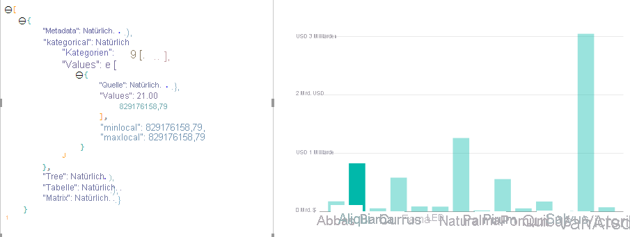
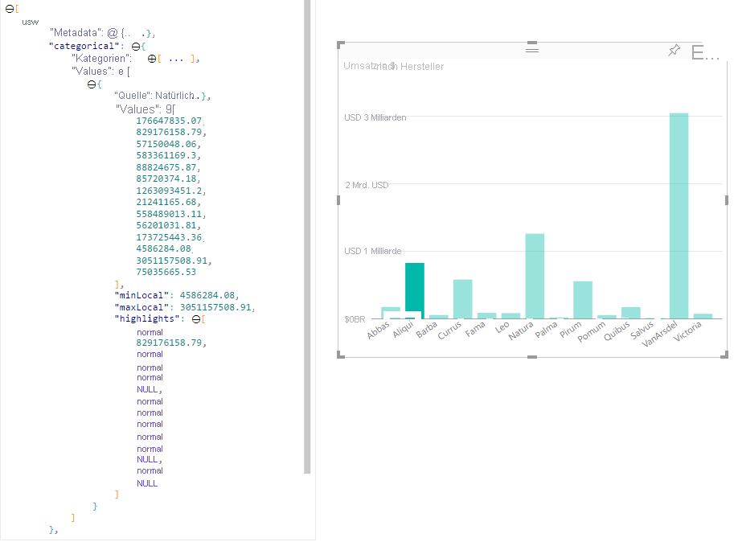

# Hervorheben von Datenpunkten in Power BI-VisualsHighlight data points in Power BI Visuals

Wenn ein Element ausgewählt ist, wird das `values`-Array im `dataView`-Objekt standardmäßig nach den ausgewählten Werten gefiltert.By default whenever an element is selected the `values` array in the `dataView` object will be filtered to just the selected values. Dadurch werden für alle anderen Visuals auf der Seite nur die ausgewählten Daten angezeigt.It will cause all other visuals on the page to display just the selected data.

Wenn Sie die `supportsHighlight`-Eigenschaft in `capabilities.json` auf `true` festlegen, erhalten Sie ein gänzlich ungefiltertes `values`-Array zusammen mit einem `highlights`-Array.If you set the `supportsHighlight` property in your `capabilities.json` to `true`, you'll receive the full unfiltered `values` array along with a `highlights` array. Das `highlights`-Array hat die gleiche Länge wie das Wertarray, und alle nicht ausgewählten Werte werden auf `null` festgelegt.The `highlights` array will be the same length as the values array and any non-selected values will be set to `null`. Wenn diese Eigenschaft aktiviert ist, ist das Visual dafür zuständig, die entsprechenden Daten hervorzuheben. Dazu wird das `values`-Array mit dem `highlights`-Array verglichen.With this property enabled it's the visual's responsibility to highlight the appropriate data by comparing the `values` array to the `highlights` array.

In diesem Beispiel sehen Sie, dass ein Balken ausgewählt ist.In the example, you'll notice the 1 bar that is selected. Dies ist auch der einzige Wert im highlights-Array.And it's the only value in the highlights array. Beachten Sie außerdem, dass es mehrere Auswahlen sowie teilweise Hervorhebungen geben kann.It's also important to note there could be multiple selections and partial highlight. Der entsprechende numerische Wert ist in den Werten enthalten. Highlights-Arrays sind vorhanden, unterscheiden sich jedoch voneinander.There's the corresponding numeric value in the values and highlights arrays will be present but different.
