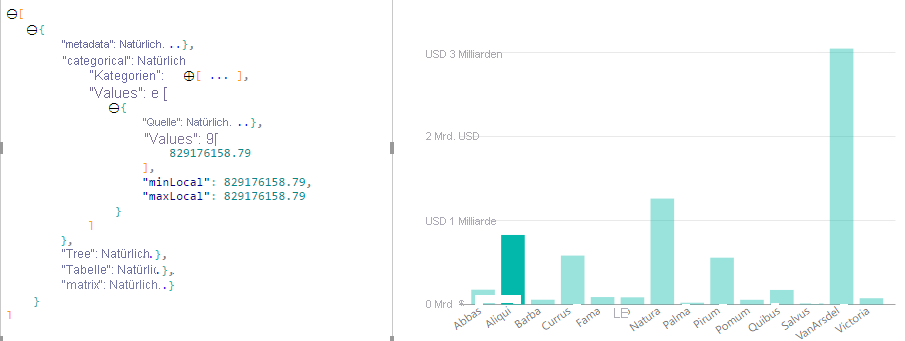

# Hervorheben von Datenpunkten in Power BI-Visuals

Wenn ein Element ausgewählt ist, wird das `values`-Array im `dataView`-Objekt standardmäßig nach den ausgewählten Werten gefiltert. Dadurch werden für alle anderen Visuals auf der Seite nur die ausgewählten Daten angezeigt.

Wenn Sie die `supportsHighlight`-Eigenschaft in `capabilities.json` auf `true` festlegen, erhalten Sie ein gänzlich ungefiltertes `values`-Array zusammen mit einem `highlights`-Array. Das `highlights`-Array hat die gleiche Länge wie das Wertarray, und alle nicht ausgewählten Werte werden auf `null` festgelegt. Wenn diese Eigenschaft aktiviert ist, ist das Visual dafür zuständig, die entsprechenden Daten hervorzuheben. Dazu wird das `values`-Array mit dem `highlights`-Array verglichen.

In diesem Beispiel sehen Sie, dass ein Balken ausgewählt ist. Dies ist auch der einzige Wert im highlights-Array. Beachten Sie außerdem, dass es mehrere Auswahlen sowie teilweise Hervorhebungen geben kann. Der entsprechende numerische Wert ist in den Werten enthalten. Highlights-Arrays sind vorhanden, unterscheiden sich jedoch voneinander.
