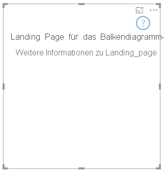

# <a name="add-a-landing-page-to-your-power-bi-visuals"></a>Hinzufügen einer Landing Page zu Ihren Power BI-Visuals

Mit API 2.3.0 können Sie eine Landing Page zu Ihren Power BI-Visuals hinzufügen. Fügen Sie dazu `supportsLandingPage` den Funktionen hinzu, und legen Sie sie auf „true“ fest. Durch diese Aktion wird Ihr Visual initialisiert und aktualisiert, bevor Sie Daten hinzufügen. Da das Visual kein Wasserzeichen mehr anzeigt, können Sie Ihre eigene Landing Page so gestalten, dass Sie im Visual angezeigt wird, solange Sie keine Daten enthält.

```typescript
export class BarChart implements IVisual {
    //...
    private element: HTMLElement;
    private isLandingPageOn: boolean;
    private LandingPageRemoved: boolean;
    private LandingPage: d3.Selection<any>;

    constructor(options: VisualConstructorOptions) {
            //...
            this.element = options.element;
            //...
    }

    public update(options: VisualUpdateOptions) {
    //...
        this.HandleLandingPage(options);
    }

    private HandleLandingPage(options: VisualUpdateOptions) {
        if(!options.dataViews || !options.dataViews.length) {
            if(!this.isLandingPageOn) {
                this.isLandingPageOn = true;
                const SampleLandingPage: Element = this.createSampleLandingPage(); //create a landing page
                this.element.appendChild(SampleLandingPage);
                this.LandingPage = d3.select(SampleLandingPage);
            }

        } else {
                if(this.isLandingPageOn && !this.LandingPageRemoved){
                    this.LandingPageRemoved = true;
                    this.LandingPage.remove();
                }
        }
    }
```

Ein Beispiel für eine Landing Page ist in der folgenden Abbildung dargestellt:


