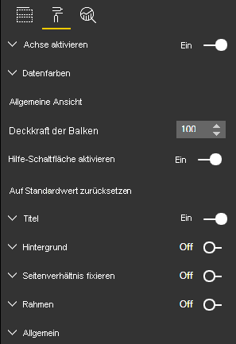

# <a name="create-a-launch-url"></a>Erstellen einer Start-URL

Durch das Erstellen einer Start-URL können Sie eine neue Browserregisterkarte (oder ein Fenster) öffnen, indem Sie tatsächliche Arbeit an Power BI delegieren.

## <a name="sample"></a>Beispiel

```typescript
   this.host.launchUrl('https://powerbi.microsoft.com');
```

## <a name="usage"></a>Verwendung

Verwenden Sie den API-Aufruf `host.launchUrl()`, wobei Sie Ihre Ziel-URL als Zeichenfolgenargument übergeben:

```typescript
this.host.launchUrl('http://some.link.net');
```

## <a name="restrictions"></a>Einschränkungen

* Verwenden Sie nur absolute, aber keine relativen Pfade. Verwenden Sie beispielsweise einen absoluten Pfad wie `http://some.link.net/subfolder/page.html`. Der relative Pfad `/page.html` wird nicht geöffnet.

* Derzeit werden nur *HTTP*- und *HTTPS*-Protokolle unterstützt. Vermeiden Sie *FTP*, *MAILTO* usw.

## <a name="best-practices"></a>Bewährte Methoden

* In der Regel empfiehlt es sich, einen Link nur als Reaktion auf die explizite Aktion eines Benutzers zu öffnen. Für den Benutzer sollte leicht erkennbar sein, dass durch das Klicken auf den Link oder die Schaltfläche eine neue Registerkarte geöffnet wird. Wenn ein `launchUrl()`-Aufruf ohne Benutzeraktion oder als Nebeneffekt einer anderen Aktion ausgelöst wird, kann dies verwirrend oder frustrierend für den Benutzer sein.

* Wenn der Link für die ordnungsgemäße Funktionsweise des Visuals nicht wichtig ist, wird empfohlen, dem Berichtsautor eine Möglichkeit zum Deaktivieren und Ausblenden des Links anzubieten. Diese Empfehlung gilt besonders für bestimmte Power BI-Anwendungsfälle wie das Einbetten eines Berichts in eine Drittanbieteranwendung oder dessen Veröffentlichung im Web.

* Vermeiden Sie es, einen `launchUrl()`-Aufruf aus einer Schleife, der `update`-Funktion des Visuals oder sonstigem häufig wiederkehrenden Code heraus aufzurufen.

## <a name="a-step-by-step-example"></a>Ausführliches Beispiel

### <a name="add-a-link-launching-element"></a>Hinzufügen eines „Start-Link“-Elements

Die folgenden Zeilen wurden der `constructor`-Funktion des Visuals hinzugefügt:

```typescript
    this.helpLinkElement = this.createHelpLinkElement();
    options.element.appendChild(this.helpLinkElement);
```

Es wurde eine private Funktion zum Erstellen und Anfügen des Anchor-Elements hinzugefügt:

```typescript
private createHelpLinkElement(): Element {
    let linkElement = document.createElement("a");
    linkElement.textContent = "?";
    linkElement.setAttribute("title", "Open documentation");
    linkElement.setAttribute("class", "helpLink");
    linkElement.addEventListener("click", () => {
        this.host.launchUrl("https://docs.microsoft.com/power-bi/developer/visuals/custom-visual-develop-tutorial");
    });
    return linkElement;
};
```

Zuletzt wird der Stil des Link-Elements durch einen Eintrag in der Datei *visual.less* definiert:

```less
.helpLink {
    position: absolute;
    top: 0px;
    right: 12px;
    display: block;
    width: 20px;
    height: 20px;
    border: 2px solid #80B0E0;
    border-radius: 20px;
    color: #80B0E0;
    text-align: center;
    font-size: 16px;
    line-height: 20px;
    background-color: #FFFFFF;
    transition: all 900ms ease;

    &:hover {
        background-color: #DDEEFF;
        color: #5080B0;
        border-color: #5080B0;
        transition: all 250ms ease;
    }

    &.hidden {
        display: none;
    }
}
```

### <a name="add-a-toggling-mechanism"></a>Hinzufügen eines Mechanismus zum Ein-/Ausblenden

Zum Hinzufügen eines Mechanismus zum Ein-/Ausblenden müssen Sie ein statisches Objekt hinzufügen, damit der Autor des Berichts die Sichtbatkeit des Link-Elements umstellen kann. (Die Standardeinstellung ist auf *hidden* festgelegt.) Weitere Informationen finden Sie im [Tutorial zu statischen Objekten](https://microsoft.github.io/PowerBI-visuals/docs/concepts/objects-and-properties).

Wie im folgenden Code veranschaulicht wurde dem Objekteintrag der *capabilities.json*-Datei das statische boolesche Objekt `showHelpLink` hinzugefügt:

```typescript
"objects": {
    "generalView": {
            "displayName": "General View",
            "properties":
                "showHelpLink": {
                    "displayName": "Show Help Button",
                    "type": {
                        "bool": true
                    }
                }
            }
        }
    }
```



Außerdem wurden der `update`-Funktion des Visuals die folgenden Zeilen hinzugefügt:

```typescript
if (settings.generalView.showHelpLink) {
    this.helpLinkElement.classList.remove("hidden");
} else {
    this.helpLinkElement.classList.add("hidden");
}
```

Die Klasse *hidden* wurde in der *visual.less*-Datei definiert, um die Anzeige des Elements zu steuern.
