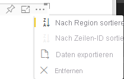

# <a name="sorting-options-for-power-bi-visuals"></a><span data-ttu-id="bf6a4-103">Sortieroptionen für Power Bi-Visuals</span><span class="sxs-lookup"><span data-stu-id="bf6a4-103">Sorting options for Power BI visuals</span></span>

<span data-ttu-id="bf6a4-104">In diesem Artikel wird beschrieben, wie *Sortieroptionen* das Sortierverhalten für Power BI-Visuals festlegen.</span><span class="sxs-lookup"><span data-stu-id="bf6a4-104">This article describes how *sorting* options specify the sorting behavior for Power BI visuals.</span></span> 

<span data-ttu-id="bf6a4-105">Die Sortierfunktion erfordert einen der folgenden Parameter.</span><span class="sxs-lookup"><span data-stu-id="bf6a4-105">The sorting capability requires one of the following parameters.</span></span>

## <a name="default-sorting"></a><span data-ttu-id="bf6a4-106">Standardsortierung</span><span class="sxs-lookup"><span data-stu-id="bf6a4-106">Default sorting</span></span>

<span data-ttu-id="bf6a4-107">Die `default`-Option ist die einfachste Form.</span><span class="sxs-lookup"><span data-stu-id="bf6a4-107">The `default` option is the simplest form.</span></span> <span data-ttu-id="bf6a4-108">Sie ermöglicht es, die im DataMappings-Abschnitt dargestellten Daten zu sortieren.</span><span class="sxs-lookup"><span data-stu-id="bf6a4-108">It allows sorting the data presented in the 'DataMappings' section.</span></span> <span data-ttu-id="bf6a4-109">Durch diese Option kann der Benutzer Datenzuordnungen sortieren und die Sortierrichtung angeben.</span><span class="sxs-lookup"><span data-stu-id="bf6a4-109">The option enables sorting of the data mappings by the user and specifies the sorting direction.</span></span>

```json
    "sorting": {
        "default": {   }
    }
```



## <a name="implicit-sorting"></a><span data-ttu-id="bf6a4-111">Implizite Sortierung</span><span class="sxs-lookup"><span data-stu-id="bf6a4-111">Implicit sorting</span></span>

<span data-ttu-id="bf6a4-112">Beim impliziten Sortieren wird die Sortierung mit dem Arrayparameter `clauses` ausgeführt, der die Sortierung für jede Datenrolle beschreibt.</span><span class="sxs-lookup"><span data-stu-id="bf6a4-112">Implicit sorting is sorting with the array parameter `clauses`, which describes sorting for each data role.</span></span> <span data-ttu-id="bf6a4-113">`implicit` bedeutet, dass die Sortierreihenfolge vom Benutzer des Visuals nicht geändert werden kann.</span><span class="sxs-lookup"><span data-stu-id="bf6a4-113">`implicit` means that the visual's user can't change the sorting order.</span></span> <span data-ttu-id="bf6a4-114">In Power BI werden keine Sortieroptionen im Menü des Visuals angezeigt.</span><span class="sxs-lookup"><span data-stu-id="bf6a4-114">Power BI doesn't display sorting options in the visual's menu.</span></span> <span data-ttu-id="bf6a4-115">Allerdings werden Daten von Power BI gemäß den festgelegten Einstellungen sortiert.</span><span class="sxs-lookup"><span data-stu-id="bf6a4-115">However, Power BI does sort data according to specified settings.</span></span>

<span data-ttu-id="bf6a4-116">`clauses`-Parameter können mehrere Objekte mit zwei Parametern enthalten:</span><span class="sxs-lookup"><span data-stu-id="bf6a4-116">`clauses` parameters can contain several objects with two parameters:</span></span>

- <span data-ttu-id="bf6a4-117">`role`: Bestimmt `DataMapping` für die Sortierung</span><span class="sxs-lookup"><span data-stu-id="bf6a4-117">`role`: Determines `DataMapping` for sorting</span></span>
- <span data-ttu-id="bf6a4-118">`direction`: Bestimmt die Sortierrichtung (1 = aufsteigend, 2 = absteigend)</span><span class="sxs-lookup"><span data-stu-id="bf6a4-118">`direction`: Determines sort direction (1 = Ascending, 2 = Descending)</span></span>

```json
    "sorting": {
        "implicit": {
            "clauses": [
                {
                    "role": "category",
                    "direction": 1
                },
                {
                    "role": "measure",
                    "direction": 2
                }
            ]
        }
    }
```

## <a name="custom-sorting"></a><span data-ttu-id="bf6a4-119">Benutzerdefinierte Sortierung</span><span class="sxs-lookup"><span data-stu-id="bf6a4-119">Custom sorting</span></span>

<span data-ttu-id="bf6a4-120">Benutzerdefinierte Sortierung bedeutet, dass die Sortierung vom Entwickler im Code des Visuals verwaltet wird.</span><span class="sxs-lookup"><span data-stu-id="bf6a4-120">Custom sorting means that the sorting is managed by the developer in the visual's code.</span></span>
