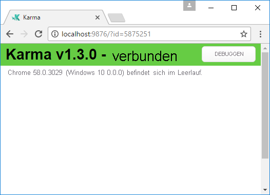
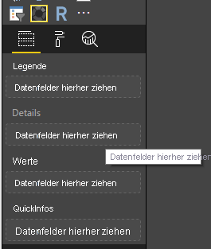
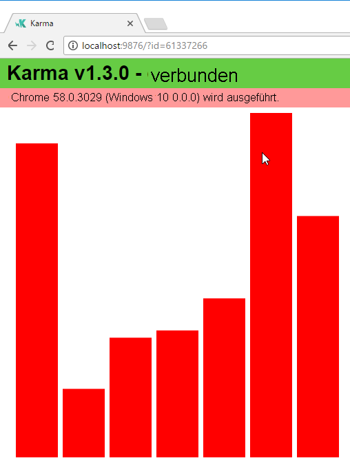
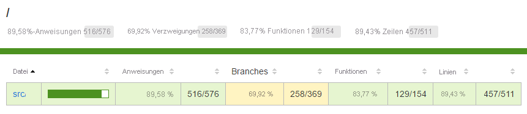
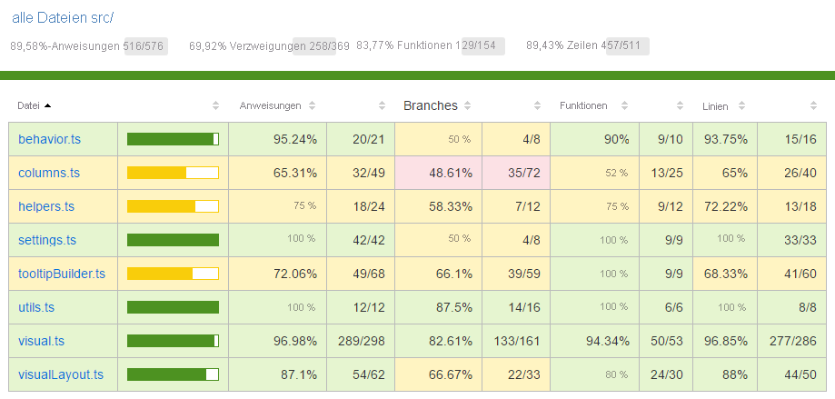
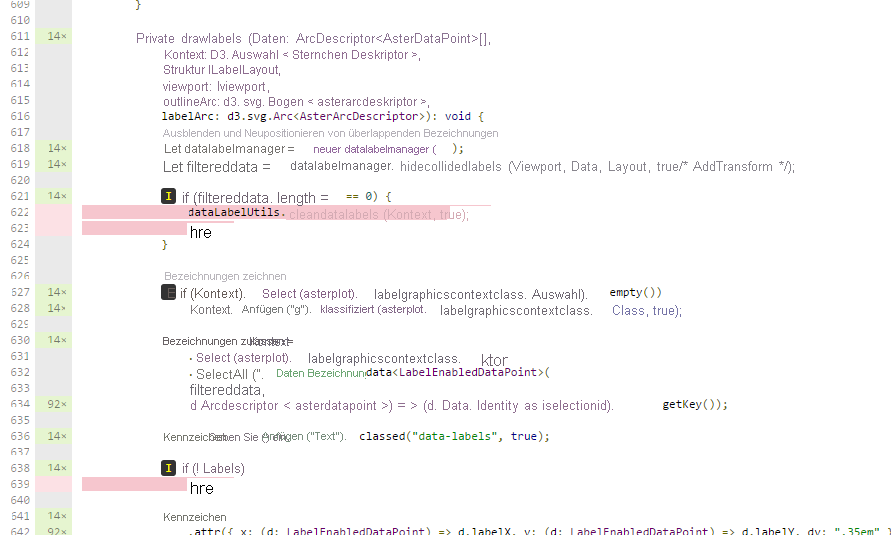

# <a name="tutorial-add-unit-tests-for-power-bi-visual-projects"></a><span data-ttu-id="9086f-103">Tutorial: Hinzufügen von Komponententests zu Power BI-Visualprojekten</span><span class="sxs-lookup"><span data-stu-id="9086f-103">Tutorial: Add unit tests for Power BI visual projects</span></span>

<span data-ttu-id="9086f-104">In diesem Artikel werden die Grundlagen zur Erstellung von Komponententests für Power BI-Visualprojekte beschrieben. Dabei wird u. a. Folgendes thematisiert:</span><span class="sxs-lookup"><span data-stu-id="9086f-104">This article describes the basics of writing unit tests for your Power BI visuals, including how to:</span></span>

* <span data-ttu-id="9086f-105">Einrichten des Testframeworks Jasmine und des Test Runners Karma für JavaScript-Code</span><span class="sxs-lookup"><span data-stu-id="9086f-105">Set up the Karma JavaScript test runner testing framework, Jasmine.</span></span>
* <span data-ttu-id="9086f-106">Verwenden des Pakets „powerbi-visuals-utils-testutils“</span><span class="sxs-lookup"><span data-stu-id="9086f-106">Use the powerbi-visuals-utils-testutils package.</span></span>
* <span data-ttu-id="9086f-107">Verwenden von Pseudo- und Fakeobjekten, um Komponententests für Power BI-Visuals zu vereinfachen</span><span class="sxs-lookup"><span data-stu-id="9086f-107">Use mocks and fakes to help simplify unit testing of Power BI visuals.</span></span>

## <a name="prerequisites"></a><span data-ttu-id="9086f-108">Voraussetzungen</span><span class="sxs-lookup"><span data-stu-id="9086f-108">Prerequisites</span></span>

* <span data-ttu-id="9086f-109">Ein installiertes Power BI-Visualprojekt</span><span class="sxs-lookup"><span data-stu-id="9086f-109">An installed Power BI visuals project</span></span>
* <span data-ttu-id="9086f-110">Eine konfigurierte Node.js-Umgebung</span><span class="sxs-lookup"><span data-stu-id="9086f-110">A configured Node.js environment</span></span>

## <a name="install-and-configure-the-karma-javascript-test-runner-and-jasmine"></a><span data-ttu-id="9086f-111">Installieren und Konfigurieren des Jasmine-Testframeworks und des Test Runners Karma für JavaScript-Code</span><span class="sxs-lookup"><span data-stu-id="9086f-111">Install and configure the Karma JavaScript test runner and Jasmine</span></span>

<span data-ttu-id="9086f-112">Fügen Sie der Datei *package.json* im Abschnitt `devDependencies` die erforderlichen Bibliotheken hinzu:</span><span class="sxs-lookup"><span data-stu-id="9086f-112">Add the required libraries to the *package.json* file in the `devDependencies` section:</span></span>

```json
"@babel/polyfill": "^7.2.5",
"@types/d3": "5.5.0",
"@types/jasmine": "2.5.37",
"@types/jasmine-jquery": "1.5.28",
"@types/jquery": "2.0.41",
"@types/karma": "3.0.0",
"@types/lodash-es": "4.17.1",
"coveralls": "3.0.2",
"istanbul-instrumenter-loader": "^3.0.1",
"jasmine": "2.5.2",
"jasmine-core": "2.5.2",
"jasmine-jquery": "2.1.1",
"jquery": "3.1.1",
"karma": "3.1.1",
"karma-chrome-launcher": "2.2.0",
"karma-coverage": "1.1.2",
"karma-coverage-istanbul-reporter": "^2.0.4",
"karma-jasmine": "2.0.1",
"karma-junit-reporter": "^1.2.0",
"karma-sourcemap-loader": "^0.3.7",
"karma-typescript": "^3.0.13",
"karma-typescript-preprocessor": "0.4.0",
"karma-webpack": "3.0.5",
"puppeteer": "1.17.0",
"style-loader": "0.23.1",
"ts-loader": "5.3.0",
"ts-node": "7.0.1",
"tslint": "^5.12.0",
"webpack": "4.26.0"
```

<span data-ttu-id="9086f-113">Weitere Informationen zum Paket finden Sie unter:</span><span class="sxs-lookup"><span data-stu-id="9086f-113">To learn more about the package, see the description at.</span></span>

<span data-ttu-id="9086f-114">Speichern Sie die Datei *package.json*. Führen Sie anschließend am Speicherort von `package.json` den folgenden Befehl aus:</span><span class="sxs-lookup"><span data-stu-id="9086f-114">Save the *package.json* file and, at the `package.json` location, run the following command:</span></span>

```cmd
npm install
```

<span data-ttu-id="9086f-115">Der Paket-Manager installiert alle neuen Pakete, die *package.json* hinzugefügt wurden.</span><span class="sxs-lookup"><span data-stu-id="9086f-115">The package manager installs all new packages that are added to *package.json*.</span></span>

<span data-ttu-id="9086f-116">Konfigurieren Sie den Test Runner und die `webpack`-Konfiguration, um Komponententests auszuführen.</span><span class="sxs-lookup"><span data-stu-id="9086f-116">To run unit tests, configure the test runner and `webpack` config.</span></span>

<span data-ttu-id="9086f-117">Der folgende Code ist ein Beispiel aus der Datei *test.webpack.config.js*:</span><span class="sxs-lookup"><span data-stu-id="9086f-117">The following code is a sample of the *test.webpack.config.js* file:</span></span>

```typescript
const path = require('path');
const webpack = require("webpack");

module.exports = {
    devtool: 'source-map',
    mode: 'development',
    optimization : {
        concatenateModules: false,
        minimize: false
    },
    module: {
        rules: [
            {
                test: /\.tsx?$/,
                use: 'ts-loader',
                exclude: /node_modules/
            },
            {
                test: /\.json$/,
                loader: 'json-loader'
            },
            {
                test: /\.tsx?$/i,
                enforce: 'post',
                include: /(src)/,
                exclude: /(node_modules|resources\/js\/vendor)/,
                loader: 'istanbul-instrumenter-loader',
                options: { esModules: true }
            },
            {
                test: /\.less$/,
                use: [
                    {
                        loader: 'style-loader'
                    },
                    {
                        loader: 'css-loader'
                    },
                    {
                        loader: 'less-loader',
                        options: {
                            paths: [path.resolve(__dirname, 'node_modules')]
                        }
                    }
                ]
            }
        ]
    },
    externals: {
        "powerbi-visuals-api": '{}'
    },
    resolve: {
        extensions: ['.tsx', '.ts', '.js', '.css']
    },
    output: {
        path: path.resolve(__dirname, ".tmp/test")
    },
    plugins: [
        new webpack.ProvidePlugin({
            'powerbi-visuals-api': null
        })
    ]
};
```

<span data-ttu-id="9086f-118">Der folgende Code ist ein Beispiel aus der Datei *karma.conf.ts*:</span><span class="sxs-lookup"><span data-stu-id="9086f-118">The following code is a sample of the *karma.conf.ts* file:</span></span>

```typescript
"use strict";

const webpackConfig = require("./test.webpack.config.js");
const tsconfig = require("./test.tsconfig.json");
const path = require("path");

const testRecursivePath = "test/visualTest.ts";
const srcOriginalRecursivePath = "src/**/*.ts";
const coverageFolder = "coverage";

process.env.CHROME_BIN = require("puppeteer").executablePath();

import { Config, ConfigOptions } from "karma";

module.exports = (config: Config) => {
    config.set(<ConfigOptions>{
        mode: "development",
        browserNoActivityTimeout: 100000,
        browsers: ["ChromeHeadless"], // or Chrome to use locally installed Chrome browser
        colors: true,
        frameworks: ["jasmine"],
        reporters: [
            "progress",
            "junit",
            "coverage-istanbul"
        ],
        junitReporter: {
            outputDir: path.join(__dirname, coverageFolder),
            outputFile: "TESTS-report.xml",
            useBrowserName: false
        },
        singleRun: true,
        plugins: [
            "karma-coverage",
            "karma-typescript",
            "karma-webpack",
            "karma-jasmine",
            "karma-sourcemap-loader",
            "karma-chrome-launcher",
            "karma-junit-reporter",
            "karma-coverage-istanbul-reporter"
        ],
        files: [
            "node_modules/jquery/dist/jquery.min.js",
            "node_modules/jasmine-jquery/lib/jasmine-jquery.js",
            {
                pattern: './capabilities.json',
                watched: false,
                served: true,
                included: false
            },
            testRecursivePath,
            {
                pattern: srcOriginalRecursivePath,
                included: false,
                served: true
            }
        ],
        preprocessors: {
            [testRecursivePath]: ["webpack", "coverage"]
        },
        typescriptPreprocessor: {
            options: tsconfig.compilerOptions
        },
        coverageIstanbulReporter: {
            reports: ["html", "lcovonly", "text-summary", "cobertura"],
            dir: path.join(__dirname, coverageFolder),
            'report-config': {
                html: {
                    subdir: 'html-report'
                }
            },
            combineBrowserReports: true,
            fixWebpackSourcePaths: true,
            verbose: false
        },
        coverageReporter: {
            dir: path.join(__dirname, coverageFolder),
            reporters: [
                // reporters not supporting the `file` property
                { type: 'html', subdir: 'html-report' },
                { type: 'lcov', subdir: 'lcov' },
                // reporters supporting the `file` property, use `subdir` to directly
                // output them in the `dir` directory
                { type: 'cobertura', subdir: '.', file: 'cobertura-coverage.xml' },
                { type: 'lcovonly', subdir: '.', file: 'report-lcovonly.txt' },
                { type: 'text-summary', subdir: '.', file: 'text-summary.txt' },
            ]
        },
        mime: {
            "text/x-typescript": ["ts", "tsx"]
        },
        webpack: webpackConfig,
        webpackMiddleware: {
            stats: "errors-only"
        }
    });
};
```

<span data-ttu-id="9086f-119">Sie können diese Konfiguration bei Bedarf ändern.</span><span class="sxs-lookup"><span data-stu-id="9086f-119">If necessary, you can modify this configuration.</span></span>

<span data-ttu-id="9086f-120">Der Code in *karma.conf.js* enthält die folgende Variablen:</span><span class="sxs-lookup"><span data-stu-id="9086f-120">The code in *karma.conf.js* contains the following variable:</span></span>

* <span data-ttu-id="9086f-121">`recursivePathToTests`: der Speicherort des Testcodes.</span><span class="sxs-lookup"><span data-stu-id="9086f-121">`recursivePathToTests`: Locates the test code</span></span>

* <span data-ttu-id="9086f-122">`srcRecursivePath`: der Speicherort des JavaScript-Ausgabecodes nach dem Kompilieren.</span><span class="sxs-lookup"><span data-stu-id="9086f-122">`srcRecursivePath`: Locates the output JavaScript code after compiling</span></span>

* <span data-ttu-id="9086f-123">`srcCssRecursivePath`: der Speicherort der CSS-Ausgabe nach dem Kompilieren der LESS-Datei mit Formatangaben.</span><span class="sxs-lookup"><span data-stu-id="9086f-123">`srcCssRecursivePath`: Locates the output CSS after compiling less file with styles</span></span>

* <span data-ttu-id="9086f-124">`srcOriginalRecursivePath`: der Speicherort des Visualquellcodes.</span><span class="sxs-lookup"><span data-stu-id="9086f-124">`srcOriginalRecursivePath`: Locates the source code of your visual</span></span>

* <span data-ttu-id="9086f-125">`coverageFolder`: der Speicherort, an dem der Bericht zur Code Coverage erstellt werden soll.</span><span class="sxs-lookup"><span data-stu-id="9086f-125">`coverageFolder`: Determines where the coverage report is to be created</span></span>

<span data-ttu-id="9086f-126">Die Konfigurationsdatei enthält die folgenden Eigenschaften:</span><span class="sxs-lookup"><span data-stu-id="9086f-126">The configuration file includes the following properties:</span></span>

* <span data-ttu-id="9086f-127">`singleRun: true`: Tests lassen sich entweder einmalig oder auf einem CI-System (Continuous Integration) ausführen.</span><span class="sxs-lookup"><span data-stu-id="9086f-127">`singleRun: true`: Tests are run on a continuous integration (CI) system, or they can be run one time.</span></span> <span data-ttu-id="9086f-128">Sie können für das Debuggen von Tests die Einstellung *false* festlegen.</span><span class="sxs-lookup"><span data-stu-id="9086f-128">You can change the setting to *false* for debugging your tests.</span></span> <span data-ttu-id="9086f-129">Der Browser wird von Karma weiterhin ausgeführt, damit Sie die Konsole zum Debuggen verwenden können.</span><span class="sxs-lookup"><span data-stu-id="9086f-129">Karma keeps the browser running so that you can use the console for debugging.</span></span>

* <span data-ttu-id="9086f-130">`files: [...]`: In diesem Array können Sie die Dateien festlegen, die in den Browser geladen werden sollen.</span><span class="sxs-lookup"><span data-stu-id="9086f-130">`files: [...]`: In this array, you can specify the files to load to the browser.</span></span> <span data-ttu-id="9086f-131">Normalerweise handelt es sich um Quelldateien, Testfälle und Bibliotheken (für Jasmine und Testhilfsprogramme).</span><span class="sxs-lookup"><span data-stu-id="9086f-131">Usually, there are source files, test cases, libraries (Jasmine, test utilities).</span></span> <span data-ttu-id="9086f-132">Sie können die Liste bei Bedarf um weitere Dateien ergänzen.</span><span class="sxs-lookup"><span data-stu-id="9086f-132">You can add additional files to the list, as necessary.</span></span>

* <span data-ttu-id="9086f-133">`preprocessors`: In diesem Abschnitt konfigurieren Sie die Aktionen, die vor den Komponententests ausgeführt werden.</span><span class="sxs-lookup"><span data-stu-id="9086f-133">`preprocessors`: In this section, you configure actions that run before the unit tests run.</span></span> <span data-ttu-id="9086f-134">Die Aktionen kompilieren TypeScript vorab zu JavaScript, bereiten Quellzuordnungsdateien vor und generieren den Bericht zur Code Coverage.</span><span class="sxs-lookup"><span data-stu-id="9086f-134">They precompile the typescript to JavaScript, prepare source map files, and generate code coverage report.</span></span> <span data-ttu-id="9086f-135">Sie können `coverage` deaktivieren, wenn Sie Tests debuggen.</span><span class="sxs-lookup"><span data-stu-id="9086f-135">You can disable `coverage` when you debug your tests.</span></span> <span data-ttu-id="9086f-136">Durch „coverage“ wird zusätzlicher Testcode generiert, der bei der Code Coverage für Tests berücksichtigt wird. Dies erschwert das Debuggen von Tests.</span><span class="sxs-lookup"><span data-stu-id="9086f-136">Coverage generates additional code for check code for the test coverage, which complicates debugging tests.</span></span>

<span data-ttu-id="9086f-137">Eine Beschreibung aller Karma-Konfigurationen finden Sie auf der Seite [Karma-Konfigurationsdatei](https://karma-runner.github.io/1.0/config/configuration-file.html).</span><span class="sxs-lookup"><span data-stu-id="9086f-137">For descriptions of all Karma configurations, go to the [Karma Configuration File](https://karma-runner.github.io/1.0/config/configuration-file.html) page.</span></span>

<span data-ttu-id="9086f-138">Sie können `scripts` praktischerweise einen Testbefehl hinzufügen:</span><span class="sxs-lookup"><span data-stu-id="9086f-138">For your convenience, you can add a test command into `scripts`:</span></span>

```json
{
    "scripts": {
        "pbiviz": "pbiviz",
        "start": "pbiviz start",
        "typings":"node node_modules/typings/dist/bin.js i",
        "lint": "tslint -r \"node_modules/tslint-microsoft-contrib\"  \"+(src|test)/**/*.ts\"",
        "pretest": "pbiviz package --resources --no-minify --no-pbiviz --no-plugin",
        "test": "karma start"
    }
    ...
}
```

<span data-ttu-id="9086f-139">Nun können Sie mit dem Erstellen von Komponententests beginnen.</span><span class="sxs-lookup"><span data-stu-id="9086f-139">You're now ready to begin writing your unit tests.</span></span>

## <a name="check-the-dom-element-of-the-visual"></a><span data-ttu-id="9086f-140">Überprüfen des DOM-Elements des Visuals</span><span class="sxs-lookup"><span data-stu-id="9086f-140">Check the DOM element of the visual</span></span>

<span data-ttu-id="9086f-141">Erstellen Sie zunächst eine Instanz des Visuals, um dieses zu testen.</span><span class="sxs-lookup"><span data-stu-id="9086f-141">To test the visual, first create an instance of visual.</span></span>

### <a name="create-a-visual-instance-builder"></a><span data-ttu-id="9086f-142">Erstellen des Visualinstanz-Generators</span><span class="sxs-lookup"><span data-stu-id="9086f-142">Create a visual instance builder</span></span>

<span data-ttu-id="9086f-143">Fügen Sie dem Ordner *test* die Datei *visualBuilder.ts* hinzu, indem Sie folgenden Code verwenden:</span><span class="sxs-lookup"><span data-stu-id="9086f-143">Add a *visualBuilder.ts* file to the *test* folder by using the following code:</span></span>

```typescript
import {
    VisualBuilderBase
} from "powerbi-visuals-utils-testutils";

import {
    BarChart as VisualClass
} from "../src/visual";

import  powerbi from "powerbi-visuals-api";
import VisualConstructorOptions = powerbi.extensibility.visual.VisualConstructorOptions;

export class BarChartBuilder extends VisualBuilderBase<VisualClass> {
    constructor(width: number, height: number) {
        super(width, height);
    }

    protected build(options: VisualConstructorOptions) {
        return new VisualClass(options);
    }

    public get mainElement() {
        return this.element.children("svg.barChart");
    }
}
```

<span data-ttu-id="9086f-144">Es gibt eine `build`-Methode, mit der Sie eine Instanz des Visuals erstellen können.</span><span class="sxs-lookup"><span data-stu-id="9086f-144">There's `build` method for creating an instance of your visual.</span></span> <span data-ttu-id="9086f-145">`mainElement` ist eine get-Methode, die eine Instanz des DOM-Stammelements im Visual zurückgibt.</span><span class="sxs-lookup"><span data-stu-id="9086f-145">`mainElement` is a get method, which returns an instance of "root" document object model (DOM) element in your visual.</span></span> <span data-ttu-id="9086f-146">Der Getter ist optional, erleichtert jedoch das Erstellen von Komponententests.</span><span class="sxs-lookup"><span data-stu-id="9086f-146">The getter is optional, but it makes writing the unit test easier.</span></span>

<span data-ttu-id="9086f-147">Sie verfügen nun über eine Instanz des Visuals.</span><span class="sxs-lookup"><span data-stu-id="9086f-147">You now have a build of an instance of your visual.</span></span> <span data-ttu-id="9086f-148">Als Nächstes schreiben Sie den Testfall.</span><span class="sxs-lookup"><span data-stu-id="9086f-148">Let's write the test case.</span></span> <span data-ttu-id="9086f-149">Mit dem Testfall werden die SVG-Elemente überprüft, die beim Anzeigen des Visuals erstellt werden.</span><span class="sxs-lookup"><span data-stu-id="9086f-149">The test case checks the SVG elements that are created when your visual is displayed.</span></span>

### <a name="create-a-typescript-file-to-write-test-cases"></a><span data-ttu-id="9086f-150">Erstellen einer TypeScript-Datei zum Schreiben von Testfällen</span><span class="sxs-lookup"><span data-stu-id="9086f-150">Create a typescript file to write test cases</span></span>

<span data-ttu-id="9086f-151">Fügen Sie den Testfällen die Datei *visualTest.ts* hinzu, indem Sie folgenden Code verwenden:</span><span class="sxs-lookup"><span data-stu-id="9086f-151">Add a *visualTest.ts* file for the test cases by using the following code:</span></span>

```typescript
import powerbi from "powerbi-visuals-api";

import { BarChartBuilder } from "./VisualBuilder";

import {
    BarChart as VisualClass
} from "../src/visual";

import VisualBuilder = powerbi.extensibility.visual.test.BarChartBuilder;

describe("BarChart", () => {
    let visualBuilder: VisualBuilder;
    let dataView: DataView;

    beforeEach(() => {
        visualBuilder = new VisualBuilder(500, 500);
    });

    it("root DOM element is created", () => {
        expect(visualBuilder.mainElement).toBeInDOM();
    });
});
```

<span data-ttu-id="9086f-152">Mehrere Methoden werden aufgerufen:</span><span class="sxs-lookup"><span data-stu-id="9086f-152">Several methods are called:</span></span>

* <span data-ttu-id="9086f-153">[`describe`](https://jasmine.github.io/api/2.6/global.html#describe): beschreibt einen Testfall.</span><span class="sxs-lookup"><span data-stu-id="9086f-153">[`describe`](https://jasmine.github.io/api/2.6/global.html#describe): Describes a test case.</span></span> <span data-ttu-id="9086f-154">Im Kontext des Jasmine-Frameworks wird damit häufig eine Sammlung oder eine Gruppe von Spezifikationen beschrieben.</span><span class="sxs-lookup"><span data-stu-id="9086f-154">In the context of the Jasmine framework, it often describes a suite or group of specs.</span></span>

* <span data-ttu-id="9086f-155">`beforeEach`: wird vor jedem Aufruf der `it`-Methode aufgerufen, die in der Methode [`describe`](https://jasmine.github.io/api/2.6/global.html#beforeEach) definiert ist.</span><span class="sxs-lookup"><span data-stu-id="9086f-155">`beforeEach`: Is called before each call of the `it` method, which is defined in the [`describe`](https://jasmine.github.io/api/2.6/global.html#beforeEach) method.</span></span>

* <span data-ttu-id="9086f-156">[`it`](https://jasmine.github.io/api/2.6/global.html#it): definiert eine einzelne Spezifikation. Die `it`-Methode sollte eine oder mehrere `expectations` enthalten.</span><span class="sxs-lookup"><span data-stu-id="9086f-156">[`it`](https://jasmine.github.io/api/2.6/global.html#it): Defines a single spec. The `it` method should contain one or more `expectations`.</span></span>

* <span data-ttu-id="9086f-157">[`expect`](https://jasmine.github.io/api/2.6/global.html#expect): erstellt eine Erwartung für eine Spezifikation. Eine Spezifikation ist erfolgreich, wenn alle Erwartungen ohne Fehler erfüllt werden.</span><span class="sxs-lookup"><span data-stu-id="9086f-157">[`expect`](https://jasmine.github.io/api/2.6/global.html#expect): Creates an expectation for a spec. A spec succeeds if all expectations pass without any failures.</span></span>

* <span data-ttu-id="9086f-158">`toBeInDOM`: eine der *matchers*-Methoden.</span><span class="sxs-lookup"><span data-stu-id="9086f-158">`toBeInDOM`: One of the *matchers* methods.</span></span> <span data-ttu-id="9086f-159">Weitere Informationen zu Matchern finden Sie unter [Jasmine-Namespace: matchers](https://jasmine.github.io/api/2.6/matchers.html).</span><span class="sxs-lookup"><span data-stu-id="9086f-159">For more information about matchers, see [Jasmine Namespace: matchers](https://jasmine.github.io/api/2.6/matchers.html).</span></span>

<span data-ttu-id="9086f-160">Weitere Informationen zu Jasmine finden Sie auf der Seite [Dokumentation zum Jasmine-Framework](https://jasmine.github.io/).</span><span class="sxs-lookup"><span data-stu-id="9086f-160">For more information about Jasmine, see the [Jasmine framework documentation](https://jasmine.github.io/) page.</span></span>

### <a name="launch-unit-tests"></a><span data-ttu-id="9086f-161">Starten von Komponententests</span><span class="sxs-lookup"><span data-stu-id="9086f-161">Launch unit tests</span></span>

<span data-ttu-id="9086f-162">Mit diesem Test wird überprüft, ob das SVG-Stammelement der Visuals erstellt wird.</span><span class="sxs-lookup"><span data-stu-id="9086f-162">This test checks that root SVG element of the visuals is created.</span></span> <span data-ttu-id="9086f-163">Geben Sie den folgenden Befehl im Befehlszeilentool ein, um den Komponententest auszuführen:</span><span class="sxs-lookup"><span data-stu-id="9086f-163">To run the unit test, enter the following command in the command-line tool:</span></span>

```cmd
npm run test
```

<span data-ttu-id="9086f-164">`karma.js` führt den Testfall im Chrome-Browser aus.</span><span class="sxs-lookup"><span data-stu-id="9086f-164">`karma.js` runs the test case in the Chrome browser.</span></span>



> [!NOTE]
> <span data-ttu-id="9086f-166">Sie müssen Google Chrome lokal installieren.</span><span class="sxs-lookup"><span data-stu-id="9086f-166">You must install Google Chrome locally.</span></span>

<span data-ttu-id="9086f-167">Im Befehlszeilenfenster wird die folgende Ausgabe angezeigt:</span><span class="sxs-lookup"><span data-stu-id="9086f-167">In the command-line window, you'll get following output:</span></span>

```cmd
> karma start

23 05 2017 12:24:26.842:WARN [watcher]: Pattern "E:/WORKSPACE/PowerBI/PowerBI-visuals-sampleBarChart/data/*.csv" does not match any file.
23 05 2017 12:24:30.836:WARN [karma]: No captured browser, open http://localhost:9876/
23 05 2017 12:24:30.849:INFO [karma]: Karma v1.3.0 server started at http://localhost:9876/
23 05 2017 12:24:30.850:INFO [launcher]: Launching browser Chrome with unlimited concurrency
23 05 2017 12:24:31.059:INFO [launcher]: Starting browser Chrome
23 05 2017 12:24:33.160:INFO [Chrome 58.0.3029 (Windows 10 0.0.0)]: Connected on socket /#2meR6hjXFmsE_fjiAAAA with id 5875251
Chrome 58.0.3029 (Windows 10 0.0.0): Executed 1 of 1 SUCCESS (0.194 secs / 0.011 secs)

=============================== Coverage summary ===============================
Statements   : 27.43% ( 65/237 )
Branches     : 19.84% ( 25/126 )
Functions    : 43.86% ( 25/57 )
Lines        : 20.85% ( 44/211 )
================================================================================
```

### <a name="how-to-add-static-data-for-unit-tests"></a><span data-ttu-id="9086f-168">Hinzufügen statischer Daten zu Komponententests</span><span class="sxs-lookup"><span data-stu-id="9086f-168">How to add static data for unit tests</span></span>

<span data-ttu-id="9086f-169">Erstellen Sie die Datei *visualData.ts* im Ordner *test*, indem Sie folgenden Code verwenden:</span><span class="sxs-lookup"><span data-stu-id="9086f-169">Create the *visualData.ts* file in the *test* folder by using the following code:</span></span>

```typescript
import powerbi from "powerbi-visuals-api";
import DataView = powerbi.DataView;

import {
    testDataViewBuilder,
    getRandomNumbers
} from "powerbi-visuals-utils-testutils";

export class SampleBarChartDataBuilder extends TestDataViewBuilder {
    public static CategoryColumn: string = "category";
    public static MeasureColumn: string = "measure";

    public constructor() {
        super();
        ...
    }

    public getDataView(columnNames?: string[]): DataView {
        let dateView: any = this.createCategoricalDataViewBuilder([
            ...
        ],
        [
            ...
        ], columnNames).build();

        // there's client side computed maxValue
        let maxLocal = 0;
        this.valuesMeasure.forEach((item) => {
                if (item > maxLocal) {
                    maxLocal = item;
                }
        });
        (<any>dataView).categorical.values[0].maxLocal = maxLocal;
    }
}
```

<span data-ttu-id="9086f-170">Die `SampleBarChartDataBuilder`-Klasse erbt von `TestDataViewBuilder` und implementiert die abstrakte Methode `getDataView`.</span><span class="sxs-lookup"><span data-stu-id="9086f-170">The `SampleBarChartDataBuilder` class extends `TestDataViewBuilder` and implements the abstract method `getDataView`.</span></span>

<span data-ttu-id="9086f-171">Wenn Sie Daten in Datenfeldbuckets eingeben, generiert Power BI ein `dataview`-Kategorieobjekt, das auf den Daten basiert.</span><span class="sxs-lookup"><span data-stu-id="9086f-171">When you put data into data-field buckets, Power BI produces a categorical `dataview` object that's based on your data.</span></span>



<span data-ttu-id="9086f-173">In Komponententests stehen keine Power BI-Kernfunktionen zur Verfügung, mit denen sich die Daten kopieren lassen.</span><span class="sxs-lookup"><span data-stu-id="9086f-173">In unit tests, you don't have Power BI core functions to reproduce the data.</span></span> <span data-ttu-id="9086f-174">Sie müssen die statischen Daten jedoch dem `dataview`-Kategorieobjekt zuordnen.</span><span class="sxs-lookup"><span data-stu-id="9086f-174">But you need to map your static data to the categorical `dataview`.</span></span> <span data-ttu-id="9086f-175">Dabei unterstützt Sie die `TestDataViewBuilder`-Klasse.</span><span class="sxs-lookup"><span data-stu-id="9086f-175">The `TestDataViewBuilder` class can help you map it.</span></span>

<span data-ttu-id="9086f-176">Weitere Informationen zur Zuordnung von Datenansichten finden Sie unter [DataViewMappings](https://github.com/Microsoft/PowerBI-visuals/blob/master/Capabilities/DataViewMappings.md).</span><span class="sxs-lookup"><span data-stu-id="9086f-176">For more information about Data View mapping, see [DataViewMappings](https://github.com/Microsoft/PowerBI-visuals/blob/master/Capabilities/DataViewMappings.md).</span></span>

<span data-ttu-id="9086f-177">In der `getDataView`-Methode rufen Sie die `createCategoricalDataViewBuilder`-Methode mit Ihren Daten auf.</span><span class="sxs-lookup"><span data-stu-id="9086f-177">In the `getDataView` method, you call the `createCategoricalDataViewBuilder` method with your data.</span></span>

<span data-ttu-id="9086f-178">Die Datei [capabilities.json](https://github.com/Microsoft/PowerBI-visuals-sampleBarChart/blob/master/capabilities.json#L2) des `sampleBarChart`-Visuals enthält das dataRoles-Objekt und das dataViewMapping-Objekt:</span><span class="sxs-lookup"><span data-stu-id="9086f-178">In `sampleBarChart` visual [capabilities.json](https://github.com/Microsoft/PowerBI-visuals-sampleBarChart/blob/master/capabilities.json#L2) file, we have dataRoles and dataViewMapping objects:</span></span>

```json
"dataRoles": [
    {
        "displayName": "Category Data",
        "name": "category",
        "kind": "Grouping"
    },
    {
        "displayName": "Measure Data",
        "name": "measure",
        "kind": "Measure"
    }
],
"dataViewMappings": [
    {
        "conditions": [
            {
                "category": {
                    "max": 1
                },
                "measure": {
                    "max": 1
                }
            }
        ],
        "categorical": {
            "categories": {
                "for": {
                    "in": "category"
                }
            },
            "values": {
                "select": [
                    {
                        "bind": {
                            "to": "measure"
                        }
                    }
                ]
            }
        }
    }
],
```

<span data-ttu-id="9086f-179">Um die gleiche Zuordnung zu generieren, müssen Sie die folgenden Parameter auf die `createCategoricalDataViewBuilder`-Methode festlegen:</span><span class="sxs-lookup"><span data-stu-id="9086f-179">To generate the same mapping, you must set the following params to `createCategoricalDataViewBuilder` method:</span></span>

```typescript
([
    {
        source: {
            displayName: "Category",
            queryName: SampleBarChartData.ColumnCategory,
            type: ValueType.fromDescriptor({ text: true }),
            roles: {
                Category: true
            },
        },
        values: this.valuesCategory
    }
],
[
    {
        source: {
            displayName: "Measure",
            isMeasure: true,
            queryName: SampleBarChartData.MeasureColumn,
            type: ValueType.fromDescriptor({ numeric: true }),
            roles: {
                Measure: true
            },
        },
        values: this.valuesMeasure
    },
], columnNames)
```

<span data-ttu-id="9086f-180">Dabei ist `this.valuesCategory` ein Array von Kategorien:</span><span class="sxs-lookup"><span data-stu-id="9086f-180">Where `this.valuesCategory` is an array of categories:</span></span>

```ts
public valuesCategory: string[] = ["Monday", "Tuesday", "Wednesday", "Thursday", "Friday", "Saturday", "Sunday"];
```

<span data-ttu-id="9086f-181">`this.valuesMeasure` ist ein Array von Measures für jede Kategorie:</span><span class="sxs-lookup"><span data-stu-id="9086f-181">And `this.valuesMeasure` is an array of measures for each category:</span></span>

```ts
public valuesMeasure: number[] = [742731.43, 162066.43, 283085.78, 300263.49, 376074.57, 814724.34, 570921.34];
```

<span data-ttu-id="9086f-182">Jetzt können Sie die `SampleBarChartDataBuilder`-Klasse im Komponententest verwenden.</span><span class="sxs-lookup"><span data-stu-id="9086f-182">Now, you can use the `SampleBarChartDataBuilder` class in your unit test.</span></span>

<span data-ttu-id="9086f-183">Die `ValueType`-Klasse ist im Paket „powerbi-visuals-utils-testutils“ definiert.</span><span class="sxs-lookup"><span data-stu-id="9086f-183">The `ValueType` class is defined in the powerbi-visuals-utils-testutils package.</span></span> <span data-ttu-id="9086f-184">Für die `createCategoricalDataViewBuilder`-Methode ist die `lodash`-Bibliothek erforderlich.</span><span class="sxs-lookup"><span data-stu-id="9086f-184">And the `createCategoricalDataViewBuilder` method requires the `lodash` library.</span></span>

<span data-ttu-id="9086f-185">Fügen Sie die folgenden Pakete den Abhängigkeiten hinzu.</span><span class="sxs-lookup"><span data-stu-id="9086f-185">Add these packages to the dependencies.</span></span>

<span data-ttu-id="9086f-186">In `package.json` im Abschnitt `devDependencies`</span><span class="sxs-lookup"><span data-stu-id="9086f-186">In `package.json` at `devDependencies` section</span></span>

```json
"lodash-es": "4.17.1",
"powerbi-visuals-utils-testutils": "2.2.0"
```

<span data-ttu-id="9086f-187">Aufruf</span><span class="sxs-lookup"><span data-stu-id="9086f-187">Call</span></span>

```cmd
npm install
```

<span data-ttu-id="9086f-188">zur Installation der `lodash-es`-Bibliothek</span><span class="sxs-lookup"><span data-stu-id="9086f-188">to install `lodash-es` library.</span></span>

<span data-ttu-id="9086f-189">Nun können Sie den Komponententest erneut ausführen.</span><span class="sxs-lookup"><span data-stu-id="9086f-189">Now, you can run the unit test again.</span></span> <span data-ttu-id="9086f-190">Folgende Ausgabe muss angezeigt werden:</span><span class="sxs-lookup"><span data-stu-id="9086f-190">You must get the following output:</span></span>

```cmd
> karma start

23 05 2017 16:19:54.318:WARN [watcher]: Pattern "E:/WORKSPACE/PowerBI/PowerBI-visuals-sampleBarChart/data/*.csv" does not match any file.
23 05 2017 16:19:58.333:WARN [karma]: No captured browser, open http://localhost:9876/
23 05 2017 16:19:58.346:INFO [karma]: Karma v1.3.0 server started at http://localhost:9876/
23 05 2017 16:19:58.346:INFO [launcher]: Launching browser Chrome with unlimited concurrency
23 05 2017 16:19:58.394:INFO [launcher]: Starting browser Chrome
23 05 2017 16:19:59.873:INFO [Chrome 58.0.3029 (Windows 10 0.0.0)]: Connected on socket /#NcNTAGH9hWfGMCuEAAAA with id 3551106
Chrome 58.0.3029 (Windows 10 0.0.0): Executed 1 of 1 SUCCESS (1.266 secs / 1.052 secs)

=============================== Coverage summary ===============================
Statements   : 56.72% ( 135/238 )
Branches     : 32.54% ( 41/126 )
Functions    : 66.67% ( 38/57 )
Lines        : 52.83% ( 112/212 )
================================================================================
```

<span data-ttu-id="9086f-191">Das Visual wird im Chrome-Browser geöffnet und wie folgt dargestellt:</span><span class="sxs-lookup"><span data-stu-id="9086f-191">Your visual opens in the Chrome browser, as shown:</span></span>



<span data-ttu-id="9086f-193">Aus der Zusammenfassung geht hervor, dass sich die Code Coverage erhöht hat.</span><span class="sxs-lookup"><span data-stu-id="9086f-193">The summary shows that coverage has increased.</span></span> <span data-ttu-id="9086f-194">Weitere Informationen zur aktuellen Code Coverage finden Sie in der Datei `coverage\index.html`.</span><span class="sxs-lookup"><span data-stu-id="9086f-194">To learn more about current code coverage, open `coverage\index.html`.</span></span>



<span data-ttu-id="9086f-196">Sie können sich auch die Code Coverage für den Ordner `src` ansehen:</span><span class="sxs-lookup"><span data-stu-id="9086f-196">Or look at the scope of the `src` folder:</span></span>



<span data-ttu-id="9086f-198">Sie können sich für jede Datei den Quellcode anzeigen lassen.</span><span class="sxs-lookup"><span data-stu-id="9086f-198">In the scope of file, you can view the source code.</span></span> <span data-ttu-id="9086f-199">Die `Coverage`-Hilfsprogramme heben Zeilen rot hervor, wenn bestimmter Code während der Komponententests nicht ausgeführt wird.</span><span class="sxs-lookup"><span data-stu-id="9086f-199">The `Coverage` utilities would highlight the row in red if certain code isn't executed during the unit tests.</span></span>



> [!IMPORTANT]
> <span data-ttu-id="9086f-201">Die Code Coverage sagt nichts darüber aus, ob ein Großteil der Visualfunktionen getestet wurde.</span><span class="sxs-lookup"><span data-stu-id="9086f-201">Code coverage doesn't mean that you have good functionality coverage of the visual.</span></span> <span data-ttu-id="9086f-202">Ein einfacher Komponententest führt zu einer Code Coverage von über 96 % in `src\visual.ts`.</span><span class="sxs-lookup"><span data-stu-id="9086f-202">One simple unit test provides over 96 percent coverage in `src\visual.ts`.</span></span>

## <a name="next-steps"></a><span data-ttu-id="9086f-203">Nächste Schritte</span><span class="sxs-lookup"><span data-stu-id="9086f-203">Next steps</span></span>

<span data-ttu-id="9086f-204">Sobald Ihr Visual bereit ist, können Sie es zur Veröffentlichung übermitteln.</span><span class="sxs-lookup"><span data-stu-id="9086f-204">When your visual is ready, you can submit it for publication.</span></span> <span data-ttu-id="9086f-205">Weitere Informationen finden Sie unter [Veröffentlichen von Power BI-Visuals in AppSource](../office-store.md).</span><span class="sxs-lookup"><span data-stu-id="9086f-205">For more information, see [Publish Power BI visuals to AppSource](../office-store.md).</span></span>
